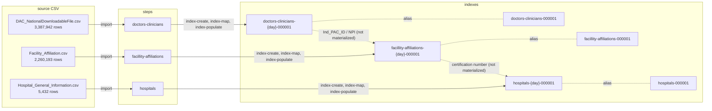

# CMS Providers

## Purpose

A reference implementation of the [entitopia framework](../README.md) over Medicare provider data. It exercises the framework at scale — 5.6M rows across three datasets — and demonstrates phonetic and fuzzy analyzers on names and addresses.

This project is deliberately the **simple** case: three independent datasets, no enrichment, no ingestion pipelines, no cross-dataset matching. See [DOT-Commercial](../DOT-Commercial/) for the enrichment and entity-matching case.

Framework concepts (steps, phases, configuration layout) and the data-loading hazards common to any dataset are documented in the [top-level README](../README.md). This README covers what is specific to the CMS data.

## Index Data

Three independent indexes, each loaded straight from its own CSV. Nothing enriches anything else — the relationships between these datasets exist in the data (shared `Ind_PAC_ID` / `NPI` values) but are not materialized in Elasticsearch.

Each step runs the same three phases — `index-create`, `index-map`, `index-populate` — because there is nothing to enrich and no pipeline to build. That makes this project the smallest complete example of the framework.

## Open Items

1. No enrichment exists. The `Ind_PAC_ID`-to-facility and facility-to-hospital relationships shown dashed above could be materialized with enrichment policies, the way DOT-Commercial denormalizes five datasets onto its carriers index.
1. Affiliations extend to more than hospitals, so `facillity-affiliations` is broader than its name suggests.
1. No `entity-match` step. The phonetic and cleaning analyzers are configured on names and addresses here but nothing queries them — this project loads and analyzes, it does not yet match. Duplicate-clinician detection across registrations would be the natural use.

## Data

### doctors-clinicians

Broke out the clinician pipeline and indexing into their own steps so playing with the index would just be a --step with no --phase

Individual doctors or clinicians in `doctors-clinicians` have more than one entry depending on how many registrations are captured.

1. Deterministic `_id` from the composite key `Ind_enrl_ID` + `org_pac_id` + `adrs_id`. The same `NPI`/`Ind_PAC_ID`/`Ind_enrl_ID` appear in more than one row (multiple hospitals/registrations), so a clinician needs org + address to be unique. See [Document IDs](#document-ids).

### facillity-affiliations

This is more than just `Hospital` affiliations.

1. Deterministic `_id` from the composite key `Ind_PAC_ID` + `Facility Affiliations Certification Number`. See [Document IDs](#document-ids).

### hospitals

1. Hospitals `_id` is populated by the single `Facility ID` column.

## Fetching Data

Run `bash download_cms_provider.sh` from this directory. It resolves the **current** download URL for each file from the CMS provider-data metastore at runtime and downloads with `curl -sSfL`, rather than hardcoding the `.../resources/<hash>_<timestamp>/<file>.csv` paths — those are not stable (CMS republishes each dataset under a new hash/timestamp and the old path 404s). See the first validation finding below.

## Document IDs

Every dataset has an `id_field` in its `index-config.json`, so re-running a dataset's `index-populate` phase against the same day's index overwrites existing documents by deterministic `_id` instead of duplicating them (`phase_index_populate.py`'s `compute_id()` joins a list of columns with `|`). Each composite is the **minimal** key empirically verified 100% unique against the full downloaded dataset — larger keys work too but are unnecessary, and no smaller key is unique.

| dataset                  | `id_field`                                                     | rows      | why this key                                                                                                                                                                                        |
| ------------------------ | -------------------------------------------------------------- | --------- | --------------------------------------------------------------------------------------------------------------------------------------------------------------------------------------------------- |
| `hospitals`              | `Facility ID` (single column)                                  | 5,432     | naturally unique                                                                                                                                                                                    |
| `facillity-affiliations` | `["Ind_PAC_ID", "Facility Affiliations Certification Number"]` | 2,260,193 | a 2-column key **is** unique here; `[NPI, facility_type, cert]` collides on 47 rows, `Ind_PAC_ID` + affiliation cert separates all                                                                  |
| `doctors-clinicians`     | `["Ind_enrl_ID", "org_pac_id", "adrs_id"]`                     | 3,387,942 | no 1- or 2-column key is unique (best pair `[Ind_PAC_ID, adrs_id]` still collides on 49,795 rows); a clinician recurs across org + address, so enrollment + org + address is the minimal unique key |

Neither big dataset has exact full-row duplicates, so these keys separate every row (they do not collapse identical rows).

## Validation findings

Notes from validating the datasets, the download script, and loading against a live Elasticsearch (mirrors the DOT-Commercial validation work).

1. **`download_cms_provider.sh`'s hardcoded URLs 404 and corrupt the data silently.** CMS rehosts each resource under a content-hashed `<hash>_<timestamp>` path that expires; all three original URLs returned 404. Because the script used plain `curl` (no `--fail`), a 404 writes the HTML error page into the `.csv`, and the `[ ! -f "$FILE" ]` guard then caches that corruption on every later run. Fixed by resolving the current `downloadURL` from the CMS provider-data metastore (`api/1/metastore/schemas/dataset/items`) at runtime and downloading with `curl -sSfL` (also fixed a `$File`/`$FILE` typo).
2. **All three `index-mappings.json` referenced stale CMS column names, so their custom analyzers were silently inert.** CMS renamed the source columns; the mappings still used the old abbreviated names (`frst_nm`, `lst_nm`, `mid_nm`, `cty`, `st`, `phn_numbr`, `org_nm`, the typo'd `Addresss`, plus a nonexistent `EMAIL_ADDRESS`). Elasticsearch treats a mapping for a nonexistent field as inert and dynamic-maps the real fields as plain `text`+`keyword`, so `name_clean`/`name_phonetic`/`street_clean`/`phone_clean` never applied to the actual name/address/phone fields. Fixed by remapping to the current column names (`Provider First/Last/Middle Name`, `City/Town`, `State`, `Telephone Number`, `Address`, and `Facility Name` in place of `org_nm`).
3. **`ZIP Code` was dropping documents under load.** `ZIP Code` was unpinned, so Elasticsearch dynamically inferred `long` from the first numeric value; alphanumeric ZIPs like `'7221120ND'` then failed with `document_parsing_exception` under `parallel_bulk`'s concurrency, dropping 62 of 3,387,942 `doctors-clinicians` rows (failures are logged and counted, not raised). It also mangled leading-zero ZIPs (e.g. Puerto Rico `00602` → `602`). Fixed by pinning `ZIP Code` to `keyword` in `doctors-clinicians` and `hospitals` (mirroring the DOT-Commercial `insp_carrier_state_id` fix); reload then indexed all rows and preserves leading zeros. `facillity-affiliations` has no ZIP column and was unaffected.
4. **`num_rows` was capped at a 50,000-row validation sample.** Each `index-config.json` had `num_rows: 50000`, so a "full" load silently truncated (e.g. 50k of 3.39M `doctors-clinicians` rows) — the same validation-sample-in-production hazard the DOT-Commercial README calls out. Set to `null` for full loads.
5. **Two datasets had no `id_field`, so same-day reruns duplicated every row.** Added the deterministic composite keys documented under [Document IDs](#document-ids); verified idempotent (re-running `facillity-affiliations` against the same-day index left the count at 2,260,193 rather than doubling it).

## References

- Medicare Providers <https://data.cms.gov/provider-data/>
- Data Dictionary <https://data.cms.gov/provider-data/sites/default/files/data_dictionaries/physician/DOC_Data_Dictionary.pdf>
