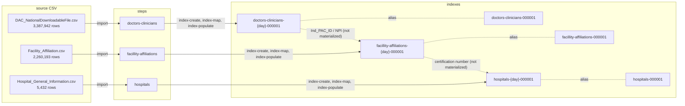

# CMS Providers

## Purpose

A reference implementation of the [entitopia framework](../README.md) over Medicare provider data. It exercises the framework at scale — 5.6M rows across three datasets — and demonstrates phonetic and fuzzy analyzers on names and addresses.

This project is deliberately the **simple** case: three independent datasets, no enrichment, no ingestion pipelines, no cross-dataset matching. See [DOT-Commercial](../DOT-Commercial/) for the enrichment and entity-matching case.

Framework concepts (steps, phases, configuration layout) and the data-loading hazards common to any dataset are documented in the [top-level README](../README.md). This README covers what is specific to the CMS data.

> **Counts here are point-in-time.** Every row count, distinct-value count and
> percentage below was measured against one CMS download. CMS republishes on its
> own schedule — and has renamed columns mid-flight before, which is how this
> project shipped three inert analyzers — so expect your own download to differ.
> The magnitudes are what the arguments rest on, not the exact figures. If your
> measurement disagrees, trust it and update this file.

## Index Data

Three independent indexes, each loaded straight from its own CSV. Nothing enriches anything else — the relationships between these datasets exist in the data (shared `Ind_PAC_ID` / `NPI` values) but are not materialized in Elasticsearch.

Each step runs the same three phases — `index-create`, `index-map`, `index-populate` — because there is nothing to enrich and no pipeline to build. That makes this project the smallest complete example of the framework.

## Open Items

1. No enrichment exists. The `Ind_PAC_ID`-to-facility and facility-to-hospital relationships shown dashed above could be materialized with enrichment policies, the way DOT-Commercial denormalizes five datasets onto its carriers index.
1. Affiliations extend to more than hospitals, so `facillity-affiliations` is broader than its name suggests.
1. **Only `hospitals` matches; `doctors-clinicians` and `facillity-affiliations` still only load.** The `hospital-duplicates` step sweeps 5,419 facilities in `all-entities` mode and emits 3,627 pairs. The other two datasets have the analyzers configured and nothing querying them. `doctors-clinicians` is the obvious next one — 3.39M rows and a three-part composite key, so it is a different size of problem, not a copy of this one.

1. **The hospitals mapping pins 7 of 38 columns.** The extract grew and the mapping did not follow, so 31 columns are dynamically mapped — the first hazard in the [top-level README](../README.md). Nothing currently reads them, so nothing is broken today; the ones the sweep touches are all pinned. It matters the moment someone filters or aggregates on a quality-rating column and finds a term query matching zero documents.

1. **What the duplicate sweep does and does not claim.** It finds facilities that resemble each other. It does **not** find fraud, and nothing in its output should be read that way: hospital records sharing a name and address are overwhelmingly legitimate multi-record facilities, campuses, or a system's several listings. Its `metrics.json` deliberately records population shape only — no `canary`, no `triage`, none of the chameleon-detection vocabulary that would make a resemblance read as an accusation.

   **Read `pairs` as directed pairs, not as relationships.** The sides are named `left` and `right` rather than `predecessor`/`successor`, because with no dated events there is no succession to assert — but the sweep still compares every record against every candidate, so A→B and B→A are both emitted. Measured: 3,627 emitted pairs cover **1,966 distinct unordered pairs**, with 1,661 of them (84%) present in both directions. Every count below inherits that, so a duplicate relationship is roughly a pair and a half. De-duplicating is [an open framework item](../README.md#open-work-items); it interacts with `max_pairs_per_predecessor`, which is per-record, so dropping a direction can lose a pair when one side's slate is full.

   Measured on 5,419 facilities: 3,627 pairs, 22 scoring ≥ 0.70, 18 ≥ 0.90, and 1,261 records hitting the 100-candidate ceiling. What sits at 0.5–0.6 is mostly two facilities in one town sharing a place name once the generic hospital words are stripped — genuine ambiguity rather than noise, and resolving it needs a judgement about whether they are one system.

1. **Generic hospital words are stopped in both name analyzers, and the list is measured.** Across the 5,419 names, `HOSPITAL` appears in 52.7%, `CENTER` in 30.2%, `MEDICAL` in 26.6%, `HEALTH` in 16.7%. This project's rule is that a token two records share more than roughly a percent of the time cannot carry a match, so everything above that is stopped and distinctive words like `MERCY`, `VALLEY` and `VA` are kept.

   Applied to `name_clean` as well as `name_phonetic`, unlike DOT-Commercial which stops carrier suffixes only in its phonetic arms — a hospital name is mostly generic by token count, while a carrier name usually keeps a distinctive token even with its suffix left in. The before/after on the full corpus: candidates examined 532,529 → 237,798, truncated predecessors 5,234 → 1,261, pairs scoring 0.5–0.6 4,285 → 1,467, of which the share sharing nothing but generic words went 59% → 0%. Pairs ≥ 0.70 and ≥ 0.90 were unchanged at 22 and 18, which is the part that matters: the noise went without taking a real match with it.

1. **The fraud-succession analysis this project was started for cannot be run on the data it downloads.** The original goal was the healthcare form of the chameleon pattern — a clinic shut down for fraud reopening at the same address, or under the same ownership, with a near-miss name. That is structurally the sweep [DOT-Commercial](../DOT-Commercial/) runs.

   The obstacle is the data, not the domain. All three extracts here are **directories**: they record who practices where and which facilities they affiliate with, which is a description of a present state. None of them records an _event_ — there is no enrollment, termination, exclusion, or reinstatement date in any of the three. Per [adding a dataset](../docs/adding-a-dataset.md), identity fields without lifecycle timing support duplicate detection but not succession, and succession is the entire fraud pattern. A duplicate sweep over these files can say two records look like the same facility; it cannot say one replaced the other.

   Restoring the original goal needs two sources this project does not download, filling the roles DOT-Commercial already fills:

   | Role                               | DOT-Commercial          | Healthcare candidate                                                                                                |
   | ---------------------------------- | ----------------------- | ------------------------------------------------------------------------------------------------------------------- |
   | Dated shutdown event               | `out-of-service-orders` | OIG **LEIE** (excluded individuals and entities, carrying an exclusion date), plus the separate reinstatement file  |
   | Entity record with a creation date | `carriers`              | NPPES NPI registry (enumeration and deactivation dates), or CMS Medicare fee-for-service public provider enrollment |
   | Corroborating join                 | `boc3-agents`           | `facillity-affiliations`, already downloaded                                                                        |

   **This table is unverified.** It is a starting point for an investigation, not a finding. Each candidate has to go through `scripts/profile_dataset.py` and be checked for the three things that decide whether it is usable at all: a real date, identity fields worth matching on, and a key it shares with the others — a dataset with no shared key needs a fuzzy pre-join, which [adding a dataset](../docs/adding-a-dataset.md) flags as substantially larger work. Design this only after measuring; specifying against remembered column names is how this project shipped three inert analyzers.

## Data

### doctors-clinicians

Broke out the clinician pipeline and indexing into their own steps so playing with the index would just be a --step with no --phase

Individual doctors or clinicians in `doctors-clinicians` have more than one entry depending on how many registrations are captured.

1. Deterministic `_id` from the composite key `Ind_enrl_ID` + `org_pac_id` + `adrs_id`. The same `NPI`/`Ind_PAC_ID`/`Ind_enrl_ID` appear in more than one row (multiple hospitals/registrations), so a clinician needs org + address to be unique. See [Document IDs](#document-ids).

### facillity-affiliations

This is more than just `Hospital` affiliations.

1. Deterministic `_id` from the composite key `Ind_PAC_ID` + `Facility Affiliations Certification Number`. See [Document IDs](#document-ids).

### hospitals

1. Hospitals `_id` is populated by the single `Facility ID` column.

## Fetching Data

Run `bash download_cms_provider.sh` from this directory. It resolves the **current** download URL for each file from the CMS provider-data metastore at runtime and downloads with `curl -sSfL`, rather than hardcoding the `.../resources/<hash>_<timestamp>/<file>.csv` paths — those are not stable (CMS republishes each dataset under a new hash/timestamp and the old path 404s). See the first validation finding below.

## Document IDs

Every dataset has an `id_field` in its `index-config.json`, so re-running a dataset's `index-populate` phase against the same day's index overwrites existing documents by deterministic `_id` instead of duplicating them (`phase_index_populate.py`'s `compute_id()` joins a list of columns with `|`). Each composite is the **minimal** key empirically verified 100% unique against the full downloaded dataset — larger keys work too but are unnecessary, and no smaller key is unique.

| dataset                  | `id_field`                                                     | rows      | why this key                                                                                                                                                                                        |
| ------------------------ | -------------------------------------------------------------- | --------- | --------------------------------------------------------------------------------------------------------------------------------------------------------------------------------------------------- |
| `hospitals`              | `Facility ID` (single column)                                  | 5,432     | naturally unique                                                                                                                                                                                    |
| `facillity-affiliations` | `["Ind_PAC_ID", "Facility Affiliations Certification Number"]` | 2,260,193 | a 2-column key **is** unique here; `[NPI, facility_type, cert]` collides on 47 rows, `Ind_PAC_ID` + affiliation cert separates all                                                                  |
| `doctors-clinicians`     | `["Ind_enrl_ID", "org_pac_id", "adrs_id"]`                     | 3,387,942 | no 1- or 2-column key is unique (best pair `[Ind_PAC_ID, adrs_id]` still collides on 49,795 rows); a clinician recurs across org + address, so enrollment + org + address is the minimal unique key |

Neither big dataset has exact full-row duplicates, so these keys separate every row (they do not collapse identical rows).

## Validation findings

Notes from validating the datasets, the download script, and loading against a live Elasticsearch (mirrors the DOT-Commercial validation work).

1. **`download_cms_provider.sh`'s hardcoded URLs 404 and corrupt the data silently.** CMS rehosts each resource under a content-hashed `<hash>_<timestamp>` path that expires; all three original URLs returned 404. Because the script used plain `curl` (no `--fail`), a 404 writes the HTML error page into the `.csv`, and the `[ ! -f "$FILE" ]` guard then caches that corruption on every later run. Fixed by resolving the current `downloadURL` from the CMS provider-data metastore (`api/1/metastore/schemas/dataset/items`) at runtime and downloading with `curl -sSfL` (also fixed a `$File`/`$FILE` typo).
2. **All three `index-mappings.json` referenced stale CMS column names, so their custom analyzers were silently inert.** CMS renamed the source columns; the mappings still used the old abbreviated names (`frst_nm`, `lst_nm`, `mid_nm`, `cty`, `st`, `phn_numbr`, `org_nm`, the typo'd `Addresss`, plus a nonexistent `EMAIL_ADDRESS`). Elasticsearch treats a mapping for a nonexistent field as inert and dynamic-maps the real fields as plain `text`+`keyword`, so `name_clean`/`name_phonetic`/`street_clean`/`phone_clean` never applied to the actual name/address/phone fields. Fixed by remapping to the current column names (`Provider First/Last/Middle Name`, `City/Town`, `State`, `Telephone Number`, `Address`, and `Facility Name` in place of `org_nm`).
3. **`ZIP Code` was dropping documents under load.** `ZIP Code` was unpinned, so Elasticsearch dynamically inferred `long` from the first numeric value; alphanumeric ZIPs like `'7221120ND'` then failed with `document_parsing_exception` under `parallel_bulk`'s concurrency, dropping 62 of 3,387,942 `doctors-clinicians` rows (failures are logged and counted, not raised). It also mangled leading-zero ZIPs (e.g. Puerto Rico `00602` → `602`). Fixed by pinning `ZIP Code` to `keyword` in `doctors-clinicians` and `hospitals` (mirroring the DOT-Commercial `insp_carrier_state_id` fix); reload then indexed all rows and preserves leading zeros. `facillity-affiliations` has no ZIP column and was unaffected.
4. **`num_rows` was capped at a 50,000-row validation sample.** Each `index-config.json` had `num_rows: 50000`, so a "full" load silently truncated (e.g. 50k of 3.39M `doctors-clinicians` rows) — the same validation-sample-in-production hazard the DOT-Commercial README calls out. Set to `null` for full loads.
5. **Two datasets had no `id_field`, so same-day reruns duplicated every row.** Added the deterministic composite keys documented under [Document IDs](#document-ids); verified idempotent (re-running `facillity-affiliations` against the same-day index left the count at 2,260,193 rather than doubling it).
6. **The "already present" guard cached a stub the same way the old one cached a 404 page.** Finding 1 replaced `[ ! -f "$FILE" ]` with `[ -s "$dest" ]` — non-empty — which defeats an HTML error page but not a short file. **Measured 2026-08-16**: a checkout carried a `Hospital_General_Information.csv` of a header and five rows in place of the 5,432-row extract. Being non-empty it satisfied the guard, so every later run would have skipped it and the corruption would have persisted indefinitely — the identical failure shape, one layer down. Fixed by testing plausibility rather than existence: a file below `MIN_PLAUSIBLE_LINES` (50) is re-downloaded rather than skipped. The floor sits two orders of magnitude under the smallest genuine file here, so it cannot reject a real download; it catches a stub or a truncated transfer. The general lesson is worth more than the fix — **an existence guard is only as good as its notion of "present", and each tightening of it has so far been defeated by a corruption the previous one did not imagine.**

## References

- Medicare Providers <https://data.cms.gov/provider-data/>
- Data Dictionary <https://data.cms.gov/provider-data/sites/default/files/data_dictionaries/physician/DOC_Data_Dictionary.pdf>
