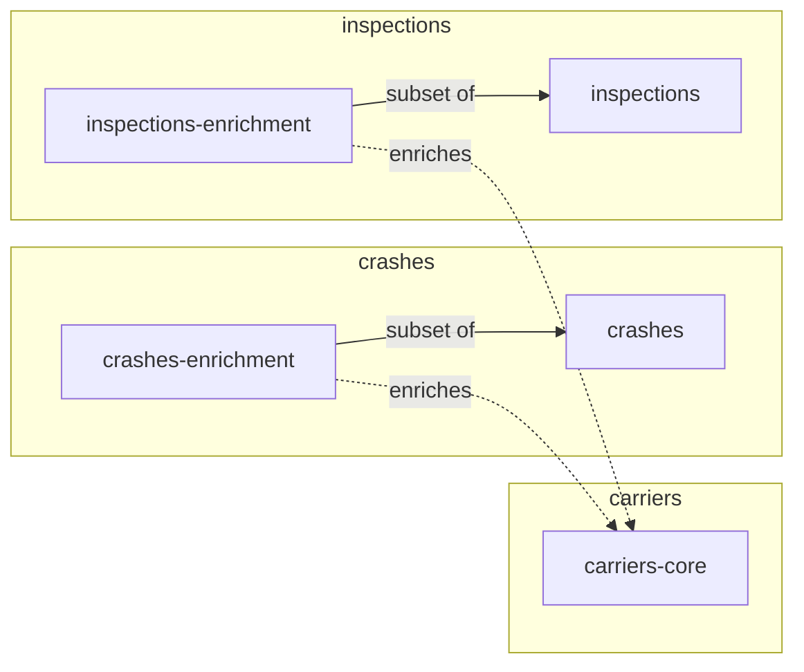
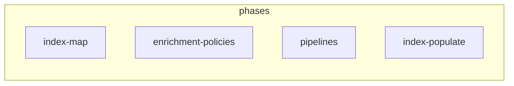
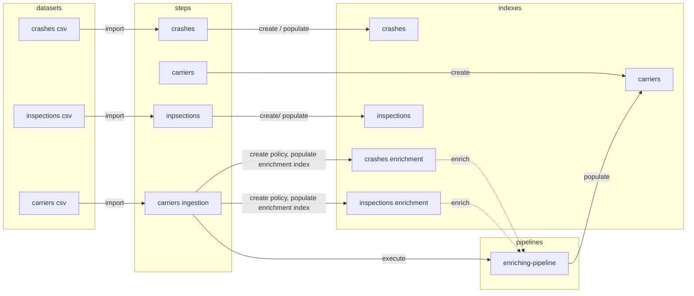

DOT Commercial https://ai.fmcsa.dot.gov/SMS/Tools/Downloads.aspx

## Index Data

```mermaid
flowchart LR
    subgraph crashes-graph[crashes]
        crashes
        crashes-enrichment -->|subset of| crashes
    end
    subgraph inspections-graph[inspections]
        inspections
        inspections-enrichment --> | subset of | inspections
    end
    subgraph carriers-graph[carriers]
        crashes-enrichment -.->|enriches| carriers-core
        inspections-enrichment -.->|enriches| carriers-core
    end
```
## Phases
Phases represent the type of work that can be done in one or more steps

```mermaid
flowchart LR
    subgraph phases
        index-map
        enrichment-policies
        pipelines
        index-populate
    end
```

## Flow

```mermaid
flowchart LR
    subgraph steps
        direction LR
        crashes-step[crashes]
        inspections-step[inpsections]
        carriers-step[carriers]
        carriers-ingestion-step[carriers ingestion]
    end

    subgraph indexes
        direction LR
        crashes-index[crashes]
        crashes-enrichment-index[crashes enrichment]
        inspections-index[inspections]
        inspections-enrichment-index[inspections enrichment]
        carriers-index[carriers]
    end

    subgraph datasets
        direction LR
        crashes-csv[crashes csv]
        inspections-csv[inspections csv]
        carriers-csv[carriers csv]
    end

    subgraph pipelines
        direction LR
        enriching-pipeline
    end

    crashes-step -->|create / populate| crashes-index
    inspections-step -->|create/ populate | inspections-index
    carriers-step --> | create | carriers-index


    crashes-enrichment-index -.->|enrich| enriching-pipeline
    inspections-enrichment-index -.->|enrich| enriching-pipeline
    carriers-ingestion-step --> | execute| enriching-pipeline -->|populate| carriers-index

    crashes-csv-->|import| crashes-step
    inspections-csv -->|import| inspections-step
    carriers-csv -->|import| carriers-ingestion-step

    carriers-ingestion-step -->|create policy, populate enrichment index| crashes-enrichment-index
    carriers-ingestion-step -->|create policy, populate enrichment index| inspections-enrichment-index


```