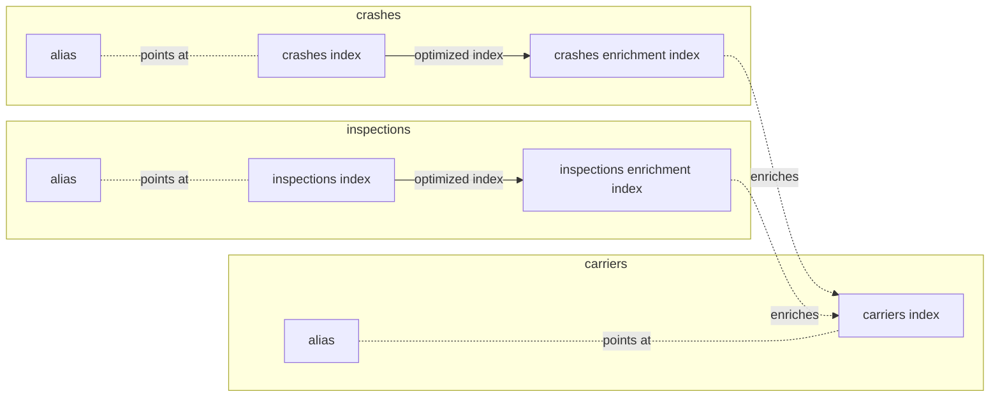
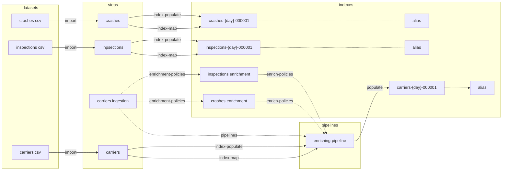

DOT Commercial https://ai.fmcsa.dot.gov/SMS/Tools/Downloads.aspx

## Processing Steps
This data set is loaded and configured in 4 steps
1. `crashes` - create an index and load the crash data
1. `inspections` - create an index and load the vehicle inpsections data
1. `carriers-ingestion` - create the enrichment indexes on `crashes` and `inspections` and an ingestion pipeline that uses them
1. `carriers` - create an index and load the carriers data using the pipeline to enrich `carriers` with data from `crashes` and `inspections`

## Processing Phases
Each step can contain one or more phases as described by json configuration files. Phases represent the type of work that can be done in one or more steps.  Each step can contain zero or more phases.

1. `index-map` - create an index and alias
1. `enrichment-policies` - create enrichment policies and the related enrichment indexes
1. `pipelines` - create elasticsearch ingestion pipelines
1. `index-populate` - load data into an index

## Index Data
The data is organized and related as follows.

## Flow
An integrated view of the steps and phases.

