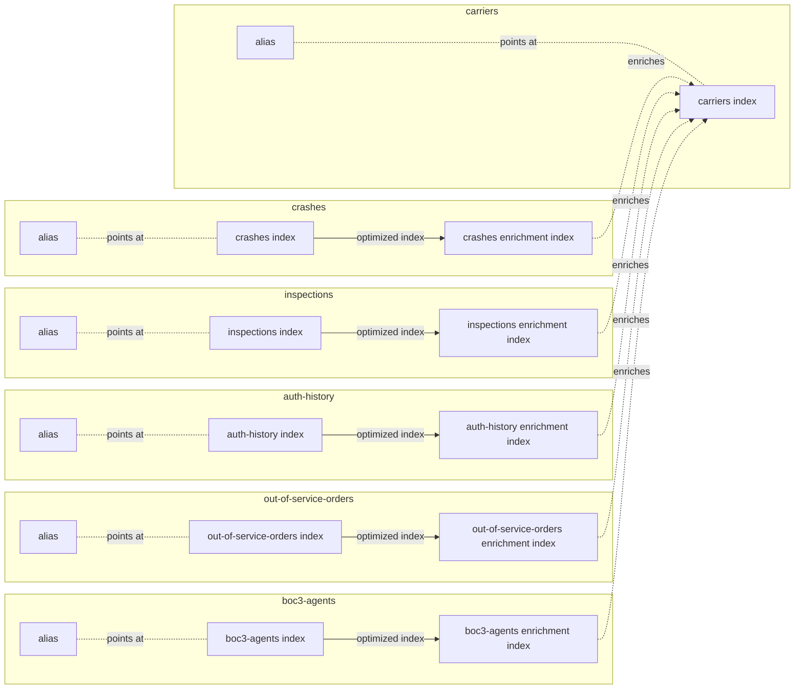
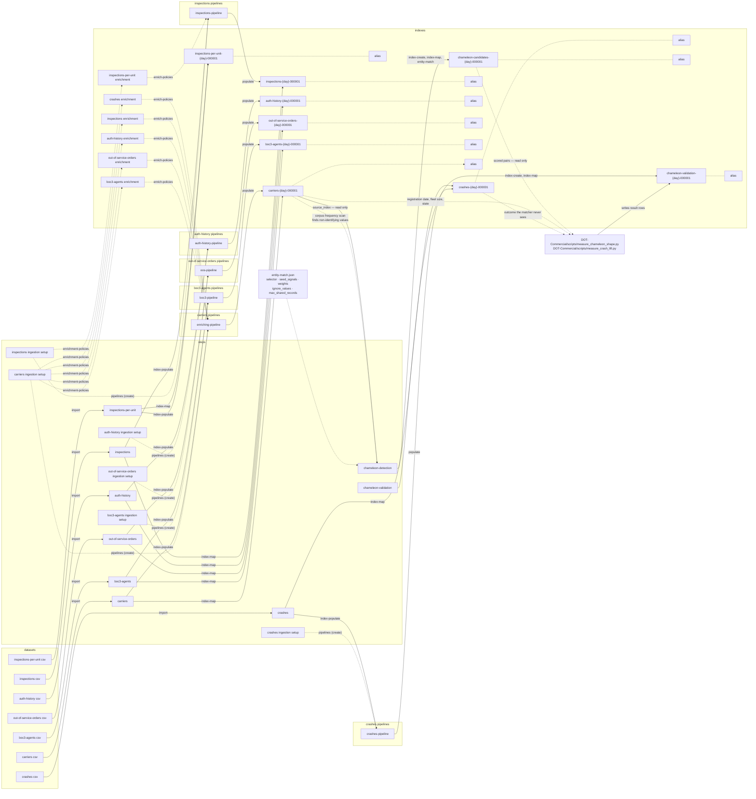

# DOT Commercial

A reference implementation of the [entitopia framework](../README.md) over FMCSA commercial trucking data. It is the **complex** case: seven datasets, six enrichment policies, a two-level enrichment chain, ingestion pipelines, and the project's first `entity-match` step.

Its goal is detecting **chameleon carriers** — trucking companies shut down for safety or insurance reasons that reopen under a new DOT number while reusing the same addresses, phones, trucks, and near-identical names.

Framework concepts (steps, phases, configuration layout) and the data-loading hazards common to any dataset are in the [top-level README](../README.md). This README covers what is specific to the FMCSA data.

> **Counts here are point-in-time**, measured against the **July 2026** FMCSA
> extract unless stated otherwise. FMCSA republishes continuously: carriers are
> added and shut down daily, so row counts, the predecessor population, the
> placeholder values in `ignore_values`, and every match count below will differ
> on your own download. Sweep results depend on the extract twice over — once
> through the data and once through thresholds tuned against it. Treat these as
> evidence of magnitude and shape, not as figures to reproduce.

On the DOT Site <https://data.transportation.gov/Trucking-and-Motorcoaches/>

## Open items

Dataset-specific. Framework-level items are in the [top-level README](../README.md).

1. **`entity-match` thresholds are still uncalibrated, though it has now run against production data.** A full sweep over the July 2026 extract (2,085,534 carriers, 48,540 predecessors, 500 candidates each) emitted **421,846 pairs** from 22,316,105 candidates examined, of which 80.1% score below 0.50 — that band is noise. Applying the triage filter — re-registered within a year of shutdown, scoring ≥ 0.70, and sharing a VIN or phone/email — leaves **906 pairs**, of which 436 reuse the _byte-identical_ legal name. Measured 2026-08-06 against a carriers index whose stamped analysis fingerprint (`0595ca890d9ec6fb`) equals the one computed from the shipped config, so every figure here is re-derivable rather than historical.

   **State the triage filter exactly, because its prose reading and its query disagree.** As run, it is `gap_days <= 365`, `total_score >= 0.70`, and `matched_on` containing `vin-overlap` or `exact-identifier` — bounded above only. It therefore admits pairs whose successor registered _before_ the predecessor's shutdown, sometimes by years, which is not what "re-registered within a year of shutdown" describes. Adding the obvious lower bound (`gap_days >= 0`) cuts the same run from **906 to 186**. Both are recorded because 906 is what every earlier revision of this item measured and 186 is what its sentence meant; the filter differs, not the data. Prefer 186 when the question is "who reappeared after being shut down."

   That also resolves the "roughly 195 pairs" an earlier revision cited and could not reproduce. It is the 2026-08-01 run under the lower-bounded filter — re-measured directly as **195**, against the **957** the same run yields unbounded. So the three figures that looked irreconcilable (195, 906, 957) are two filters over two runs, not a lost measurement. Nothing here is unaccounted for any more.

   The scores remain **uncalibrated confidence, not probability.** `total_score` is a weighted mean of evaluable signals renormalized over their weights; nothing has been fitted against known outcomes, so 0.9 does not mean 90% likely. Turning it into a probability needs labelled FMCSA enforcement results, which the project does not have. Until then, treat the ranking as triage order and the per-signal `matched_on` / contributions as the reason to act.

   Separately reviewable: **675 pairs share a vehicle and nothing else** — no name, address, or phone overlap. These are unreachable without VIN seeding and score ~0.11, so they surface only because `vin-overlap` is marked `conclusive`; they will never appear in a score-ranked list. Triage them by `gap_days`, not by score. Shape of the strongest example measured: `<CARRIER-A>` → `<CARRIER-B>`, unrelated legal names, same city, re-registered 14 days after shutdown, operating a truck with the same VIN.

   Sanity anchors from that run, useful when re-tuning: the top of the list is dominated by carriers re-registering under a **byte-identical legal name** at the same address and phone within days of shutdown — the strongest measured pair reused its name exactly and re-registered **one day** after being placed out of service, scoring 0.9998 on name, address, phone and timing together. If a config change stops surfacing that shape, the change is wrong. Re-checked against the 2026-08-06 run and unchanged, which is the check this paragraph exists to demand.

   **The controlled comparison an earlier revision called for has now been run, and the stop-list correction barely moved anything.** Two sweeps over the same July 2026 extract, differing only in the `unit_designator_stop` fix — seven spelled-out words (`space`, `office`, `pier`, `trailer`, `hangar`, `building`, `slip`) removed, `spc` added — with no change to `entity-match.json` or anything under `matching/` in between:

   |                             |  before |                      after |
   | --------------------------- | ------: | -------------------------: |
   | pairs emitted               | 421,613 | **421,846** (+233, +0.06%) |
   | scoring below 0.50          |  80.14% |                     80.06% |
   | triage set (906 filter)     |     906 |                    **906** |
   | ↳ byte-identical legal name |     436 |                    **436** |
   | vehicle-only pairs          |     675 |                    **675** |

   The correction perturbs the noise band and leaves the reviewable set untouched — the expected outcome for a change affecting roughly 2,800 `phy_street` values out of 2,085,534, and a useful negative result: street-token changes of this size are not what is holding calibration back. Weighting is (see the next item).

   **The calibration question above finally has an answer against reality, not just against itself, and it is recorded here in full because the theory-of-operation explainer's [§9](docs/chameleon-pipeline-explainer.md#9-does-the-score-actually-predict-anything) only summarizes it.** Two validations, primary then secondary per the design's own framing, both measured 2026-08-08 against the same `carriers-000001` / `chameleon-candidates-000001` aliases (fingerprint `0595ca890d9ec6fb`, unchanged from the sweep above) and persisted to the `chameleon-validation-000001` alias, so either run is re-derivable by `run_id` rather than only quotable from this paragraph.

   Primary — does the score find chameleon-shaped pairs, checked directly against the README's own definition ("shut down... that reopen under a new DOT number"), no proxy or external data needed: `.venv/bin/python DOT-Commercial/scripts/measure_chameleon_shape.py`. Of the **1,729 pairs scoring ≥ 0.70**, the `gap_days` distribution is 728 registered more than 180 days _before_ the predecessor's shutdown (42.1%), 161 within the `temporal` signal's own 180-day pre-positioning window (9.3%), 435 within a year after (25.2%), and 405 more than a year after (23.4%) — **only 34.5% (596 of 1,729) is temporally coherent** within the scorer's own window. Mean `total_score` separates pre-shutdown pairs (0.4425 over 306,401) from post-shutdown pairs (0.4520 over 115,445) by just **0.0095**. `TemporalSignal` is not broken — `matching/signals.py` deliberately gives a pre-shutdown pair partial credit (`BACKWARD_WINDOW_DAYS = 180`, `BACKWARD_SCALE = 0.5`) because pre-positioning a successor ahead of a known-coming shutdown is a real tactic — it is simply outvoted: `temporal` carries 0.05 of the 0.94 configured total (a ceiling of ~0.053 on any score), while the three name signals above carry 0.45 combined, nine times as much. **This is independent corroboration of the name-triple-weighting item below, not a new defect.** A caveat that travels with it: 49 CFR 386.73 covers operating as an _affiliated entity_, not only under a new identity, so a high-scoring pair naming a pre-existing company is not automatically a false positive — it may be a genuine affiliate. What it is not is _reincarnation_, which is what this project says it hunts. (Item 3, closed below, has since gated the live sweep on exactly this window — the 34.5% measured here against the 2026-08-06 run is 100% in the current `chameleon-candidates-000001` output.)

   Secondary — does the flagged population show GAO-12-364's measured crash lift (18% vs 6%, a proxy for safety risk, not a redefinition of "chameleon"): `.venv/bin/python DOT-Commercial/scripts/measure_crash_lift.py`. Crash window (read from `crashes-000001`, reloaded to 333,120 docs matching `crashes.csv` exactly — a prior index held 333,122 from an older rolling-window extract, so any earlier crash-figure quote will show small, legitimate movement against this one): 2024-08-12 to 2026-07-29. 249,778 distinct successors; the restricted cohort (`add_date` before the crash window, comparable to GAO's figures) is **196,707** (21.2% excluded as registered inside the window). Per-band crash rate inside that cohort does not rise with score:

   | score band | carriers | crashed |   rate |
   | ---------- | -------: | ------: | -----: |
   | 0.35-0.50  |  146,045 |   9,683 |  6.63% |
   | 0.50-0.60  |   46,797 |   2,296 |  4.91% |
   | 0.60-0.70  |    1,275 |      69 |  5.41% |
   | 0.70-0.80  |      283 |      39 | 13.78% |
   | 0.80-0.90  |      156 |      19 | 12.18% |
   | 0.90-1.00  |      145 |       6 |  4.14% |

   Flagged successors crashed at **6.64%** overall; the whole unflagged population (standardized by registration-year/fleet-size/state to the flagged cohort's mix, 252 strata excluded for holding no controls) crashed at **6.02%** — a lift of **1.10x** against GAO's published **3.0x**. The permuted-score placebo landed within a point of the same rate on the two bands holding 98.0% of the restricted cohort ((146,045 + 46,797) / 196,707); the small high-score tail bands (n=145-283) moved more, consistent with sampling noise at that count rather than a real trend. **Report this as "the flagged population is not measurably riskier than comparable carriers," never as a verdict on matching accuracy** — crash involvement is a proxy GAO used because chameleon carriers matter for safety, not this project's definition of one. The loaded census also carries no officer name, EIN, or DUNS — three of the identifiers FMCSA's own ARCHI tool matches on — so a weak lift is at least as consistent with missing inputs as with a bad scorer. **Both validations measure precision-shaped properties only** — whether a flagged pair is temporally coherent, and whether the flagged population is riskier than comparable carriers. Neither can measure recall: there is no list of known chameleon carriers to check the sweep against, so a real chameleon it never surfaced is invisible to both methods.

   **Why GAO measured 3.0x and this sweep measures 1.10x: dilution, not a difference in how the outcome was measured.** GAO flagged **1,136 carriers**; this sweep flags **249,778 distinct successors — 12.0% of every carrier in the census**. A flagged set that is mostly false positives has a crash rate that converges on the population base rate by arithmetic, and this one did: 6.64% flagged, 6.02% standardized control, 5.86% base. Three independent lines agree on that reading:

   - **A structural ceiling.** A predecessor has at most _one_ true successor. Of the **48,540** predecessors the selector examined, only **46,792** appear in at least one emitted pair — the rest are inert for this ratio, since a predecessor with no pair cannot contribute a true positive either way. Against that pair-producing denominator the sweep emits **9.0 pairs per predecessor** (421,846 over 46,792). So at most 46,792 pairs — **11.1%** — can be correct, and that assumes every shut-down carrier reincarnated, which is nowhere near true. (Dividing by all 48,540 examined instead gives 8.7 pairs and a 11.5% ceiling — close enough to read the same way, but the two denominators answer different questions, so pick one and say which.) The real ceiling is a fraction of 11.1%.
   - **The dilution arithmetic.** If true positives carry GAO's 3.0x and false positives sit at base rate, an observed 1.10x implies a true-positive share of `(1.10 - 1) / (3.0 - 1)` ≈ **5%** — comfortably under the structural ceiling, which is what an independent estimate should look like.
   - **The primary measurement, by a different route.** Only 34.5% of the ≥ 0.70 tier is temporally coherent. Different method, same conclusion. (Since gated to 100% by item 3, closed below; this bullet describes the pre-gate measurement that motivated the gate, not the current sweep.)

   Two population differences compound it. GAO examined **new applicants** — a narrow funnel by construction — while this sweeps 2,085,534 carriers. And GAO required attribute match **and** demonstrated motive to evade; the motive filter here (an out-of-service order) was measured against the July 2026 extract cited throughout this validation, which predates the `nested`-mapping fix below and its unchanged-population result — this validation's population figures were not re-run after that fix, since it did not change the predecessor set. FMCSA's own vetting also matches officer names, EIN and DUNS, none of which the census carries.

   Ruled out as explanations: the **24-month crash window** (the control used the identical window, so the comparison is internally consistent) and the **outcome definition** (the measured base rate — 5.86%, against the current `crashes-000001` index this validation reads throughout — lands within 0.14 points of GAO's 6%, which is strong evidence it is the same outcome variable). The 5% figure is a one-parameter model assuming GAO's lift transfers and false positives sit exactly at base rate; GAO's population was 2005-2010 new applicants rather than 2026 carriers, so treat it as an order-of-magnitude read.

   **This is a precision problem, and precision is fixable.** Ranked by expected effect on the dilution above:

   | #   | Change                                                                                         | Why it should tighten precision                                                                                                                                                                                                                                                     | Status                      |
   | --- | ---------------------------------------------------------------------------------------------- | ----------------------------------------------------------------------------------------------------------------------------------------------------------------------------------------------------------------------------------------------------------------------------------- | --------------------------- |
   | 1   | Map `out_of_service_orders` as `nested` and use a `nested` query in `matching/predecessors.py` | Was expected to shrink the predecessor set at the source; measured instead to leave it unchanged on this extract, because no carrier here currently has the split-order shape the bug required. Still repairs `shutdown_date`/`gap_days` for any carrier that does have that shape. | **closed** — measured below |
   | 2   | Rebalance signal weights away from name                                                        | 0.45 of 0.94 sits on one field while `temporal` gets 0.05, which is why 42.1% of the top tier sits outside the modelled window and still clears 0.70 on name and address alone. A complete name change is the defining chameleon move.                                              | **closed** — measured below |
   | 3   | Require temporal coherence rather than scoring it                                              | A successor registered more than 180 days before the shutdown fails the project's own definition. Gating the score on it, rather than leaving it a 5%-weighted signal, removes pairs outside the window outright regardless of how well name and address otherwise match.           | **closed** — measured below |
   | 4   | Parse street into house number / name / unit                                                   | `100 MAIN ST` vs `200 MAIN ST` scores 0.525 on a signal weighted 0.20 — a false-positive generator at scale.                                                                                                                                                                        | open item below             |
   | 5   | Source officer name (EIN and DUNS are not obtainable — see below)                              | The identifiers ARCHI matches on and this census lacks. Still the largest single lever, but only one third of it is actually available; the other two are dead ends, which is worth knowing before anyone plans work around them.                                                   | not yet an item             |

   **Item 1 has now been measured, and the result is not the one the table above predicted.** Two sweeps over the same July 2026 extract, differing only in the `out_of_service_orders` mapping (`object` vs `nested`) and the corresponding query in `matching/predecessors.py` — nothing else under `matching/` or in `entity-match.json` changed:

   |                         |  before |   after |
   | ----------------------- | ------: | ------: |
   | predecessors examined   |  48,540 |  48,540 |
   | pairs emitted           | 421,846 | 421,844 |
   | `coherent_share_ge_070` |  34.47% |  34.47% |
   | `vin_only`              |     519 |     519 |
   | `vin_only_identity`     |     675 |     675 |
   | `triage_bounded`        |     186 |     186 |
   | `identical_name_triage` |     436 |     436 |

   The predecessor population is identical, carrier for carrier — not just equal in count. Diffed the actual `dot_number` sets matched by each query rather than trusting the totals: zero carriers differ either direction. No carrier in this extract currently has an out-of-service order whose `status` and `oos_date` only jointly satisfy the `out-of-service` selector's configured filters (`ACTIVE`, `oos_date_from: 2020-01-01`) when pulled from two different array elements — the exact shape the `object` mapping's flattening bug required. The fix is real and was proven correct independently on a synthetic document holding that shape (matched under the old `object` mapping, correctly excluded under `nested`); this extract simply doesn't contain a carrier the bug was affecting, under this selector's current filters. The 2-pair difference (421,846 → 421,844) is within `max_candidates` truncation noise — 43,111 of 48,540 predecessors hit the 500-candidate ceiling on this run, so a tie at that boundary can move by a document or two between runs with no change in selection logic. No guarded metric regressed (`scripts/compare_sweeps.py` exit code 0), so the change was kept: `carriers-000001` now points at the `nested`-mapped index, and `matching/population.py` queries it as `nested`. See the closed item below for the fix itself.

   **Item 3 has now been measured, and it is implemented differently from how the table above describes it — recorded here rather than silently done differently.** The gap is a property of the _pair_ (successor `add_date` minus predecessor `oos_date`), not of the predecessor alone, so it cannot be expressed as a predecessor-only selector query. It is instead a `PairScorer` guard (`matching/scorer.py`): `scoring.min_gap_days` / `scoring.max_gap_days` in `entity-match.json`, both `None` by default so an unconfigured deployment is unaffected, drop a pair outright — `score_pair` returns `None` — when its gap falls outside the window, before any score threshold is applied. Configured to `-180` / `365`: the same `BACKWARD_WINDOW_DAYS` the `temporal` signal itself already treats as a plausible pre-positioning window, and the same `max_gap_days` the signal already uses, so the gate admits exactly what the scorer claims to model and nothing wider.

   Two sweeps over the same July 2026 extract, differing only in this gate:

   |                          |  before |   after |
   | ------------------------ | ------: | ------: |
   | pairs emitted            | 421,844 | 258,326 |
   | `pairs_ge_070`           |   1,729 |     596 |
   | `coherent_ge_070`        |     596 |     596 |
   | `coherent_share_ge_070`  |  34.47% |    100% |
   | `vin_only`               |     519 |       1 |
   | `vin_only_identity`      |     675 |     190 |
   | `triage_unbounded`       |     906 |     291 |
   | `triage_bounded`         |     186 |     186 |
   | `identical_name_triage`  |     436 |     153 |
   | `canary`                 |      11 |      11 |
   | predecessors with a pair |  46,792 |  41,969 |

   `coherent_share_ge_070` — the whole point of the gate — moved from 34.47% to **100%**: every pair the current sweep scores ≥ 0.70 now falls inside the window the scorer itself models, because a pair outside it can no longer reach that score at all. `coherent_ge_070`, `triage_bounded` and `canary` hold exactly flat, so the pairs the gate is supposed to preserve survived completely intact — nothing coherent was lost reaching this result.

   `identical_name_triage` fell 436 → 153, which `scripts/compare_sweeps.py` flags against its `within_10pct` expectation (exit code 1). Investigated rather than waved through: of the baseline's 436, exactly 283 have `gap_days < -180` — a successor registered more than 180 days _before_ the predecessor's shutdown, sharing an identical legal name coincidentally with respect to timing. That is precisely the shape this item exists to remove, and `triage_bounded` does not count it (it already excludes `gap_days < 0` and held flat at 186 both runs) because `identical_name_triage`'s own definition, unlike `triage_bounded`'s, carries no lower bound on `gap_days`. The metric predates this gate and does not distinguish direction; the fall is the gate working as intended against a metric that happens not to share its floor, not a lost match. Kept on that basis: `chameleon-candidates-000001` now points at the gated sweep, measured 2026-08-11.

   The 34.5% coherent-share figure the primary validation above measures against the 2026-08-06 run no longer describes the live sweep: gated to **100%** by this item, an incoherent pair cannot reach the ≥ 0.70 tier at all any more. That earlier paragraph is left as-is because it documents the measurement that motivated this gate, not because the number is still current.

   **Operational note for whoever runs this sweep next.** The full-scale run died silently three times before this result — no traceback, no error text, the log stopping mid-setup each time, always within a narrow band of roughly the same 48% of the predecessor population processed regardless of launch mechanism or host memory state at the time. Root cause undetermined: `log show` was non-functional in the sandbox this was diagnosed in, so no OS-level kill signature was ever captured, and a data-triggered cause (one carrier's outsized sub-document array, since the selector processes predecessors sorted by `dot_number` and the deaths clustered at a consistent relative position) could not be ruled out before two larger bisection runs and the full run itself all completed cleanly, which points toward something transient — contention, timing, host memory pressure — rather than a deterministic trigger in this task's own code. Separately, and worth fixing on its own regardless of this: `phase_entity_match.py` logs nothing between the setup phase and the final `entity-match complete` line, so a hung run and a genuinely-working long run are indistinguishable from the log, or from a document count that looks "stable" for the same reason a finished run's does. That gap is what made three separate death reports need independent verification before anyone could trust them, and will cost the next person the same time.

   **This task's own sweep hit the same failure signature again, twice, before a third attempt succeeded — recorded here only because it's the same reliability hazard the paragraph above describes, not a new one.** Two attempts against the identical command died silently, log stopping mid-setup with no traceback, before a third attempt (launched with `PYTHONFAULTHANDLER=1` to rule out a native crash) completed cleanly and produced no fault-handler output — ruling out a segfault as this run's explanation. A continuous host memory trace taken across the second death showed free memory dropping to double digits of MB (on a 64GB host) in the final minutes before the process vanished, with a sharp spike in non-pageable ("wired") memory partway through — stronger direct evidence for host memory pressure than the snapshot-only evidence available for the incident above, though still not a confirmed root cause. Two independent tasks now hitting the identical signature on the identical command raises this from "possibly transient" toward "worth investigating directly" (e.g. a bounded-memory run or a profiler) if it recurs a third time.

   **Item 2 has now been measured, and the rebalance was kept.** Two sweeps over the same July 2026 extract, differing only in `entity-match.json`'s signal weights — the three name signals reduced from `0.22`/`0.13`/`0.10` (0.45 combined) to `0.15`/`0.09`/`0.06` (0.30 combined), holding their 22:13:10 ratio, with the 0.15 moved onto `exact-identifier` (`0.12` → `0.19`) and `vin-overlap` (`0.08` → `0.16`); `address` (0.20), `temporal` (0.05) and `agent` (0.04) unchanged; total held at 0.94 so `min_total_score = 0.35` keeps its meaning:

   |                          |  before |  after |
   | ------------------------ | ------: | -----: |
   | pairs emitted            | 258,326 | 77,237 |
   | `pairs_ge_070`           |     596 |    611 |
   | `coherent_share_ge_070`  |    100% |   100% |
   | `vin_only`               |       1 |      1 |
   | `vin_only_identity`      |     190 |    207 |
   | `triage_bounded`         |     186 |    197 |
   | `identical_name_triage`  |     153 |    145 |
   | `canary`                 |      11 |     11 |
   | predecessors with a pair |  41,969 | 23,247 |

   `scripts/compare_sweeps.py` exit code 0 — no guarded metric regressed. `pairs` and `predecessors with a pair` both fall sharply (informational, not guarded): with less of the score coming from name, more candidates that previously cleared 0.35 on name-plus-address alone no longer do, which is the intended effect of moving weight onto harder-to-fake corroboration. Everything gated `must_not_fall` held or rose, including the two identifiers this task deliberately upweighted (`vin_only_identity` +8.9%, `triage_bounded` +5.9%).

   `identical_name_triage` fell 153 → 145 (**−5.2%**), inside the `within_10pct` budget the brief set for exactly this metric, on the reasoning that reducing name weight should cost some byte-identical-name pairs their only lift over the 0.70 tier. Investigated rather than taken on faith: diffing the two runs' `identical_name_triage` populations by predecessor/successor DOT-number pair finds **8 pairs lost, 0 gained**. Every lost pair scored `0.7044`–`0.7280` under the old weights — clustered immediately above the 0.70 floor — and all eight already carried `exact-identifier` and `temporal` in `matched_on` alongside the name signals, meaning corroboration was present but the pair depended on name weight to clear the tier at all. That is precisely the mechanism the brief predicted, not an unexplained loss.

   Secondary validation moved the opposite direction from what the dilution arithmetic predicted, and that is reported rather than smoothed over. `scripts/measure_chameleon_shape.py` confirms the primary result holds under the new weights: the `180d+ before` band — the one Task 3's gate exists to remove — is **0.0% in every score band**, unchanged from the gated baseline. `scripts/measure_crash_lift.py` against the smaller, more corroboration-weighted flagged population (51,634 distinct successors; 25,080-carrier restricted cohort) measured a lift of **0.92x** — below 1.0, and below both GAO's 3.0x and the 1.10x measured against the original, ungated, name-heavy sweep. The brief flagged this possibility explicitly: a flat or falling lift here does not distinguish a worse scorer from the crash-proxy's own limits, since the flagged population's temporal coherence (the primary, ground-truth-adjacent check) held at 100%. Recorded as a genuine null result on the secondary, proxy-based check, not as evidence against the rebalance.

   Kept on the primary check and the guarded comparison: `chameleon-candidates-000001` now points at the reweighted sweep, measured 2026-08-12.

   **The first sweep over a corpus the loader no longer corrupts, measured 2026-08-13, and the reviewable set did not move at all.** Every dataset was reloaded after `csv_load_utils.py` stopped inferring column types (top-level README, closed items): leading zeros are preserved, 66 previously-unpinned fields are typed explicitly, `float` is gone from every mapping, and `auth_history` / `boc3_agents` join through new normalization pipelines. `carriers` was rebuilt against the `nested` mapping. This is a **data** change, not a scoring change — nothing under `matching/` or in `entity-match.json` differs from the run above:

   |                          | before |  after |
   | ------------------------ | -----: | -----: |
   | pairs emitted            | 77,237 | 75,537 |
   | `pairs_ge_070`           |    611 |    584 |
   | `coherent_share_ge_070`  |   100% |   100% |
   | `vin_only`               |      1 |      1 |
   | `vin_only_identity`      |    207 |    208 |
   | `triage_unbounded`       |    302 |    302 |
   | `triage_bounded`         |    197 |    197 |
   | `identical_name_triage`  |    145 |    145 |
   | `canary`                 |     11 |     11 |
   | predecessors with a pair | 23,247 | 23,040 |

   `scripts/compare_sweeps.py` exit code 0, no guarded metric regressed. **What did not move is the result.** `triage_bounded`, `identical_name_triage`, `triage_unbounded` and `canary` are identical, and **98.4% of the pair drop (1,673 of 1,700) sits below 0.70** — entirely inside the band this item already calls noise. A reload that changed the type of 66 fields and rewrote two join keys cost no evidence in the tier anyone reviews, which is where damage would show first.

   Read it as _no measurable effect_, not as an improvement: nothing here targeted precision, and the plan's own rule is that a smaller pair population proves nothing by itself. The residual churn is most plausibly the shared-value `ignore_values` lists recomputing against the reloaded corpus, since they are derived from the live index at sweep time. Two controls support the comparison being like-for-like: **48,540 predecessors**, the same figure every run above reports, and analysis fingerprint `0595ca890d9ec6fb`, unchanged — so no part of the movement is differently-analyzed tokens. Recorded as `task-6` in `data/precision/result-indexes.txt`, with the summary in `data/precision/baseline-post-reload.json` as the reference point for future work.

   Item 5 has no home elsewhere in this list, so it is recorded here. Items 1, 2 and 3 have now been measured, above; items 4 and 5 have not, and the ordering among the remainder is still an expectation, not a measurement — re-run both validation scripts after each to find out.

   **On item 5 specifically, researched 2026-08-08 and recorded so it is not re-researched.** The three ARCHI identifiers are not equally available, and two of them are not available at all:

   - **DUNS is obsolete.** The federal government retired it on 2022-04-04 in favour of the [UEI in SAM.gov](https://www.fema.gov/node/what-unique-entity-identifier-uei-and-how-it-related-system-award-management-sam). GAO-12-364 cites DUNS because it was written in 2012. DUNS still exists only as Dun & Bradstreet's commercial product — licensed, not bulk-downloadable. UEI is free but covers only entities registered for federal awards, which most small carriers are not.
   - **EIN is not public.** FMCSA collects it at registration and does not disseminate it; the IRS publishes EINs only for tax-exempt organizations. No public dataset of carrier EINs exists, and a tax identifier is an unlikely FOIA result.
   - **Officer name is obtainable, but not from FMCSA.** Verified: the carriers index has 47 fields and none is officer/owner/contact/principal, and `carriers.csv` has no such column. It would have to come from state Secretary of State registries (authoritative, but 50 different formats), an aggregator such as OpenCorporates (one API, paid for bulk), FMCSA's [L&I system](https://li-public.fmcsa.dot.gov/lihtml/liintro.html) (whose [data.gov entry documents HTML access only](https://catalog.data.gov/dataset/licensing-and-insurance), no bulk file), or FOIA.

   **A person-name field is already downloaded and unused.** `boc3_agents.attn_to_or_title` is indexed, populated on **75.4% of sampled rows**, and referenced by no signal in `entity-match.json`. It is the process agent's contact rather than the carrier's officer, so it is weaker than what ARCHI matches on and will be shared across a filing agent's entire book of business — the exact false-positive shape `ignore_values` exists to suppress. Recorded because it costs nothing to evaluate if item 5 is ever picked up: the data is already on disk and in the cluster. Not judged worth measuring yet.

1. **Superseded indexes are never pruned.** Since the alias swap landed, a reload leaves the previous date-stamped index on disk, still holding a full copy of the dataset but no longer answering to the alias — so it is both invisible to every consumer and consuming disk. That trade was deliberate (a correctness fix should not delete data), but it means retention is now an unowned operational decision: nothing here says how many reloads back to keep or removes anything. Any existing cluster also still carries the indexes accumulated before the fix; each alias is repaired by the next run of its step, but the detached indexes remain.

1. **`AddressSignal` scores a street as an unordered bag of tokens, so the house number carries no more weight than the word `STREET`.** Two different buildings on one road overlap on everything except one token: `100 MAIN ST` against `200 MAIN ST` scores 0.75 containment, **0.525** after `fuzzy_scale`, on a signal weighted 0.20. Canonical-token contraction reduced but did not remove this, since it shrinks the denominator as well. The fix is to parse the street into house number, street name and secondary unit and score the parts separately, letting a house-number mismatch cap the result rather than cost one token. Deferred from the address synonym normalization work.

1. **Nothing here measures recall, and the one artifact that could is drawn but unread.** Every metric in this file measures a precision-shaped property — temporal coherence, corroboration, the canary shape, crash lift. None can measure recall, because there is no list of known chameleon carriers to check the sweep against, so **a real chameleon the sweep never surfaced is invisible to all of it.** The `within_10pct` tripwires on `vin_only`, `triage_bounded` and `identical_name_triage` are proxies: they detect a change that destroys evidence shapes the sweep already found, not one that fails to find something new.

   `DOT-Commercial/scripts/sample_pairs_for_review.py` exists to make the missing judgment cheap rather than to supply it. A 60-pair stratified sample — 15 in each of `0.35-0.50`, `0.50-0.70`, `0.70-0.90`, `0.90-1.00` — was redrawn 2026-08-15 against the `task-6` index (`chameleon-candidates-2026.08.13-000001`, 75,537 pairs scanned, scores spanning 0.350315 to 0.99926) and **all 60 verdicts are `null`**. Adjudicating them is a human's job: it means weighing a byte-identical name, a shared address and a plausible timeline the way the sanity anchors above do, which is exactly the judgment this project has refused to put behind a heuristic. No subagent, and no automated rule, should fill that field in.

   The sample file is gitignored under `*/data/`, so **do not treat it as the artifact of record** — regenerate it, which is why the sampler takes a seed and shuffles deterministically:

   ```bash
   .venv/bin/python DOT-Commercial/scripts/sample_pairs_for_review.py \
     --pairs-index "$(awk '/^task-6 /{print $2}' DOT-Commercial/data/precision/result-indexes.txt)"
   ```

   The same seed against the same index reproduces the same 60 pairs, which is also what lets a second reviewer check agreement — the first thing anyone will want to do with a small hand-labelled set. That is also why the redraw above cost nothing: the sample it replaced held no verdicts, and re-running the command reproduces the current one exactly. That last claim is now tested rather than asserted — a redraw against the same index on 2026-08-15 produced a byte-identical file — which matters because it is the only thing making it safe to regenerate a file that may by then hold someone's hand-written verdicts. Whatever precision-at-k comes out of the review belongs in this item, beside the figures it is finally able to qualify.

### Closed work items

1. **`insp_carrier_state_id` was unpinned, but the document loss this item blamed on it never happened.** The item asserted that Elasticsearch dynamically inferred `float` from whichever value `parallel_bulk` saw first, so every non-numeric row failed with `document_parsing_exception`, dropping 36,788 of 5,647,567 inspections with the victims varying by thread ordering. Measured against the live cluster on 2026-08-12, none of that is what the loader does. `utils/csv_load_utils.py` calls `pd.read_csv` with no `dtype`, so **pandas resolves each column's type once over the whole file before Elasticsearch ever sees a document**. The column mixes two-letter state codes and `NONE` with numerics, so pandas infers `str`, every value arrives as a JSON string, and dynamic mapping picks `text` — which accepts all of them. The inference is therefore neither numeric nor concurrency-dependent, and the pre-fix index was not lossy: the `text`-mapped index and the `keyword`-mapped one both hold **5,662,304 documents, exactly the CSV's row count**, and both carry the field on **1,082,951** of them, exactly pandas' non-null count for the column. **Rows recovered by the fix: 0.**

   The pin is kept regardless, for the reason the item should have given: `keyword` is the correct type for an identifier column that genuinely mixes numeric and non-numeric values (38,065 non-numeric on this extract), and pinning removes the dependence on inference altogether — including the `ignore_above: 256` that the inferred `text` mapping silently carried. No downstream reload was needed and none was run: the field is absent from the inspections enrich policy (`dot_number`, `inspection_id`, `units.insp_unit_vehicle_id_number`) and from every matching config and code path, so the corpus the chameleon sweep reads is unchanged and the sweep baselines above still describe it.

   The transferable lesson is not about this column. A failure mode was described in precise, plausible mechanical detail — concurrency, first-value inference, a named exception, a row count to two significant figures — and carried across three documents for weeks without anyone comparing two indexes. **The `float` inference was assumed from the column's contents, never observed in a mapping.** Checking cost two `curl`s.

1. **`entity-match` could over-select predecessors** because `out_of_service_orders` was mapped as a plain `object` rather than `nested`. A carrier with an ACTIVE 2015 order and an INACTIVE 2022 order would satisfy `status: ACTIVE` and `oos_date >= 2020` from two _different_ array elements, so it would be swept even though no single order matched both filters, and `TemporalSignal` could report a `shutdown_date` from the order the selector never intended to match. Fixed by mapping `out_of_service_orders` as `nested` (`configuration/carriers/index-mappings.json`) and querying it with a `nested` clause in `matching/predecessors.py`, gated on 9 new tests in `tests/test_predecessors.py`. The array path is read from config (`oos_path`, defaulting to the existing field name) rather than hardcoded, so the fix doesn't add a second FMCSA-specific literal on top of the ones the framework-generality item above already tracks. Verified correct against a synthetic document holding exactly the split-order shape (matched under `object`, correctly excluded under `nested`) and against the real July 2026 extract, where the predecessor population turned out to be unchanged (48,540 both ways, identical carrier for carrier) — the measured before/after table lives in the uncalibrated-thresholds item above, since that is where every other sweep measurement in this file is recorded.

1. **Name similarity was effectively triple-weighted, ranking the wrong pairs highest.** `entity-match.json` listed three name signals over the same two fields (`name-phonetic` twice plus `name-token`, together 0.45 of the 0.94 total) against `exact-identifier` (0.12) and `vin-overlap` (0.08), despite prior validation showing the latter two are harder-to-fake evidence. Measured on the shipped config: a pair with a byte-identical street, same state, and registration 45 days after the shutdown scored **0.3483 and was dropped** by the 0.35 floor, while two carriers sharing nothing but a generic name token scored **0.5113 and was emitted**. The `min_signals` half of this was already fixed by counting distinct evidence sources rather than signal instances (8 signals resolve to 6 sources), leaving the weighting itself as the open half. Fixed by moving 0.15 off name (0.45 → 0.30, holding the three arms' 22:13:10 ratio: `0.15`/`0.09`/`0.06`) onto `exact-identifier` (0.12 → 0.19) and `vin-overlap` (0.08 → 0.16); `address`, `temporal` and `agent` unchanged; total held at 0.94 so `min_total_score = 0.35` keeps its meaning. Measured against the July 2026 extract: `pairs_ge_070` 596 → 611, `vin_only_identity` 190 → 207, `triage_bounded` 186 → 197, `identical_name_triage` 153 → 145 (−5.2%, inside the 10% budget expected from trading name weight for identifier weight — investigated: all 8 lost pairs scored 0.7044-0.7280 under the old weights, clustered immediately above the 0.70 floor, exactly the borderline shape reducing name weight was expected to cost). `scripts/compare_sweeps.py` exit code 0, no guarded metric regressed. The full before/after table and the secondary crash-lift result (which moved to 0.92x, a genuine null rather than the hoped-for improvement — recorded, not hidden) live in the uncalibrated-thresholds item above, since that is where every other sweep measurement in this file is recorded.

## Fetching Data

Run `python3 fetch_commercial_carriers.py` from this directory to pull the latest carrier census, crash, inspection, inspection-unit (VIN), authority-history, out-of-service-order, and BOC-3 process-agent data from the data.transportation.gov Socrata API. Optionally pass `--dataset=<carriers|crashes|inspections|inspections_per_unit|auth_history|out_of_service_orders|boc3_agents>` to fetch just one. See `configuration/fetch-config.json` for dataset IDs; `carriers`/`auth_history`/`out_of_service_orders`/`boc3_agents` are unwindowed full pulls (no `date_field`), while `crashes`/`inspections`/`inspections_per_unit` use the lookback window described there.

## Datasets

| Step                    | Socrata ID  | Rows      | Purpose                                                                                                                                                                                                                                                   |
| ----------------------- | ----------- | --------- | --------------------------------------------------------------------------------------------------------------------------------------------------------------------------------------------------------------------------------------------------------- |
| `carriers`              | `kjg3-diqy` | 2,085,534 | Carrier census — the core entity each other dataset enriches.                                                                                                                                                                                             |
| `crashes`               | `aayw-vxb3` | 333,300   | Crash history per carrier.                                                                                                                                                                                                                                |
| `inspections`           | `fx4q-ay7w` | 5,647,567 | Vehicle inspection history per carrier.                                                                                                                                                                                                                   |
| `inspections-per-unit`  | `wt8s-2hbx` | 9,620,293 | Per-unit VIN/vehicle detail, enriched onto `inspections`.                                                                                                                                                                                                 |
| `auth-history`          | `9mw4-x3tu` | 4,941,925 | Every authority grant/revocation event per carrier — the reincarnation-timing signal for shadow/chameleon carriers (revoked → new DOT# granted soon after).                                                                                               |
| `out-of-service-orders` | `p2mt-9ige` | 394,963   | Carriers ordered out of service for safety, with reason/date/rescind date — flags who was shut down, a prime candidate for "who reappeared nearby afterward."                                                                                             |
| `boc3-agents`           | `2emp-mxtb` | 1,860,604 | Each carrier's legal process agent (name + address). **Weak signal:** only 89 distinct agents cover all 1.43M filings, so two unrelated carriers share an agent roughly 7% of the time by chance. Used only as IDF-weighted corroboration at weight 0.04. |

`auth-history`, `out-of-service-orders`, and `boc3-agents` were added specifically to support detecting shadow/chameleon commercial carriers — entities that get shut down and reappear under a new DOT number while reusing infrastructure. See `docs/superpowers/specs/2026-07-28-dot-commercial-shadow-carrier-datasets-design.md` for the full tiered survey (these three are "Tier 1"; insurance-churn and richer safety-history datasets were surveyed and deliberately deferred as Tier 2/3).

The earlier claim that a shared BOC-3 agent is "a harder signal to fake than a business address" did not survive measurement — the dataset carries no per-carrier information, only which of ~89 commercial filing companies a carrier paid. See the chameleon carrier matching design spec.

### Document IDs

Every dataset now has an `id_field` in its `index-config.json`, so re-running a dataset's `index-populate` phase against the same day's index overwrites existing documents instead of duplicating them. `id_field` can be a single column name (`carriers`: `dot_number`, `inspections`: `inspection_id`, `inspections-per-unit`: `insp_unit_id`, `crashes`: `crash_id`, `boc3-agents`: `docket_number`) or, for the two datasets with no single unique column, a JSON list of columns that `phase_index_populate.py` joins into a composite key (`out-of-service-orders`: `dot_number`+`oos_date`+`oos_reason`+`status`+`rescind_date`; `auth-history`: all 9 columns). See the "`id_field` fix" section of the shadow-carrier design spec above for the uniqueness analysis behind each choice.

### Enriched field mappings

`carriers/index-mappings.json` explicitly maps every field the `carriers-ingestion-setup` enrich policies slipstream onto a carrier document (`out_of_service_orders`, `auth_history`, `crashes`, `inspections`, and — since an earlier fix — `boc3_agents`). Without an explicit mapping, the first document indexed with a given enriched field determines its dynamic type, with two failure modes this repo has already hit once each (see the enrich-match and inspections-per-unit design specs):

- **Dynamic string fields get `terms`/`term`-hostile analysis.** A bare string dynamically maps as `text` with a `.keyword` multi-field, not `keyword` outright, and `.keyword` additionally carries `ignore_above: 256` — a long value silently stops being indexed there. `matching/predecessors.py`'s selector queries (`{"terms": {"out_of_service_orders.status": [...]}}`, `{"term": {"auth_history.disp_action_desc": "REVOKED"}}`) run against the exact-value field, not the analyzed one, and standard analysis lowercases the indexed token — an uppercase query term like `"ACTIVE"` then matches nothing. Confirmed directly against a live index: `terms` on the dynamically-mapped `out_of_service_orders.status` returned 0 hits for `["ACTIVE"]`; the same query against `.status.keyword` returned the expected hit. Pinning every enriched field to `keyword` closes this off for all four `PredecessorSelector` selectors at once, the same way Task 9 already had to pin `boc3_agents.co_name.keyword` for its own aggregation query.
- **Dynamic date detection can reject the whole document.** `out_of_service_orders.oos_date` would otherwise auto-detect as `date`, reopening the trap the inspections-per-unit design spec spent two fix rounds closing: a single malformed date value throws `document_parsing_exception` and Elasticsearch drops the entire carrier document, not just that field. `oos_date` is mapped `keyword` here to match how the standalone `out-of-service-orders` index already maps it, and because the chameleon-matching temporal signal (`matching/signals.py::parse_flexible_date`) parses dates client-side rather than relying on Elasticsearch date math — the `out-of-service` selector's `range` clause on `oos_date` still works correctly on ISO-formatted keywords because they sort lexicographically.

`inspections.units.insp_unit_vehicle_id_number` is mapped `keyword` for the same reason — it carries the per-unit VIN through the two-level enrichment chain (`inspections-per-unit` → `inspections` → `carriers`) so the `vin-overlap` signal can see the 5.6M-row inspection VINs rather than only the 333K crash records.

### Name and address analyzers

`carriers/index-settings.json` defines the analyzers the chameleon matching relies on. Three choices in it are deliberate and easy to undo by accident.

**Two phonetic encoders, not one.** `name_phonetic` uses `double_metaphone` and `name_phonetic_bm` uses `beider_morse`, and `entity-match.json` weights them independently (0.22 and 0.13). They are complementary rather than redundant — measured against a live cluster:

| Input     | `double_metaphone` | `beider_morse` |
| --------- | ------------------ | -------------- |
| `SMITH`   | `SM0 XMT`          | `zmit`         |
| `SMYTH`   | `SM0 XMT`          | —              |
| `SCHMIDT` | `XMT SMT`          | `zmit`         |

Double-metaphone collides spelling variants exactly (`SMITH`/`SMYTH`); Beider-Morse collides cross-language ones (`SMITH`/`SCHMIDT`) that double-metaphone only partially matches. Dropping either arm loses a class of name evasion.

`double_metaphone` replaced the original `metaphone` outright: it emits a primary _and_ an alternate encoding, and `max_code_len` is raised from its default of 4 to 6 because four characters over-collide on company-name tokens. `beider_morse` is pinned to `["english","spanish"]` rather than left to guess — language guessing on short corporate tokens is unstable and makes output non-reproducible between runs. Note it emits multiple tokens only for names ambiguous across those languages (`GONZALEZ` → four; `SMITH` → one).

**A corporate-suffix stop filter runs before phonetic encoding, and only in the phonetic analyzers.** Nearly every carrier name ends in `LLC`, `INC`, `TRUCKING`, or `TRANSPORT`. Because scoring happens in Python there is no BM25 IDF to discount them, so left in place they would dominate every comparison. `.clean` keeps the full name. One consequence worth knowing: a carrier named literally `TRUCKING LLC` reduces to zero tokens, which the scorer treats as "no signal" rather than "no match".

**Streets have two subfields because one tokenizer cannot serve both purposes.** `street_clean` uses a `keyword` tokenizer for exact-after-normalization comparison; `street_tokens` uses a standard tokenizer, drops secondary-unit designators, and contracts street suffixes to a canonical token for fuzzy matching. `street_clean` also carries a `collapse_whitespace` filter: `punct_white` turns each punctuation mark into a space without collapsing the run, so without it `55 CEDAR ST, STE 4` and `55 CEDAR ST STE 4` were different single tokens and identical addresses silently produced zero candidates.

**Suffixes contract to one canonical token rather than expanding to both forms.** `street_suffix_canon` maps `st, str, strt => street`, not `st, street`. Under expansion a matching suffix contributed **2** to both the intersection and the set sizes in `containment`, so the least identifying part of an address counted twice: two unrelated same-state addresses sharing only `AVE` scored **0.420** on a signal weighted 0.20, and score **0.233** after the change. Measured over 2,000 sampled pairs, 40% of address scores move and 790 of them move down.

**Secondary-unit designators are removed, not canonicalized.** `unit_designator_stop` drops `STE`/`APT`/`UNIT`/`RM`/`BLDG` and keeps the unit number, so `STE 200` and `UNIT 200` still match on `200`. Mapping them all to one shared `unit` token was measured and rejected: it handed a free common token to any two addresses that merely both had a suite, lifting an unrelated pair in different states from 0.000 to 0.140. `KEY` is deliberately absent from the stop list because `KEY LARGO` and `KEY WEST` are street names.

**A `po_box_canon` char filter runs before the tokenizer.** The standard tokenizer keeps `P.O` as a single token, so `punct_white` — a _token_ filter — rewrote the period in place and emitted the literal token `p o`, which could never equal `po`. 43,799 `mailing_street` records use a punctuated form against 193,722 plain, and none of them could match across the spelling. A token filter cannot fix this; the repair has to happen before tokenization.

## Processing Steps

This data set is loaded and configured in 15 steps. Every dataset carriers enriches from is preceded by its own `-ingestion-setup` step, whose only job is the pipeline that normalizes `dot_number` into the canonical string the join compares — see the framework README's item on that contract for why each one exists and what happens when one is missing.

1. `crashes-ingestion-setup` - create a pipeline that normalizes `dot_number` in `_source` (fixes the enrich-match bug described in the design spec)
1. `crashes` - create an index and load the crash data
1. `inspections-per-unit` - create an index and load the per-unit VIN/vehicle data (FMCSA `wt8s-2hbx`)
1. `inspections-ingestion-setup` - create the enrichment index on `inspections-per-unit`, and an ingestion pipeline that uses it and normalizes `dot_number`
1. `inspections` - create an index and load the vehicle inspections data, enriched with per-unit VIN data via the pipeline from `inspections-ingestion-setup`
1. `auth-history-ingestion-setup` - create a pipeline that normalizes `dot_number`, which FMCSA zero-pads to eight characters in this file
1. `auth-history` - create an index and load authority grant/revocation history (FMCSA `9mw4-x3tu`)
1. `out-of-service-orders-ingestion-setup` - create a pipeline that normalizes `dot_number`
1. `out-of-service-orders` - create an index and load out-of-service order history (FMCSA `p2mt-9ige`)
1. `boc3-agents-ingestion-setup` - create a pipeline that normalizes `dot_number`, zero-padded in this file as well
1. `boc3-agents` - create an index and load BOC-3 legal process agent history (FMCSA `2emp-mxtb`)
1. `carriers-ingestion-setup` - create the enrichment indexes on `crashes`, `inspections`, `auth-history`, `out-of-service-orders`, and `boc3-agents`, and an ingestion pipeline that uses them
1. `carriers` - create an index and load the carriers data using the pipeline to enrich `carriers` with data from `crashes`, `inspections`, `auth-history`, `out-of-service-orders`, and `boc3-agents`
1. `chameleon-detection` - sweep shut-down carriers for likely successors and write ranked suspect pairs to `chameleon-candidates`
1. `chameleon-validation` - create the index the validation scripts persist their measured runs to

We could have combined some of the setup and indexing steps and used the phase boundaries but this seemed to be an easier partitioning scheme to use just needing the `--step` parameter for partial work

The first thirteen steps **load data**; `chameleon-detection` **looks for fraud**. They are independent: the sweep reads only `carriers-000001` and touches no CSV, so retuning thresholds, weights, or seeding means rerunning that one step — no reload. Conversely, a defect in the load is invisible to the sweep, which will happily score whatever is in the index and report a confident result.

**Refresh before every `*-ingestion-setup` step.** Enrich policy execution only sees _searchable_ documents, and Elasticsearch's 1-second default refresh interval means documents indexed moments earlier are invisible. Running the whole project in one `--project=DOT-Commercial` call reproduces this as a timing-dependent silent failure: every phase logs success and the carriers come out with no enrichment at all.

### Chameleon detection tuning

`configuration/chameleon-detection/entity-match.json` holds the knobs. Measured against the full July 2026 extract (2,085,534 carriers; 46,529 predecessors matching the configured selector):

| Setting                                                     | Value                                                   | Why                                                                                                                                                                                                                                                                                                                                                                                                          |
| ----------------------------------------------------------- | ------------------------------------------------------- | ------------------------------------------------------------------------------------------------------------------------------------------------------------------------------------------------------------------------------------------------------------------------------------------------------------------------------------------------------------------------------------------------------------ |
| `population.selector`                                       | `out-of-service`                                        | `revoked-authority` covers roughly half of every carrier ever registered — involuntary revocation for lapsed insurance is routine and is not evidence of a chameleon.                                                                                                                                                                                                                                        |
| `candidates.max_candidates`                                 | `500`                                                   | Raised from 100. Cost 4× the runtime and produced **no new top-tier findings** — relevance ranking already had those near the top — but recovered mid-tier recall (+13% shared-VIN pairs). 89% of predecessors still truncate; going higher has poor ROI.                                                                                                                                                    |
| `candidates.seed_signals`                                   | includes `vin-overlap`                                  | Without it a carrier that changes name, address and phone but keeps its trucks is unreachable at any `max_candidates`. Measured: 257 carriers per 400 predecessors reachable only this way.                                                                                                                                                                                                                  |
| `vin-overlap.conclusive`                                    | `true`                                                  | A shared VIN at weight 0.08 totals ~0.11 for a pair sharing nothing else, under the 0.35 floor, so every such pair was discarded. Clearing the floor by weight alone would need ~0.46 and would swamp every other pair.                                                                                                                                                                                      |
| `vin-overlap.max_shared_carriers`                           | `5`                                                     | Any VIN on more than 5 carriers is not identifying. Without this, 94% of the apparent VIN recall gain was placeholder noise.                                                                                                                                                                                                                                                                                 |
| `signals` name / `exact-identifier` / `vin-overlap` weights | `0.30` / `0.19` / `0.16` (was `0.45` / `0.12` / `0.08`) | Moved 0.15 off the three name signals (holding their 22:13:10 ratio) onto the two harder-to-fake corroborating signals. Total held at 0.94 so `min_total_score = 0.35` keeps its meaning. Measured: `identical_name_triage` fell 5.2%, inside the 10% budget, while `vin_only_identity` (+8.9%) and `triage_bounded` (+5.9%) both rose — see the closed name-weighting item above for the full before/after. |
| `scoring.min_signals`                                       | `2`                                                     | Counts distinct **evidence sources**, not signal instances — the three name signals read the same two fields and collapse to one.                                                                                                                                                                                                                                                                            |

**`ignore_values` records the placeholder VINs this dataset actually contains.** FMCSA crash reports carry `GGGG` on 158 carriers, `UNKNOWN` on 79, `99999999999999999` on 51, plus runs of zeros, `-`, `.` and `*****************`. A binary shared-identifier signal scores 1.0 on those, so two carriers that both filed "UNKNOWN" read as a perfect identity match. The declared list covers what is known; the `max_shared_carriers` frequency scan catches the rest (203 values on the current extract). Both feed the same suppression set.

## Processing Phases

Each step can contain one or more phases as described by json configuration files. Phases represent the type of work that can be done in one or more steps. Each step can contain zero or more phases.
See [README.md](../README.md)

## Index Data

The data is organized and related as follows.


```mermaid
flowchart LR
    subgraph crashes-graph[crashes]
        crashes-alias[alias] -..-|points at| crashes[crashes index]
        crashes --> | optimized index| crashes-enrichment[crashes enrichment index]
    end
    subgraph inspections-graph[inspections]
        inspections-alias[alias] -..-|points at| inspections[inspections index]
        inspections --> |optimized index| inspections-enrichment[inspections enrichment index]
    end
    subgraph auth-history-graph[auth-history]
        auth-history-alias[alias] -..-|points at| auth-history[auth-history index]
        auth-history --> | optimized index| auth-history-enrichment[auth-history enrichment index]
    end
    subgraph oos-graph[out-of-service-orders]
        oos-alias[alias] -..-|points at| oos[out-of-service-orders index]
        oos --> | optimized index| oos-enrichment[out-of-service-orders enrichment index]
    end
    subgraph boc3-graph[boc3-agents]
        boc3-alias[alias] -..-|points at| boc3[boc3-agents index]
        boc3 --> | optimized index| boc3-enrichment[boc3-agents enrichment index]
    end
    subgraph carriers-graph[carriers]
        crashes-enrichment -.->|enriches| carriers-core
        inspections-enrichment -.->|enriches| carriers-core
        auth-history-enrichment -.->|enriches| carriers-core
        oos-enrichment -.->|enriches| carriers-core
        boc3-enrichment -.->|enriches| carriers-core
        carriers-alias[alias] -..- | points at| carriers-core[carriers index]
    end
```

## Flow

An integrated view of the steps and phases.


```mermaid
flowchart LR
    subgraph steps
        direction LR
        crashes-ingestion-setup-step[crashes ingestion setup]
        crashes-step[crashes]
        per-unit-step[inspections-per-unit]
        inspections-ingestion-setup-step[inspections ingestion setup]
        inspections-step[inspections]
        auth-history-ingestion-setup-step[auth-history ingestion setup]
        auth-history-step[auth-history]
        oos-ingestion-setup-step[out-of-service-orders ingestion setup]
        oos-step[out-of-service-orders]
        boc3-ingestion-setup-step[boc3-agents ingestion setup]
        boc3-step[boc3-agents]
        carriers-step[carriers]
        carriers-ingestion-setup-step[carriers ingestion setup]
        chameleon-step[chameleon-detection]
        chameleon-validation-step[chameleon-validation]
    end

    subgraph indexes
        direction LR
        crashes-index["crashes-{day}-000001"] -..- crashes-alias[alias]
        per-unit-index["inspections-per-unit-{day}-000001"] -..- per-unit-alias[alias]
        inspections-index["inspections-{day}-000001"] -..- inspections-alias[alias]
        auth-history-index["auth-history-{day}-000001"] -..- auth-history-alias[alias]
        oos-index["out-of-service-orders-{day}-000001"] -..- oos-alias[alias]
        boc3-index["boc3-agents-{day}-000001"] -..- boc3-alias[alias]
        carriers-index["carriers-{day}-000001"] -..-> carriers-alias[alias]

        chameleon-index["chameleon-candidates-{day}-000001"] -..- chameleon-alias[alias]
        chameleon-validation-index["chameleon-validation-{day}-000001"] -..- chameleon-validation-alias[alias]

        per-unit-enrichment-index[inspections-per-unit enrichment]
        crashes-enrichment-index[crashes enrichment]
        inspections-enrichment-index[inspections enrichment]
        auth-history-enrichment-index[auth-history enrichment]
        oos-enrichment-index[out-of-service-orders enrichment]
        boc3-enrichment-index[boc3-agents enrichment]
    end

    subgraph datasets
        direction LR
        crashes-csv[crashes csv]
        per-unit-csv[inspections-per-unit csv]
        inspections-csv[inspections csv]
        auth-history-csv[auth-history csv]
        oos-csv[out-of-service-orders csv]
        boc3-csv[boc3-agents csv]
        carriers-csv[carriers csv]
    end

    subgraph crashes-pipelines[ crashes pipelines]
        direction LR
        crashes-pipeline
    end

    subgraph inspections-pipelines[ inspections pipelines]
        direction LR
        inspections-pipeline
    end

    subgraph auth-history-pipelines[ auth-history pipelines]
        direction LR
        auth-history-pipeline
    end

    subgraph oos-pipelines[ out-of-service-orders pipelines]
        direction LR
        oos-pipeline
    end

    subgraph boc3-pipelines[ boc3-agents pipelines]
        direction LR
        boc3-pipeline
    end

    subgraph carriers-pipelines[ carriers pipelines]
        direction LR
        enriching-pipeline
    end

    crashes-step -->|index-populate| crashes-pipeline
    crashes-step -->|index-map| crashes-index
    per-unit-step -->|index-map| per-unit-index
    per-unit-step -->|index-populate| per-unit-index
    inspections-step -->|index-map| inspections-index
    inspections-step -->|index-populate| inspections-pipeline
    auth-history-step -->|index-map| auth-history-index
    auth-history-step -->|index-populate| auth-history-pipeline
    oos-step -->|index-map| oos-index
    oos-step -->|index-populate| oos-pipeline
    boc3-step -->|index-map| boc3-index
    boc3-step -->|index-populate| boc3-pipeline
    carriers-step --> | index-map | carriers-index
    carriers-step --> | index-populate| enriching-pipeline

    crashes-csv-->|import| crashes-step
    per-unit-csv -->|import| per-unit-step
    inspections-csv -->|import| inspections-step
    auth-history-csv -->|import| auth-history-step
    oos-csv -->|import| oos-step
    boc3-csv -->|import| boc3-step
    carriers-csv -->|import| carriers-step

    crashes-pipeline -->|populate| crashes-index
    inspections-pipeline -->|populate| inspections-index
    auth-history-pipeline -->|populate| auth-history-index
    oos-pipeline -->|populate| oos-index
    boc3-pipeline -->|populate| boc3-index

    per-unit-enrichment-index -.->|enrich-policies| inspections-pipeline
    inspections-ingestion-setup-step -.->|enrichment-policies| per-unit-enrichment-index
    inspections-ingestion-setup-step -.->|"pipelines (create)"| inspections-pipeline

    crashes-enrichment-index -.->|enrich-policies| enriching-pipeline
    inspections-enrichment-index -.->|enrich-policies| enriching-pipeline
    auth-history-enrichment-index -.->|enrich-policies| enriching-pipeline
    oos-enrichment-index -.->|enrich-policies| enriching-pipeline
    boc3-enrichment-index -.->|enrich-policies| enriching-pipeline
    enriching-pipeline -->|populate| carriers-index

    crashes-ingestion-setup-step -.->|"pipelines (create)"| crashes-pipeline
    auth-history-ingestion-setup-step -.->|"pipelines (create)"| auth-history-pipeline
    oos-ingestion-setup-step -.->|"pipelines (create)"| oos-pipeline
    boc3-ingestion-setup-step -.->|"pipelines (create)"| boc3-pipeline

    carriers-ingestion-setup-step -.->|enrichment-policies| crashes-enrichment-index
    carriers-ingestion-setup-step -.->|enrichment-policies| inspections-enrichment-index
    carriers-ingestion-setup-step -.->|enrichment-policies| auth-history-enrichment-index
    carriers-ingestion-setup-step -.->|enrichment-policies| oos-enrichment-index
    carriers-ingestion-setup-step -.->|enrichment-policies| boc3-enrichment-index
    carriers-ingestion-setup-step -.->|"pipelines (create)"| enriching-pipeline

    carriers-index -->|"source_index — read only"| chameleon-step
    chameleon-step -->|"index-create, index-map, entity-match"| chameleon-index
    entity-match-config["entity-match.json<br/>selector · seed_signals · weights<br/>ignore_values · max_shared_records"] -.-> chameleon-step
    carriers-index -.->|"corpus frequency scan<br/>finds non-identifying values"| chameleon-step

    chameleon-validation-step -->|"index-create, index-map"| chameleon-validation-index
    validation-scripts["DOT-Commercial/scripts/measure_chameleon_shape.py<br/>DOT-Commercial/scripts/measure_crash_lift.py"] -->|"writes result rows"| chameleon-validation-index
    chameleon-index -.->|"scored pairs — read only"| validation-scripts
    carriers-index -.->|"registration date, fleet size, state"| validation-scripts
    crashes-index -.->|"outcome the matcher never sees"| validation-scripts


```
