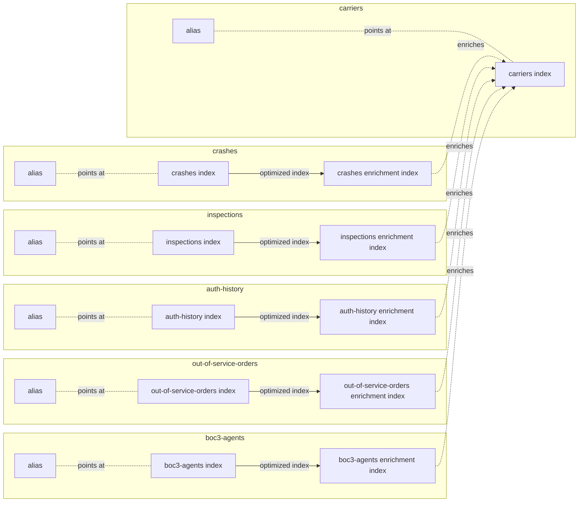
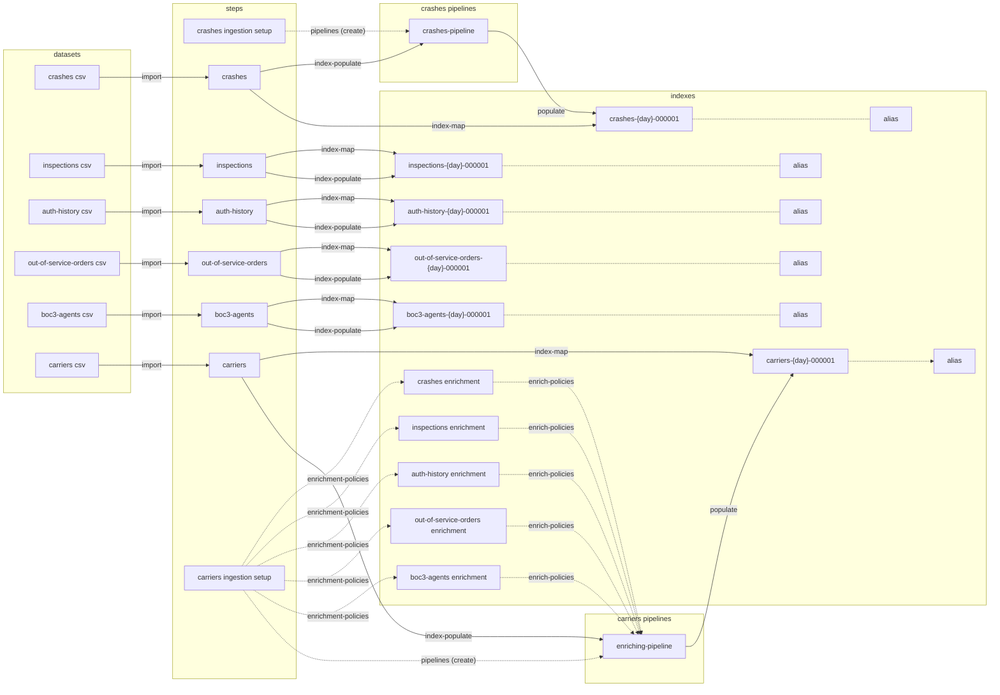

# DOT Commercial

On the DOT Site <https://data.transportation.gov/Trucking-and-Motorcoaches/>

## Fetching Data

Run `python3 fetch_commercial_carriers.py` from this directory to pull the latest carrier census, crash, inspection, inspection-unit (VIN), authority-history, out-of-service-order, and BOC-3 process-agent data from the data.transportation.gov Socrata API. Optionally pass `--dataset=<carriers|crashes|inspections|inspections_per_unit|auth_history|out_of_service_orders|boc3_agents>` to fetch just one. See `configuration/fetch-config.json` for dataset IDs; `carriers`/`auth_history`/`out_of_service_orders`/`boc3_agents` are unwindowed full pulls (no `date_field`), while `crashes`/`inspections`/`inspections_per_unit` use the lookback window described there.

## Datasets

| Step                    | Socrata ID  | Purpose                                                                                                                                                                                                                                                   |
| ----------------------- | ----------- | --------------------------------------------------------------------------------------------------------------------------------------------------------------------------------------------------------------------------------------------------------- |
| `carriers`              | `kjg3-diqy` | Carrier census — the core entity each other dataset enriches.                                                                                                                                                                                             |
| `crashes`               | `aayw-vxb3` | Crash history per carrier.                                                                                                                                                                                                                                |
| `inspections`           | `fx4q-ay7w` | Vehicle inspection history per carrier.                                                                                                                                                                                                                   |
| `inspections-per-unit`  | `wt8s-2hbx` | Per-unit VIN/vehicle detail, enriched onto `inspections`.                                                                                                                                                                                                 |
| `auth-history`          | `9mw4-x3tu` | Every authority grant/revocation event per carrier — the reincarnation-timing signal for shadow/chameleon carriers (revoked → new DOT# granted soon after).                                                                                               |
| `out-of-service-orders` | `p2mt-9ige` | Carriers ordered out of service for safety, with reason/date/rescind date — flags who was shut down, a prime candidate for "who reappeared nearby afterward."                                                                                             |
| `boc3-agents`           | `2emp-mxtb` | Each carrier's legal process agent (name + address). **Weak signal:** only 89 distinct agents cover all 1.43M filings, so two unrelated carriers share an agent roughly 7% of the time by chance. Used only as IDF-weighted corroboration at weight 0.04. |

`auth-history`, `out-of-service-orders`, and `boc3-agents` were added specifically to support detecting shadow/chameleon commercial carriers — entities that get shut down and reappear under a new DOT number while reusing infrastructure. See `docs/superpowers/specs/2026-07-28-dot-commercial-shadow-carrier-datasets-design.md` for the full tiered survey (these three are "Tier 1"; insurance-churn and richer safety-history datasets were surveyed and deliberately deferred as Tier 2/3).

The earlier claim that a shared BOC-3 agent is "a harder signal to fake than a business address" did not survive measurement — the dataset carries no per-carrier information, only which of ~89 commercial filing companies a carrier paid. See the chameleon carrier matching design spec.

### Document IDs

Every dataset now has an `id_field` in its `index-config.json`, so re-running a dataset's `index-populate` phase against the same day's index overwrites existing documents instead of duplicating them. `id_field` can be a single column name (`carriers`: `dot_number`, `inspections`: `inspection_id`, `inspections-per-unit`: `insp_unit_id`, `crashes`: `crash_id`, `boc3-agents`: `docket_number`) or, for the two datasets with no single unique column, a JSON list of columns that `phase_index_populate.py` joins into a composite key (`out-of-service-orders`: `dot_number`+`oos_date`+`oos_reason`+`status`+`rescind_date`; `auth-history`: all 9 columns). See the "`id_field` fix" section of the shadow-carrier design spec above for the uniqueness analysis behind each choice.

### Enriched field mappings

`carriers/index-mappings.json` explicitly maps every field the `carriers-ingestion-setup` enrich policies slipstream onto a carrier document (`out_of_service_orders`, `auth_history`, `crashes`, `inspections`, and — since an earlier fix — `boc3_agents`). Without an explicit mapping, the first document indexed with a given enriched field determines its dynamic type, with two failure modes this repo has already hit once each (see the enrich-match and inspections-per-unit design specs):

- **Dynamic string fields get `terms`/`term`-hostile analysis.** A bare string dynamically maps as `text` with a `.keyword` multi-field, not `keyword` outright, and `.keyword` additionally carries `ignore_above: 256` — a long value silently stops being indexed there. `matching/predecessors.py`'s selector queries (`{"terms": {"out_of_service_orders.status": [...]}}`, `{"term": {"auth_history.disp_action_desc": "REVOKED"}}`) run against the exact-value field, not the analyzed one, and standard analysis lowercases the indexed token — an uppercase query term like `"ACTIVE"` then matches nothing. Confirmed directly against a live index: `terms` on the dynamically-mapped `out_of_service_orders.status` returned 0 hits for `["ACTIVE"]`; the same query against `.status.keyword` returned the expected hit. Pinning every enriched field to `keyword` closes this off for all four `PredecessorSelector` selectors at once, the same way Task 9 already had to pin `boc3_agents.co_name.keyword` for its own aggregation query.
- **Dynamic date detection can reject the whole document.** `out_of_service_orders.oos_date` would otherwise auto-detect as `date`, reopening the trap the inspections-per-unit design spec spent two fix rounds closing: a single malformed date value throws `document_parsing_exception` and Elasticsearch drops the entire carrier document, not just that field. `oos_date` is mapped `keyword` here to match how the standalone `out-of-service-orders` index already maps it, and because the chameleon-matching temporal signal (`matching/signals.py::parse_flexible_date`) parses dates client-side rather than relying on Elasticsearch date math — `PredecessorSelector`'s `oos_date_from` range query still works correctly on ISO-formatted keywords because they sort lexicographically.

`inspections.units` is intentionally left unmapped here; it belongs to the per-unit VIN enrichment a later task owns.

## Processing Steps

This data set is loaded and configured in 11 steps.

1. `crashes-ingestion-setup` - create a pipeline that coerces `dot_number` to a real integer in `_source` (fixes the enrich-match bug described in the design spec)
1. `crashes` - create an index and load the crash data
1. `inspections-per-unit` - create an index and load the per-unit VIN/vehicle data (FMCSA `wt8s-2hbx`)
1. `inspections-ingestion-setup` - create the enrichment index on `inspections-per-unit` and an ingestion pipeline that uses it
1. `inspections` - create an index and load the vehicle inspections data, enriched with per-unit VIN data via the pipeline from `inspections-ingestion-setup`
1. `auth-history` - create an index and load authority grant/revocation history (FMCSA `9mw4-x3tu`)
1. `out-of-service-orders` - create an index and load out-of-service order history (FMCSA `p2mt-9ige`)
1. `boc3-agents` - create an index and load BOC-3 legal process agent history (FMCSA `2emp-mxtb`)
1. `carriers-ingestion-setup` - create the enrichment indexes on `crashes`, `inspections`, `auth-history`, `out-of-service-orders`, and `boc3-agents`, and an ingestion pipeline that uses them
1. `carriers` - create an index and load the carriers data using the pipeline to enrich `carriers` with data from `crashes`, `inspections`, `auth-history`, `out-of-service-orders`, and `boc3-agents`
1. `chameleon-detection` - sweep shut-down carriers for likely successors and write ranked suspect pairs to `chameleon-candidates`

We could have combined some of the setup and indexing steps and used the phase boundaries but this seemed to be an easier partitioning scheme to use just needing the `--step` parameter for partial work

## Processing Phases

Each step can contain one or more phases as described by json configuration files. Phases represent the type of work that can be done in one or more steps. Each step can contain zero or more phases.
See [README.md](../README.md)

## Index Data

The data is organized and related as follows.

```mermaid
flowchart LR
    subgraph crashes-graph[crashes]
        crashes-alias[alias] -..-|points at| crashes[crashes index]
        crashes --> | optimized index| crashes-enrichment[crashes enrichment index]
    end
    subgraph inspections-graph[inspections]
        inspections-alias[alias] -..-|points at| inspections[inspections index]
        inspections --> |optimized index| inspections-enrichment[inspections enrichment index]
    end
    subgraph auth-history-graph[auth-history]
        auth-history-alias[alias] -..-|points at| auth-history[auth-history index]
        auth-history --> | optimized index| auth-history-enrichment[auth-history enrichment index]
    end
    subgraph oos-graph[out-of-service-orders]
        oos-alias[alias] -..-|points at| oos[out-of-service-orders index]
        oos --> | optimized index| oos-enrichment[out-of-service-orders enrichment index]
    end
    subgraph boc3-graph[boc3-agents]
        boc3-alias[alias] -..-|points at| boc3[boc3-agents index]
        boc3 --> | optimized index| boc3-enrichment[boc3-agents enrichment index]
    end
    subgraph carriers-graph[carriers]
        crashes-enrichment -.->|enriches| carriers-core
        inspections-enrichment -.->|enriches| carriers-core
        auth-history-enrichment -.->|enriches| carriers-core
        oos-enrichment -.->|enriches| carriers-core
        boc3-enrichment -.->|enriches| carriers-core
        carriers-alias[alias] -..- | points at| carriers-core[carriers index]
    end
```

## Flow

An integrated view of the steps and phases.

```mermaid
flowchart LR
    subgraph steps
        direction LR
        crashes-ingestion-setup-step[crashes ingestion setup]
        crashes-step[crashes]
        inspections-step[inspections]
        auth-history-step[auth-history]
        oos-step[out-of-service-orders]
        boc3-step[boc3-agents]
        carriers-step[carriers]
        carriers-ingestion-setup-step[carriers ingestion setup]
    end

    subgraph indexes
        direction LR
        crashes-index["crashes-{day}-000001"] -..- crashes-alias[alias]
        inspections-index["inspections-{day}-000001"] -..- inspections-alias[alias]
        auth-history-index["auth-history-{day}-000001"] -..- auth-history-alias[alias]
        oos-index["out-of-service-orders-{day}-000001"] -..- oos-alias[alias]
        boc3-index["boc3-agents-{day}-000001"] -..- boc3-alias[alias]
        carriers-index["carriers-{day}-000001"] -..-> carriers-alias[alias]

        crashes-enrichment-index[crashes enrichment]
        inspections-enrichment-index[inspections enrichment]
        auth-history-enrichment-index[auth-history enrichment]
        oos-enrichment-index[out-of-service-orders enrichment]
        boc3-enrichment-index[boc3-agents enrichment]
    end

    subgraph datasets
        direction LR
        crashes-csv[crashes csv]
        inspections-csv[inspections csv]
        auth-history-csv[auth-history csv]
        oos-csv[out-of-service-orders csv]
        boc3-csv[boc3-agents csv]
        carriers-csv[carriers csv]
    end

    subgraph crashes-pipelines[ crashes pipelines]
        direction LR
        crashes-pipeline
    end

    subgraph carriers-pipelines[ carriers pipelines]
        direction LR
        enriching-pipeline
    end

    crashes-step -->|index-populate| crashes-pipeline
    crashes-step -->|index-map| crashes-index
    inspections-step -->|index-map| inspections-index
    inspections-step -->|index-populate | inspections-index
    auth-history-step -->|index-map| auth-history-index
    auth-history-step -->|index-populate| auth-history-index
    oos-step -->|index-map| oos-index
    oos-step -->|index-populate| oos-index
    boc3-step -->|index-map| boc3-index
    boc3-step -->|index-populate| boc3-index
    carriers-step --> | index-map | carriers-index
    carriers-step --> | index-populate| enriching-pipeline

    crashes-csv-->|import| crashes-step
    inspections-csv -->|import| inspections-step
    auth-history-csv -->|import| auth-history-step
    oos-csv -->|import| oos-step
    boc3-csv -->|import| boc3-step
    carriers-csv -->|import| carriers-step

    crashes-pipeline -->|populate| crashes-index

    crashes-enrichment-index -.->|enrich-policies| enriching-pipeline
    inspections-enrichment-index -.->|enrich-policies| enriching-pipeline
    auth-history-enrichment-index -.->|enrich-policies| enriching-pipeline
    oos-enrichment-index -.->|enrich-policies| enriching-pipeline
    boc3-enrichment-index -.->|enrich-policies| enriching-pipeline
    enriching-pipeline -->|populate| carriers-index

    crashes-ingestion-setup-step -.->|"pipelines (create)"| crashes-pipeline

    carriers-ingestion-setup-step -.->|enrichment-policies| crashes-enrichment-index
    carriers-ingestion-setup-step -.->|enrichment-policies| inspections-enrichment-index
    carriers-ingestion-setup-step -.->|enrichment-policies| auth-history-enrichment-index
    carriers-ingestion-setup-step -.->|enrichment-policies| oos-enrichment-index
    carriers-ingestion-setup-step -.->|enrichment-policies| boc3-enrichment-index
    carriers-ingestion-setup-step -.->|"pipelines (create)"| enriching-pipeline


```
