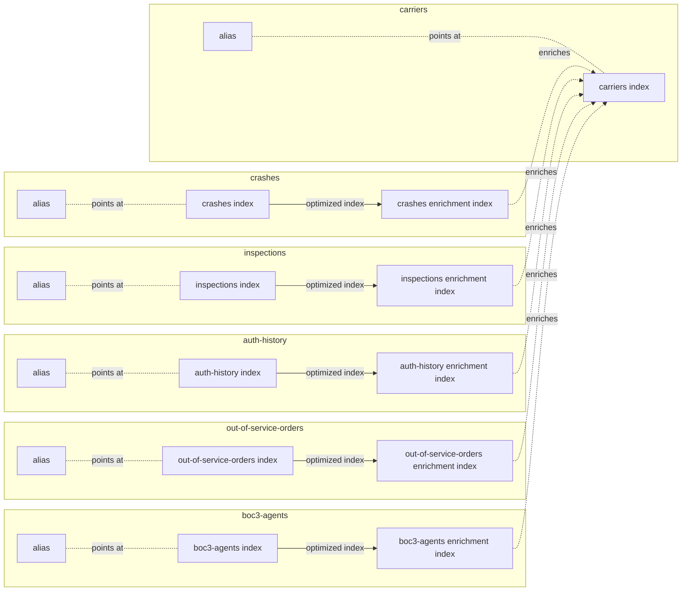
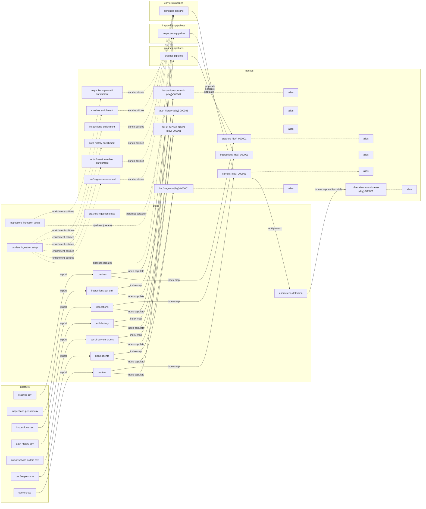

# DOT Commercial

A reference implementation of the [entitopia framework](../README.md) over FMCSA commercial trucking data. It is the **complex** case: seven datasets, six enrichment policies, a two-level enrichment chain, ingestion pipelines, and the project's first `entity-match` step.

Its goal is detecting **chameleon carriers** — trucking companies shut down for safety or insurance reasons that reopen under a new DOT number while reusing the same addresses, phones, trucks, and near-identical names.

Framework concepts (steps, phases, configuration layout) and the data-loading hazards common to any dataset are in the [top-level README](../README.md). This README covers what is specific to the FMCSA data.

On the DOT Site <https://data.transportation.gov/Trucking-and-Motorcoaches/>

## Open items

Dataset-specific. Framework-level items are in the [top-level README](../README.md).

1. **`insp_carrier_state_id` is not pinned in `inspections/index-mappings.json`**, so inspections ingestion silently drops ~0.65% of documents (36,788 of 5,647,567 on a full run). Elasticsearch dynamically infers `float` from whichever value it sees first under `parallel_bulk`'s concurrency, but the source column mixes numeric and non-numeric strings (`'NONE'`, `'S00000030887'`), so every non-conforming row fails with `document_parsing_exception`. Deterministic and lossy on every full run; which rows drop varies with thread ordering. Fix by pinning it to `keyword`, mirroring `dot_number` / `inspection_id`.
1. **`entity-match` thresholds are still uncalibrated, though it has now run against production data.** A full sweep over the July 2026 extract (2,085,536 carriers, 48,540 predecessors, 500 candidates each) emitted **426,483 pairs**, of which 81% score below 0.50 — that band is noise. The reviewable set is roughly **195 pairs**: re-registered within a year of shutdown, scoring ≥ 0.70, and sharing a VIN or phone/email. 106 of those reuse the _identical_ legal name.

   The scores remain **uncalibrated confidence, not probability.** `total_score` is a weighted mean of evaluable signals renormalized over their weights; nothing has been fitted against known outcomes, so 0.9 does not mean 90% likely. Turning it into a probability needs labelled FMCSA enforcement results, which the project does not have. Until then, treat the ranking as triage order and the per-signal `matched_on` / contributions as the reason to act.

   Sanity anchors from that run, useful when re-tuning: the top of the list is dominated by carriers re-registering under a byte-identical name at the same address and phone within days of shutdown (`CRANDOL DISTRIBUTION LLC` → `CRANDOL DISTRIBUTION LLC`, +1 day). If a config change stops surfacing those, the change is wrong.

1. **Name similarity is effectively triple-weighted, which currently ranks the wrong pairs highest.** `entity-match.json` lists three name signals over the same two fields (`name-phonetic` twice plus `name-token`, together 0.45 of the 0.94 total). Because `carrier_suffix_stop` strips `TRUCKING`/`LOGISTICS`/`LLC`/`INC`, most carrier names reduce to a single token, so the blended overlap becomes effectively binary. Measured: a pair with a byte-identical street, same state, and registration 45 days after the shutdown scored **0.3483 and was dropped** by the 0.35 floor, while `ABC TRUCKING LLC` vs `ABC LOGISTICS INC` in different states — sharing nothing but the token `ABC` — scored **0.5113 and was emitted**. A complete name change is the defining chameleon move, so this is backwards.

   The `min_signals` half of this is **fixed**: `PairScorer` now counts distinct evidence sources rather than signal instances, so the three name arms collapse into one and a name-only pair no longer clears a floor written to demand corroboration from a second, independent source. Against the shipped config, 8 signals resolve to 6 sources. What remains is the weighting itself — 0.45 of 0.94 still sits on one field — and that is a calibration decision rather than a structural one, so it should be made against real sweep output rather than guessed at a second time.

1. **`entity-match` over-selects predecessors** because `out_of_service_orders` is mapped as a plain `object` rather than `nested`. A carrier with an ACTIVE 2015 order and an INACTIVE 2022 order satisfies `status: ACTIVE` and `oos_date >= 2020` from two _different_ array elements, so it is swept even though no single order matches both filters. `TemporalSignal` then reports whichever `oos_date` is latest, so `shutdown_date` and `gap_days` on an emitted pair may come from an order the selector never intended to match. Over-selection preserves recall and `max_predecessors` bounds the cost, which is why it ships. Fix by mapping `out_of_service_orders` as `nested` and using a `nested` query in `matching/predecessors.py`.

## Fetching Data

Run `python3 fetch_commercial_carriers.py` from this directory to pull the latest carrier census, crash, inspection, inspection-unit (VIN), authority-history, out-of-service-order, and BOC-3 process-agent data from the data.transportation.gov Socrata API. Optionally pass `--dataset=<carriers|crashes|inspections|inspections_per_unit|auth_history|out_of_service_orders|boc3_agents>` to fetch just one. See `configuration/fetch-config.json` for dataset IDs; `carriers`/`auth_history`/`out_of_service_orders`/`boc3_agents` are unwindowed full pulls (no `date_field`), while `crashes`/`inspections`/`inspections_per_unit` use the lookback window described there.

## Datasets

| Step                    | Socrata ID  | Purpose                                                                                                                                                                                                                                                   |
| ----------------------- | ----------- | --------------------------------------------------------------------------------------------------------------------------------------------------------------------------------------------------------------------------------------------------------- |
| `carriers`              | `kjg3-diqy` | Carrier census — the core entity each other dataset enriches.                                                                                                                                                                                             |
| `crashes`               | `aayw-vxb3` | Crash history per carrier.                                                                                                                                                                                                                                |
| `inspections`           | `fx4q-ay7w` | Vehicle inspection history per carrier.                                                                                                                                                                                                                   |
| `inspections-per-unit`  | `wt8s-2hbx` | Per-unit VIN/vehicle detail, enriched onto `inspections`.                                                                                                                                                                                                 |
| `auth-history`          | `9mw4-x3tu` | Every authority grant/revocation event per carrier — the reincarnation-timing signal for shadow/chameleon carriers (revoked → new DOT# granted soon after).                                                                                               |
| `out-of-service-orders` | `p2mt-9ige` | Carriers ordered out of service for safety, with reason/date/rescind date — flags who was shut down, a prime candidate for "who reappeared nearby afterward."                                                                                             |
| `boc3-agents`           | `2emp-mxtb` | Each carrier's legal process agent (name + address). **Weak signal:** only 89 distinct agents cover all 1.43M filings, so two unrelated carriers share an agent roughly 7% of the time by chance. Used only as IDF-weighted corroboration at weight 0.04. |

`auth-history`, `out-of-service-orders`, and `boc3-agents` were added specifically to support detecting shadow/chameleon commercial carriers — entities that get shut down and reappear under a new DOT number while reusing infrastructure. See `docs/superpowers/specs/2026-07-28-dot-commercial-shadow-carrier-datasets-design.md` for the full tiered survey (these three are "Tier 1"; insurance-churn and richer safety-history datasets were surveyed and deliberately deferred as Tier 2/3).

The earlier claim that a shared BOC-3 agent is "a harder signal to fake than a business address" did not survive measurement — the dataset carries no per-carrier information, only which of ~89 commercial filing companies a carrier paid. See the chameleon carrier matching design spec.

### Document IDs

Every dataset now has an `id_field` in its `index-config.json`, so re-running a dataset's `index-populate` phase against the same day's index overwrites existing documents instead of duplicating them. `id_field` can be a single column name (`carriers`: `dot_number`, `inspections`: `inspection_id`, `inspections-per-unit`: `insp_unit_id`, `crashes`: `crash_id`, `boc3-agents`: `docket_number`) or, for the two datasets with no single unique column, a JSON list of columns that `phase_index_populate.py` joins into a composite key (`out-of-service-orders`: `dot_number`+`oos_date`+`oos_reason`+`status`+`rescind_date`; `auth-history`: all 9 columns). See the "`id_field` fix" section of the shadow-carrier design spec above for the uniqueness analysis behind each choice.

### Enriched field mappings

`carriers/index-mappings.json` explicitly maps every field the `carriers-ingestion-setup` enrich policies slipstream onto a carrier document (`out_of_service_orders`, `auth_history`, `crashes`, `inspections`, and — since an earlier fix — `boc3_agents`). Without an explicit mapping, the first document indexed with a given enriched field determines its dynamic type, with two failure modes this repo has already hit once each (see the enrich-match and inspections-per-unit design specs):

- **Dynamic string fields get `terms`/`term`-hostile analysis.** A bare string dynamically maps as `text` with a `.keyword` multi-field, not `keyword` outright, and `.keyword` additionally carries `ignore_above: 256` — a long value silently stops being indexed there. `matching/predecessors.py`'s selector queries (`{"terms": {"out_of_service_orders.status": [...]}}`, `{"term": {"auth_history.disp_action_desc": "REVOKED"}}`) run against the exact-value field, not the analyzed one, and standard analysis lowercases the indexed token — an uppercase query term like `"ACTIVE"` then matches nothing. Confirmed directly against a live index: `terms` on the dynamically-mapped `out_of_service_orders.status` returned 0 hits for `["ACTIVE"]`; the same query against `.status.keyword` returned the expected hit. Pinning every enriched field to `keyword` closes this off for all four `PredecessorSelector` selectors at once, the same way Task 9 already had to pin `boc3_agents.co_name.keyword` for its own aggregation query.
- **Dynamic date detection can reject the whole document.** `out_of_service_orders.oos_date` would otherwise auto-detect as `date`, reopening the trap the inspections-per-unit design spec spent two fix rounds closing: a single malformed date value throws `document_parsing_exception` and Elasticsearch drops the entire carrier document, not just that field. `oos_date` is mapped `keyword` here to match how the standalone `out-of-service-orders` index already maps it, and because the chameleon-matching temporal signal (`matching/signals.py::parse_flexible_date`) parses dates client-side rather than relying on Elasticsearch date math — `PredecessorSelector`'s `oos_date_from` range query still works correctly on ISO-formatted keywords because they sort lexicographically.

`inspections.units.insp_unit_vehicle_id_number` is mapped `keyword` for the same reason — it carries the per-unit VIN through the two-level enrichment chain (`inspections-per-unit` → `inspections` → `carriers`) so the `vin-overlap` signal can see the 5.6M-row inspection VINs rather than only the 333K crash records.

### Name and address analyzers

`carriers/index-settings.json` defines the analyzers the chameleon matching relies on. Three choices in it are deliberate and easy to undo by accident.

**Two phonetic encoders, not one.** `name_phonetic` uses `double_metaphone` and `name_phonetic_bm` uses `beider_morse`, and `entity-match.json` weights them independently (0.22 and 0.13). They are complementary rather than redundant — measured against a live cluster:

| Input     | `double_metaphone` | `beider_morse` |
| --------- | ------------------ | -------------- |
| `SMITH`   | `SM0 XMT`          | `zmit`         |
| `SMYTH`   | `SM0 XMT`          | —              |
| `SCHMIDT` | `XMT SMT`          | `zmit`         |

Double-metaphone collides spelling variants exactly (`SMITH`/`SMYTH`); Beider-Morse collides cross-language ones (`SMITH`/`SCHMIDT`) that double-metaphone only partially matches. Dropping either arm loses a class of name evasion.

`double_metaphone` replaced the original `metaphone` outright: it emits a primary _and_ an alternate encoding, and `max_code_len` is raised from its default of 4 to 6 because four characters over-collide on company-name tokens. `beider_morse` is pinned to `["english","spanish"]` rather than left to guess — language guessing on short corporate tokens is unstable and makes output non-reproducible between runs. Note it emits multiple tokens only for names ambiguous across those languages (`GONZALEZ` → four; `SMITH` → one).

**A corporate-suffix stop filter runs before phonetic encoding, and only in the phonetic analyzers.** Nearly every carrier name ends in `LLC`, `INC`, `TRUCKING`, or `TRANSPORT`. Because scoring happens in Python there is no BM25 IDF to discount them, so left in place they would dominate every comparison. `.clean` keeps the full name. One consequence worth knowing: a carrier named literally `TRUCKING LLC` reduces to zero tokens, which the scorer treats as "no signal" rather than "no match".

**Streets have two subfields because one tokenizer cannot serve both purposes.** `street_clean` uses a `keyword` tokenizer for exact-after-normalization comparison; `street_tokens` uses a standard tokenizer plus street-suffix synonyms (`st`→`street`, `ste`→`suite`) for fuzzy matching. `street_clean` also carries a `collapse_whitespace` filter: `punct_white` turns each punctuation mark into a space without collapsing the run, so without it `55 CEDAR ST, STE 4` and `55 CEDAR ST STE 4` were different single tokens and identical addresses silently produced zero candidates.

## Processing Steps

This data set is loaded and configured in 11 steps.

1. `crashes-ingestion-setup` - create a pipeline that coerces `dot_number` to a real integer in `_source` (fixes the enrich-match bug described in the design spec)
1. `crashes` - create an index and load the crash data
1. `inspections-per-unit` - create an index and load the per-unit VIN/vehicle data (FMCSA `wt8s-2hbx`)
1. `inspections-ingestion-setup` - create the enrichment index on `inspections-per-unit` and an ingestion pipeline that uses it
1. `inspections` - create an index and load the vehicle inspections data, enriched with per-unit VIN data via the pipeline from `inspections-ingestion-setup`
1. `auth-history` - create an index and load authority grant/revocation history (FMCSA `9mw4-x3tu`)
1. `out-of-service-orders` - create an index and load out-of-service order history (FMCSA `p2mt-9ige`)
1. `boc3-agents` - create an index and load BOC-3 legal process agent history (FMCSA `2emp-mxtb`)
1. `carriers-ingestion-setup` - create the enrichment indexes on `crashes`, `inspections`, `auth-history`, `out-of-service-orders`, and `boc3-agents`, and an ingestion pipeline that uses them
1. `carriers` - create an index and load the carriers data using the pipeline to enrich `carriers` with data from `crashes`, `inspections`, `auth-history`, `out-of-service-orders`, and `boc3-agents`
1. `chameleon-detection` - sweep shut-down carriers for likely successors and write ranked suspect pairs to `chameleon-candidates`

We could have combined some of the setup and indexing steps and used the phase boundaries but this seemed to be an easier partitioning scheme to use just needing the `--step` parameter for partial work

The first ten steps **load data**; `chameleon-detection` **looks for fraud**. They are independent: the sweep reads only `carriers-000001` and touches no CSV, so retuning thresholds, weights, or seeding means rerunning that one step — no reload. Conversely, a defect in the load is invisible to the sweep, which will happily score whatever is in the index and report a confident result.

**Refresh before every `*-ingestion-setup` step.** Enrich policy execution only sees _searchable_ documents, and Elasticsearch's 1-second default refresh interval means documents indexed moments earlier are invisible. Running the whole project in one `--project=DOT-Commercial` call reproduces this as a timing-dependent silent failure: every phase logs success and the carriers come out with no enrichment at all.

### Chameleon detection tuning

`configuration/chameleon-detection/entity-match.json` holds the knobs. Measured against the full July 2026 extract (2,085,534 carriers; 46,529 predecessors matching the configured selector):

| Setting                           | Value                  | Why                                                                                                                                                                                                                                                       |
| --------------------------------- | ---------------------- | --------------------------------------------------------------------------------------------------------------------------------------------------------------------------------------------------------------------------------------------------------- |
| `predecessors.selector`           | `out-of-service`       | `revoked-authority` covers roughly half of every carrier ever registered — involuntary revocation for lapsed insurance is routine and is not evidence of a chameleon.                                                                                     |
| `candidates.max_candidates`       | `500`                  | Raised from 100. Cost 4× the runtime and produced **no new top-tier findings** — relevance ranking already had those near the top — but recovered mid-tier recall (+13% shared-VIN pairs). 89% of predecessors still truncate; going higher has poor ROI. |
| `candidates.seed_signals`         | includes `vin-overlap` | Without it a carrier that changes name, address and phone but keeps its trucks is unreachable at any `max_candidates`. Measured: 257 carriers per 400 predecessors reachable only this way.                                                               |
| `vin-overlap.conclusive`          | `true`                 | A shared VIN at weight 0.08 totals ~0.11 for a pair sharing nothing else, under the 0.35 floor, so every such pair was discarded. Clearing the floor by weight alone would need ~0.46 and would swamp every other pair.                                   |
| `vin-overlap.max_shared_carriers` | `5`                    | Any VIN on more than 5 carriers is not identifying. Without this, 94% of the apparent VIN recall gain was placeholder noise.                                                                                                                              |
| `scoring.min_signals`             | `2`                    | Counts distinct **evidence sources**, not signal instances — the three name signals read the same two fields and collapse to one.                                                                                                                         |

**`ignore_values` records the placeholder VINs this dataset actually contains.** FMCSA crash reports carry `GGGG` on 158 carriers, `UNKNOWN` on 79, `99999999999999999` on 51, plus runs of zeros, `-`, `.` and `*****************`. A binary shared-identifier signal scores 1.0 on those, so two carriers that both filed "UNKNOWN" read as a perfect identity match. The declared list covers what is known; the `max_shared_carriers` frequency scan catches the rest (203 values on the current extract). Both feed the same suppression set.

## Processing Phases

Each step can contain one or more phases as described by json configuration files. Phases represent the type of work that can be done in one or more steps. Each step can contain zero or more phases.
See [README.md](../README.md)

## Index Data

The data is organized and related as follows.

```mermaid
flowchart LR
    subgraph crashes-graph[crashes]
        crashes-alias[alias] -..-|points at| crashes[crashes index]
        crashes --> | optimized index| crashes-enrichment[crashes enrichment index]
    end
    subgraph inspections-graph[inspections]
        inspections-alias[alias] -..-|points at| inspections[inspections index]
        inspections --> |optimized index| inspections-enrichment[inspections enrichment index]
    end
    subgraph auth-history-graph[auth-history]
        auth-history-alias[alias] -..-|points at| auth-history[auth-history index]
        auth-history --> | optimized index| auth-history-enrichment[auth-history enrichment index]
    end
    subgraph oos-graph[out-of-service-orders]
        oos-alias[alias] -..-|points at| oos[out-of-service-orders index]
        oos --> | optimized index| oos-enrichment[out-of-service-orders enrichment index]
    end
    subgraph boc3-graph[boc3-agents]
        boc3-alias[alias] -..-|points at| boc3[boc3-agents index]
        boc3 --> | optimized index| boc3-enrichment[boc3-agents enrichment index]
    end
    subgraph carriers-graph[carriers]
        crashes-enrichment -.->|enriches| carriers-core
        inspections-enrichment -.->|enriches| carriers-core
        auth-history-enrichment -.->|enriches| carriers-core
        oos-enrichment -.->|enriches| carriers-core
        boc3-enrichment -.->|enriches| carriers-core
        carriers-alias[alias] -..- | points at| carriers-core[carriers index]
    end
```

## Flow

An integrated view of the steps and phases.

```mermaid
flowchart LR
    subgraph steps
        direction LR
        crashes-ingestion-setup-step[crashes ingestion setup]
        crashes-step[crashes]
        per-unit-step[inspections-per-unit]
        inspections-ingestion-setup-step[inspections ingestion setup]
        inspections-step[inspections]
        auth-history-step[auth-history]
        oos-step[out-of-service-orders]
        boc3-step[boc3-agents]
        carriers-step[carriers]
        carriers-ingestion-setup-step[carriers ingestion setup]
        chameleon-step[chameleon-detection]
    end

    subgraph indexes
        direction LR
        crashes-index["crashes-{day}-000001"] -..- crashes-alias[alias]
        per-unit-index["inspections-per-unit-{day}-000001"] -..- per-unit-alias[alias]
        inspections-index["inspections-{day}-000001"] -..- inspections-alias[alias]
        auth-history-index["auth-history-{day}-000001"] -..- auth-history-alias[alias]
        oos-index["out-of-service-orders-{day}-000001"] -..- oos-alias[alias]
        boc3-index["boc3-agents-{day}-000001"] -..- boc3-alias[alias]
        carriers-index["carriers-{day}-000001"] -..-> carriers-alias[alias]

        chameleon-index["chameleon-candidates-{day}-000001"] -..- chameleon-alias[alias]

        per-unit-enrichment-index[inspections-per-unit enrichment]
        crashes-enrichment-index[crashes enrichment]
        inspections-enrichment-index[inspections enrichment]
        auth-history-enrichment-index[auth-history enrichment]
        oos-enrichment-index[out-of-service-orders enrichment]
        boc3-enrichment-index[boc3-agents enrichment]
    end

    subgraph datasets
        direction LR
        crashes-csv[crashes csv]
        per-unit-csv[inspections-per-unit csv]
        inspections-csv[inspections csv]
        auth-history-csv[auth-history csv]
        oos-csv[out-of-service-orders csv]
        boc3-csv[boc3-agents csv]
        carriers-csv[carriers csv]
    end

    subgraph crashes-pipelines[ crashes pipelines]
        direction LR
        crashes-pipeline
    end

    subgraph inspections-pipelines[ inspections pipelines]
        direction LR
        inspections-pipeline
    end

    subgraph carriers-pipelines[ carriers pipelines]
        direction LR
        enriching-pipeline
    end

    crashes-step -->|index-populate| crashes-pipeline
    crashes-step -->|index-map| crashes-index
    per-unit-step -->|index-map| per-unit-index
    per-unit-step -->|index-populate| per-unit-index
    inspections-step -->|index-map| inspections-index
    inspections-step -->|index-populate| inspections-pipeline
    auth-history-step -->|index-map| auth-history-index
    auth-history-step -->|index-populate| auth-history-index
    oos-step -->|index-map| oos-index
    oos-step -->|index-populate| oos-index
    boc3-step -->|index-map| boc3-index
    boc3-step -->|index-populate| boc3-index
    carriers-step --> | index-map | carriers-index
    carriers-step --> | index-populate| enriching-pipeline

    crashes-csv-->|import| crashes-step
    per-unit-csv -->|import| per-unit-step
    inspections-csv -->|import| inspections-step
    auth-history-csv -->|import| auth-history-step
    oos-csv -->|import| oos-step
    boc3-csv -->|import| boc3-step
    carriers-csv -->|import| carriers-step

    crashes-pipeline -->|populate| crashes-index
    inspections-pipeline -->|populate| inspections-index

    per-unit-enrichment-index -.->|enrich-policies| inspections-pipeline
    inspections-ingestion-setup-step -.->|enrichment-policies| per-unit-enrichment-index
    inspections-ingestion-setup-step -.->|"pipelines (create)"| inspections-pipeline

    crashes-enrichment-index -.->|enrich-policies| enriching-pipeline
    inspections-enrichment-index -.->|enrich-policies| enriching-pipeline
    auth-history-enrichment-index -.->|enrich-policies| enriching-pipeline
    oos-enrichment-index -.->|enrich-policies| enriching-pipeline
    boc3-enrichment-index -.->|enrich-policies| enriching-pipeline
    enriching-pipeline -->|populate| carriers-index

    crashes-ingestion-setup-step -.->|"pipelines (create)"| crashes-pipeline

    carriers-ingestion-setup-step -.->|enrichment-policies| crashes-enrichment-index
    carriers-ingestion-setup-step -.->|enrichment-policies| inspections-enrichment-index
    carriers-ingestion-setup-step -.->|enrichment-policies| auth-history-enrichment-index
    carriers-ingestion-setup-step -.->|enrichment-policies| oos-enrichment-index
    carriers-ingestion-setup-step -.->|enrichment-policies| boc3-enrichment-index
    carriers-ingestion-setup-step -.->|"pipelines (create)"| enriching-pipeline

    carriers-index -->|entity-match| chameleon-step
    chameleon-step -->|"index-map, entity-match"| chameleon-index


```
