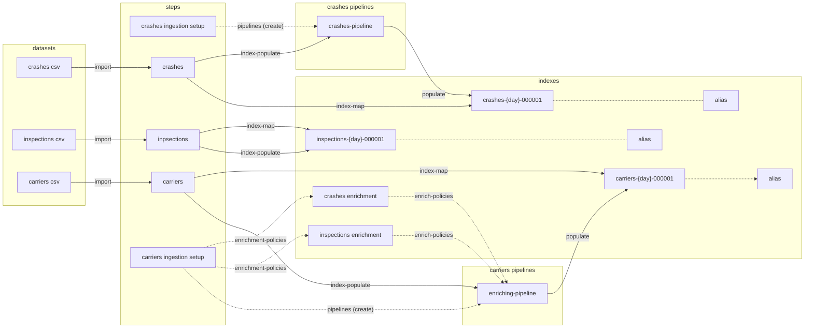

DOT Commercial https://ai.fmcsa.dot.gov/SMS/Tools/Downloads.aspx

## Processing Steps

This data set is loaded and configured in 5 steps.
1. `crashes-ingestion-setup` - create a pipeline that creates a fingerprint from two fields to be sued as the `id` field
1. `crashes` - create an index and load the crash data
1. `inspections` - create an index and load the vehicle inpsections data
1. `carriers-ingestion-setup` - create the enrichment indexes on `crashes` and `inspections` and an ingestion pipeline that uses them
1. `carriers` - create an index and load the carriers data using the pipeline to enrich `carriers` with data from `crashes` and `inspections`

We could have combined some of the setup and indexing steps and used the phase boundaries but this seemed to be an easier partitioning scheme to use just needing the `--step` parameter for partial work

## Processing Phases
Each step can contain one or more phases as described by json configuration files. Phases represent the type of work that can be done in one or more steps.  Each step can contain zero or more phases.
See [README.md](../README.md)

## Index Data
The data is organized and related as follows.

## Flow
An integrated view of the steps and phases.

