# How DOT chameleon-carrier detection works — simple version

## Purpose and theory of operation

This pipeline looks for carriers that shut down under one DOT registration and
appear to have re-registered as a "new" carrier shortly after — a pattern
sometimes called a chameleon carrier. The underlying theory is that no single
data point proves this (a shared address could be a filing agent, a shared
name could be a coincidence), but several weak, independently-noisy signals
pointing at the same successor carrier are much harder to explain by chance
than any one of them alone. So the pipeline doesn't look for an exact match —
it scores _how much_ a shut-down carrier and a newly-registered carrier
resemble each other across name, address, contact info, shared vehicles, and
timing, then keeps only the pairs with enough independent corroboration.

Raw DOT registration data is noisy in ways that would otherwise wreck that
scoring: placeholder values (`"UNKNOWN"` VINs, `(000) 000-0000` phone
numbers), inconsistent date formats, and identifiers that are genuinely shared
by hundreds of unrelated carriers (filing agents, insurance agencies). If left
in, that noise would either hide real matches under formatting differences or
manufacture fake ones out of coincidental shared junk. Preprocessing exists to
strip that out before scoring ever sees the data — some of it once at load
time (date normalization, building phonetic/fuzzy-searchable versions of names
and addresses), some of it fresh at the start of every run (suppressing values
too common to mean anything).

Elasticsearch is used for two different jobs, not one. First, as the engine
that makes fuzzy/phonetic search possible at all — its ingest pipelines and
field mappings do the one-time cleanup and indexing work, so name-sound-alike
and address-fuzzy-match queries are fast rather than something Python would
have to compute pairwise over the whole dataset. Second, as a query and
aggregation service the matching code calls repeatedly during a run — to find
candidate successor carriers, to count how common a value is, to fetch
analyzed tokens — while the actual scoring decisions (which weights, which
thresholds, which pairs survive) stay in Python, not in Elasticsearch.

Results are written back into their own Elasticsearch index rather than a
file or database table, one document per surviving predecessor/successor
pair, carrying both the total score and the full per-signal breakdown that
produced it. That makes the index itself the report: anyone (an analyst, a
dashboard, a script) can query it after the fact with ordinary Elasticsearch
queries — filtering on score, on the number of days between shutdown and
re-registration, or on which specific signals fired — without needing to
re-run the matching logic.

## Flow chart: who does the work at each step

Blue = pure Python logic. Amber = Elasticsearch working internally (no Python
decision-making involved). Purple = Python sends a query/request and
Elasticsearch does the actual computation (search, aggregation, term
vectors) before Python acts on the answer. Gray = a data store. Green =
LLM analysis (offline, optional). Pink = human review (offline, optional).

```mermaid
flowchart TD
    CSV[("carriers.csv")]
    CSV --> LOAD_PY["Python: pandas read_csv,<br/>blanks to None<br/>(phase_index_populate.py)"]
    LOAD_PY --> BULK["Python: bulk-index via ES client,<br/>routes through ingest pipeline"]
    BULK --> PIPE["Elasticsearch: ingest pipeline runs<br/>(Painless date fix, enrich lookups)"]
    PIPE --> MAP["Elasticsearch: field mappings apply<br/>(keyword / clean / phonetic / token subfields)"]
    MAP --> CARRIERS_IDX[("carriers-000001 index")]

    CARRIERS_IDX --> DECL["Python: read declared ignore_values<br/>(entity-match.json)"]
    CARRIERS_IDX --> AGG["Python sends terms aggregation query →<br/>Elasticsearch counts shared values"]
    DECL --> CTX["Python: merge declared + discovered<br/>into ScoringContext (in-memory only,<br/>not persisted)"]
    AGG --> CTX

    CTX --> PREDQ["Python builds query →<br/>Elasticsearch searches for<br/>out-of-service predecessors"]
    PREDQ --> CANDQ["Python builds seed-signal OR query →<br/>Elasticsearch returns up to 500 candidates"]
    CANDQ --> MTV["Python calls mtermvectors →<br/>Elasticsearch returns analyzed tokens"]
    MTV --> SCORE["Python: scores 8 weighted signals<br/>(matching/signals.py, scorer.py — pure math)"]
    SCORE --> FILTER["Python: applies thresholds<br/>(min_signals, identity signal, min_total_score)"]

    FILTER --> WRITE["Python: parallel_bulk writes<br/>surviving pairs, with per-signal scores"]
    WRITE --> RESULTS_IDX[("chameleon-candidates index")]
    RESULTS_IDX --> QUERY["You / any client query Elasticsearch directly<br/>(total_score, gap_days, matched_on)"]

    CARRIERS_IDX -.-> DIST["Python/ES: pull distinct values per field<br/>(VIN, phone, fax, email — same aggregation<br/>machinery as the frequency scan)"]
    DIST -.-> LLM["LLM: flags placeholder patterns,<br/>inconsistent date formats, and<br/>candidate too-common-to-be-identifying values"]
    LLM -.-> HUMAN["Human: reviews and approves<br/>suggestions before merging"]
    HUMAN -.->|"edits"| DECL

    classDef py fill:#dbeafe,stroke:#2563eb,color:#1e3a8a
    classDef es fill:#fef3c7,stroke:#d97706,color:#78350f
    classDef hybrid fill:#ede9fe,stroke:#7c3aed,color:#4c1d95
    classDef data fill:#e5e7eb,stroke:#6b7280,color:#111827
    classDef llm fill:#dcfce7,stroke:#16a34a,color:#14532d
    classDef human fill:#fce7f3,stroke:#db2777,color:#831843

    class LOAD_PY,DECL,CTX,SCORE,FILTER py
    class PIPE,MAP es
    class BULK,AGG,PREDQ,CANDQ,MTV,WRITE,QUERY,DIST hybrid
    class CSV,CARRIERS_IDX,RESULTS_IDX data
    class LLM llm
    class HUMAN human
```



The dotted path is offline and optional — it runs on some maintenance
cadence to help grow `entity-match.json`, not on every sweep. See
[§7](#7-optional-using-an-llm-to-help-build-the-declared-ignore-list) below.

## 1. Problems in the raw data

- **Placeholder values that look like real data but aren't**: VINs like `"UNKNOWN"`, `"GGGG"`, `"XXXXXXXXXXXXXXXXX"`; phone `(000) 000-0000` shows up on 664 carriers in the current extract.
- **Legitimately shared contact info**: BOC-3 filing agents, permit services, and insurance agencies sit on the paperwork for hundreds of unrelated carriers. Only 89 distinct filing agents cover 1.43M filings — two random carriers share an agent ~7% of the time by pure chance, so that alone proves nothing.
- A few data-modeling bugs noted in the README (dropped inspection records, over-eager predecessor matching from a mapping issue, mixed date formats).

## 2. How "ignore" values get identified — and whether that's persisted

Two layers, both plain **Python** logic in `phase_entity_match.py`, running _before scoring starts_ — not inside Elasticsearch:

- **A declared list** in config (`entity-match.json`) — hand-maintained junk values like the ones above.
- **An automatic frequency scan** — Python asks Elasticsearch (a `terms` aggregation query) "which values are shared by more than N carriers?" (N = 5 for VINs, 20 for phone/email/fax). Elasticsearch just answers the count; the _decision_ to treat those values as noise is Python's.

**Persistence: no.** The merged suppression set is computed once per sweep, held in memory in a `ScoringContext` object, used to score that run's pairs, then discarded. Nothing is written back to Elasticsearch or disk — every run recomputes it from scratch against current data, so there's no historical record of what got suppressed in a past run.

## 3. Preprocessing before load into Elasticsearch — who does what

Two genuinely different mechanisms:

- **Python (at load time)**: reads the CSV via pandas, converts blanks to `None`, bulk-indexes each row with a computed document ID (`dot_number`), tagging which ingest pipeline to route through. That's it — Python doesn't clean the data itself here.
- **Elasticsearch ingest pipelines (at index time, inside the ES server)**: this is the real cleanup, and it runs _inside Elasticsearch_, not in Python. Pipelines are defined as JSON (`pipelines.json`); Python registers them once via the ES API, then Elasticsearch's own scripting (Painless) and processors transform every document that flows through:
  - Reformat legacy Oracle dates (`dd-MMM-yy` → ISO, with a century-pivot rule, silently dropping the field rather than failing the whole document if unparseable).
  - "Enrich" processors that attach each carrier's related inspections, crashes, authority history, out-of-service orders, and BOC-3 agents by looking up `dot_number`.
- **Field mappings** (also ES config, applied at index-creation time): auto-generate multiple searchable variants of each field. Names get an exact `.keyword`, a cleaned `.clean`, and two phonetic encodings (double-metaphone, Beider-Morse) — both strip suffixes like "LLC"/"trucking"/"logistics" first. Addresses get an exact form and a fuzzy token form with street-suffix synonyms (`st`→`street`).

So: ingest pipelines and mappings are **Elasticsearch working internally**, driven by config Python wrote once at setup. The ignore-list/frequency-scan from question 2 is a **separate, later Python step** at matching time, using Elasticsearch only to fetch counts.

## 4. How Elasticsearch is queried, with what weights

For each carrier that went out of service, the code finds up to 500 "candidate" successor carriers via a broad OR query on name-sound, address, exact-ID, and VIN overlap. Then each candidate is scored against 8 weighted signals:

| Signal                                           | Weight                           |
| ------------------------------------------------ | -------------------------------- |
| Name (double-metaphone phonetic)                 | 0.22                             |
| Address (exact/fuzzy match)                      | 0.20                             |
| Name (Beider-Morse phonetic)                     | 0.13                             |
| Exact identifier (shared phone/fax/email)        | 0.12                             |
| Name (token/text match)                          | 0.10                             |
| VIN overlap (shared vehicle)                     | 0.08                             |
| Temporal gap (shutdown → re-registration timing) | 0.05                             |
| Filing agent overlap                             | 0.04 (rarity-weighted, not flat) |

A pair needs at least 2 independent evidence sources and at least one "identity" signal (not just timing/agent alone) to survive. Normally needs a combined score ≥0.35, **except** shared-VIN pairs bypass that floor since a shared vehicle is treated as conclusive on its own — even though the math gives it a low numeric score.

## 5. What's returned, where it lands, weights included?

Each surviving pair becomes a document in a `chameleon-candidates` index: predecessor summary, successor summary, `total_score`, `gap_days`, which signals fired (`matched_on`), and — yes — **a full per-signal breakdown** (`signal_type`, `weight`, `score`, `contribution` for each signal), so you can see exactly why a pair scored what it did, not just the final number.

## 6. Querying the stored results afterward

Query the `chameleon-candidates` index/alias directly — there's no separate summary report, the index _is_ the report. Useful fields:

- `total_score >= 0.70` for high-confidence pairs (the README's own reviewed threshold — explicitly called "uncalibrated confidence, not probability")
- `gap_days` for how soon after shutdown the successor appeared
- `matched_on` to filter by which evidence types fired (e.g. VIN + address + phone together is much stronger than VIN alone)
- `signals.*` fields if you want the per-signal explanation, not just the total — note these are mapped as a plain `object`, not `nested`, so a query that filters on `signals.signal_type` **and** `signals.score` together can match a document where those values came from two _different_ array entries. Fine for the queries below, which only ever filter one `signals.*` field at a time; if you need to correlate two signal fields in the same query, pull the array client-side and filter in code instead.

One quirk: VIN-only matches score low (~0.11) because of how the weighted average renormalizes, so they never rise to the top of a score-sorted view — the query below finds those by filtering `matched_on` for VIN overlap and sorting by `gap_days` instead.

### Sample: high-confidence pairs, corroborated by more than a shared vehicle

REST (e.g. Kibana Dev Tools, or `curl -X GET`):

```
GET chameleon-candidates-000001/_search
{
  "size": 50,
  "query": {
    "bool": {
      "filter": [
        { "range": { "total_score": { "gte": 0.70 } } },
        { "terms": { "matched_on": ["vin-overlap", "exact-identifier"] } }
      ]
    }
  },
  "sort": [ { "total_score": "desc" } ]
}
```

Python, using this project's own client helper (`utils/elasticsearch_utils.py`) and the same explicit-keyword-argument style as `matching/candidates.py` — never `body=`, per this repo's Elasticsearch convention:

```python
from utils import elasticsearch_utils, file_utils

es_config = file_utils.load_from_file("es_config.json")
es = elasticsearch_utils.connect_to_es(es_config)

response = es.search(
    index="chameleon-candidates-000001",
    size=50,
    query={
        "bool": {
            "filter": [
                {"range": {"total_score": {"gte": 0.70}}},
                {"terms": {"matched_on": ["vin-overlap", "exact-identifier"]}},
            ]
        }
    },
    sort=[{"total_score": "desc"}],
)

for hit in response["hits"]["hits"]:
    pair = hit["_source"]
    print(
        pair["predecessor"]["dot_number"],
        "->",
        pair["successor"]["dot_number"],
        pair["total_score"],
    )
```

### Sample: VIN-only pairs, triaged by gap instead of score

These score low (~0.11) by design, so sort by `gap_days` rather than `total_score`:

```
GET chameleon-candidates-000001/_search
{
  "size": 50,
  "query": {
    "bool": {
      "filter": [
        { "term": { "matched_on": "vin-overlap" } }
      ],
      "must_not": [
        {
          "terms": {
            "matched_on": ["name-phonetic", "name-token", "address", "exact-identifier"]
          }
        }
      ]
    }
  },
  "sort": [ { "gap_days": "asc" } ]
}
```

The Python form is the same shape as the sample above — swap the `query` and `sort` arguments passed to `es.search(...)`.

## 7. Optional: using an LLM to help build the declared ignore list

**Is this a valid strategy? Yes — as a suggestion generator feeding a human-reviewed list, not as something that writes `entity-match.json` directly.**

It's a genuine complement to the two mechanisms in [§2](#2-how-ignore-values-get-identified--and-whether-thats-persisted), not a replacement for either:

- The **frequency scan** only catches values that are literally common (shared by more than N carriers). It can't catch a junk value that happens to be rare — a malformed VIN that only appears on 3 carriers still isn't identifying, it's just garbage, and the frequency scan has no way to notice that.
- An **LLM pass** is good at exactly that gap: pattern-recognizing placeholders and formatting problems (obviously-fake VINs, `dd-MMM-yy` vs. ISO dates mixed in the same column, phone numbers like `(111) 111-1111`) without needing them to already be common.

How it fits into the flow (the dotted path in the flow chart above):

1. Pull the **distinct values** per field, not full rows — reuse the same aggregation machinery already used for the frequency scan (`terms` agg on `telephone.keyword`, VIN fields, etc.). This bounds what gets sent to the LLM regardless of how many carrier records exist, since the interesting object is the value, not the row.
2. Have the LLM classify each distinct value: placeholder/junk pattern, inconsistent-date-format artifact, or plausible real value. Output is a **list of suggested additions** to `ignore_values`, with the LLM's reasoning for each.
3. **A human reviews and approves before anything is merged into `entity-match.json`.** This step is not optional. `ignore_values` suppresses a signal outright — an incorrect addition doesn't throw an error or show up as a test failure, it just quietly removes evidence from every future scoring run, which is the same silent-failure shape this project is generally careful to avoid elsewhere in the pipeline.
4. Once merged and committed, the addition is picked up automatically the next time `_declared_ignored_values` reads the file — no code change needed.

This is a slow-moving, periodic maintenance step — run it when reviewing a new data extract or when the declared list seems stale, not as part of every sweep. It grows the hand-maintained list; it doesn't touch the per-run frequency scan, which keeps working exactly as before regardless of whether this step is used.
