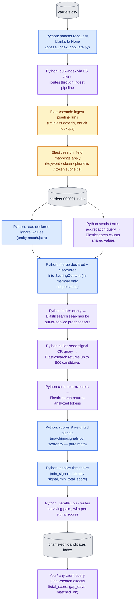
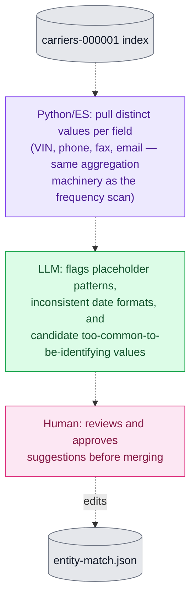

# How DOT chameleon-carrier detection works — simple version

_entitopia_ is a proof of concept for using semantic matching and multi-property
similarity as part of probabilistic entity resolution. It looks for an
_indicator_: a carrier that shut down under one DOT registration while a
closely-resembling "new" carrier registered shortly after. That pattern has
plenty of legitimate explanations — a business restructuring, a sale, a
partner buying out the other, a clerical re-filing — but it has also
historically been how a chameleon carrier sheds a safety record. The pipeline
surfaces pairs that fit the shape so a human can decide whether they are worth
investigating further.

Nothing here is a finding. No single data point proves anything: a shared
address could be a filing agent, a shared name could be coincidence. But
several weak signals pointing at the same successor are hard to explain by
chance, and that is what makes a pair worth a closer look. So the pipeline
scores _how much_ a shut-down carrier and a newly-registered one resemble each
other across name, address, contact info, shared vehicles, and timing, then
keeps the pairs with enough independent corroboration to justify the effort of
investigating them.

Raw DOT registration data is noisy and requires analysis.
There are placeholder values ("UNKNOWN" VINs, (000) 000-0000 phone numbers),
inconsistent date formats, and identifiers genuinely shared by hundreds of
unrelated carriers (filing agents, insurance agencies). Left in, that noise
hides real matches under formatting differences and manufactures fake ones
out of coincidental junk. Preprocessing strips it out before scoring sees
the data — some once at load time (date normalization, phonetic and
fuzzy-searchable versions of names and addresses), some fresh at the start
of every run (suppressing values too common to mean anything).

Elasticsearch is used for two different jobs.

1. First, as the engine that makes
   fuzzy and phonetic search possible at all: its ingest pipelines and field
   mappings do the one-time cleanup and indexing, so sound-alike name and fuzzy
   address queries are fast instead of something Python computes pairwise over
   the whole dataset.
2. Second, as a query and aggregation service the matching
   code calls during a run — finding candidate successors, counting how common a
   value is, fetching analyzed tokens. The scoring decisions (which weights,
   which thresholds, which pairs survive) stay in Python.

Results go into their own Elasticsearch index rather than a file or database
table, one document per surviving predecessor/successor pair, carrying the
total score and the full per-signal breakdown behind it. The index is the
report: an analyst, a dashboard, or a script can query it afterward —
filtering on score, on days between shutdown and re-registration, or on which
signals fired — without re-running the matching logic.

## Process Flow: who does the work at each step

Diagram colors:

- Blue = Python logic.
- Amber = Elasticsearch working internally, no Python decision-making.
- Purple = Python sends a query and Elasticsearch does the computation (search, aggregation, term vectors) before Python acts on the answer.
- Gray = a data store.
- Green = LLM analysis (offline, optional). Pink =
  human review (offline, optional).

### The sweep: CSV in, scored pairs out



### Growing `entity-match.json` (offline, optional)

This path is not part of a sweep. It runs on a maintenance cadence to grow
the declared ignore list, reading the same carrier index the sweep reads and
ending at the config file the sweep's `DECL` step loads. Dotted arrows mark
it as out-of-band. See
[§8](#8-optional-using-an-llm-to-help-build-the-declared-ignore-list) below.



## 1. Dataset sizes

Counts are point-in-time against the July 2026 FMCSA extract used throughout this document, and will differ on a fresh download.

| Step                    | Socrata ID  | Rows      | Purpose                                                                                                                                                                                                                                                   |
| ----------------------- | ----------- | --------- | --------------------------------------------------------------------------------------------------------------------------------------------------------------------------------------------------------------------------------------------------------- |
| `carriers`              | `kjg3-diqy` | 2,085,534 | Carrier census — the core entity each other dataset enriches.                                                                                                                                                                                             |
| `crashes`               | `aayw-vxb3` | 333,300   | Crash history per carrier.                                                                                                                                                                                                                                |
| `inspections`           | `fx4q-ay7w` | 5,647,567 | Vehicle inspection history per carrier.                                                                                                                                                                                                                   |
| `inspections-per-unit`  | `wt8s-2hbx` | 9,620,293 | Per-unit VIN/vehicle detail, enriched onto `inspections`.                                                                                                                                                                                                 |
| `auth-history`          | `9mw4-x3tu` | 4,941,925 | Every authority grant/revocation event per carrier — the reincarnation-timing signal for shadow/chameleon carriers (revoked → new DOT# granted soon after).                                                                                               |
| `out-of-service-orders` | `p2mt-9ige` | 394,963   | Carriers ordered out of service for safety, with reason/date/rescind date — flags who was shut down, a prime candidate for "who reappeared nearby afterward."                                                                                             |
| `boc3-agents`           | `2emp-mxtb` | 1,860,604 | Each carrier's legal process agent (name + address). **Weak signal:** only 89 distinct agents cover all 1.43M filings, so two unrelated carriers share an agent roughly 7% of the time by chance. Used only as IDF-weighted corroboration at weight 0.04. |

## 2. Problemsidentified in the raw data

- **Placeholder values that look like real data**: VINs like `"UNKNOWN"`,
  `"GGGG"`, `"XXXXXXXXXXXXXXXXX"`; phone `(000) 000-0000` shows up on 664
  carriers in the current extract.
- **Legitimately shared contact info**: BOC-3 filing agents, permit
  services, and insurance agencies sit on the paperwork for hundreds of
  unrelated carriers. Only 89 distinct filing agents cover 1.43M filings —
  two random carriers share an agent ~7% of the time by chance, so that
  alone proves nothing.
- A few data-modeling bugs noted in the README (dropped inspection
  records, over-eager predecessor matching from a mapping issue, mixed
  date formats).

## 3. How "ignore" values get identified — and handled

Two layers, both **Python** logic in `phase_entity_match.py`, running
_before scoring starts_:

- **A declared list** in config (`entity-match.json`) — hand-maintained
  junk values like the ones above.
- **An automatic frequency scan** — Python asks Elasticsearch (a `terms`
  aggregation) "which values are shared by more than N carriers?" (N = 5
  for VINs, 20 for phone/email/fax). Elasticsearch answers the count; the
  _decision_ to treat those values as noise is Python's.

The merged suppression set is computed once per sweep,
held in memory in `ScoringContext`, used to score that run's pairs, then
discarded. Every run recomputes it from scratch against current data, so
there's no record of what a past run suppressed.

## 4. Preprocessing before loading into Elasticsearch

There are two different methods for preprocessing before the data lands in Elasticsearch:

- **Python (at load time)**: reads the CSV via pandas, converts blanks to
  `None`, bulk-indexes each row with a computed document ID (`dot_number`),
  tagging which ingest pipeline to route through. Python doesn't clean the
  data itself here.
- **Elasticsearch ingest pipelines (at index time)**: the real cleanup.
  Pipelines are defined as JSON (`pipelines.json`); Python registers them
  once via the ES API, then Elasticsearch's own scripting (Painless) and
  processors transform every document that flows through:
  - Reformat legacy Oracle dates (`dd-MMM-yy` → ISO, with a century-pivot
    rule, dropping the field rather than failing the whole document if
    unparseable).
  - "Enrich" processors attach each carrier's inspections, crashes,
    authority history, out-of-service orders, and BOC-3 agents by looking
    up `dot_number`.
- **Field mappings** (also ES config, applied at index creation): generate
  multiple searchable variants of each field. Names get an exact
  `.keyword`, a cleaned `.clean`, and two phonetic encodings
  (double-metaphone, Beider-Morse) — both strip suffixes like
  "LLC"/"trucking"/"logistics" first. Addresses get an exact form and a
  fuzzy token form that contracts street suffixes to a canonical token
  (`st`→`street`), drops secondary-unit designators such as `STE`/`APT`
  while keeping the unit number, and normalizes the `P.O. BOX` family.

Ingest pipelines and field mappings both run inside Elasticsearch, not in
Python. Python's only part in them is the config it wrote once at setup.
The ignore list and frequency scan from §3 are a separate, later step —
Python logic at matching time that uses Elasticsearch only to fetch counts.

## 5. How Elasticsearch is queried, with what weights

For each carrier that went out of service, the code finds up to 500
candidate successors via a broad OR query on name-sound, address, exact-ID,
and VIN overlap. Each candidate is then scored against 8 weighted signals:

| Signal                                           | Weight                           |
| ------------------------------------------------ | -------------------------------- |
| Name (double-metaphone phonetic)                 | 0.22                             |
| Address (exact/fuzzy match)                      | 0.20                             |
| Name (Beider-Morse phonetic)                     | 0.13                             |
| Exact identifier (shared phone/fax/email)        | 0.12                             |
| Name (token/text match)                          | 0.10                             |
| VIN overlap (shared vehicle)                     | 0.08                             |
| Temporal gap (shutdown → re-registration timing) | 0.05                             |
| Filing agent overlap                             | 0.04 (rarity-weighted, not flat) |

A pair needs at least 2 independent evidence sources, at least one
"identity" signal (not just timing or agent), and a combined score ≥0.35 to
survive. Shared-VIN pairs bypass the score floor — a shared vehicle is
treated as conclusive on its own, even though the math gives it a low
numeric score.

## 6. What a result document contains, and where it's stored

Each surviving pair becomes a document in a `chameleon-candidates` index:
predecessor summary, successor summary, `total_score`, `gap_days`, which
signals fired (`matched_on`), and a full per-signal breakdown
(`signal_type`, `weight`, `score`, `contribution`), so you can see why a
pair scored what it did rather than just the final number.

## 7. Querying Elasticsearch for the calculated results

Query the `chameleon-candidates` index/alias directly — there's no separate
summary report. Useful fields:

This demonstration contains no reporting tool. There’s no separate summary
report. You can query the `chameleon-candidate`s` index/alias
directly via the REST endpoint or via 3rd party tools and languages. —

- `total_score >= 0.70` for high-confidence pairs (the README's reviewed
  threshold, and explicitly "uncalibrated confidence, not probability")
- `gap_days` for how soon after shutdown the successor appeared
- `matched_on` to filter by which evidence types fired — VIN + address +
  phone together is much stronger than VIN alone
- `signals.*` for the per-signal explanation. These are mapped as a plain
  `object`, not `nested`, so a query filtering on `signals.signal_type`
  **and** `signals.score` together can match a document where those values
  came from two _different_ array entries. Fine for the queries below,
  which filter one `signals.*` field at a time; to correlate two signal
  fields, pull the array client-side and filter in code.

VIN-only matches score low (~0.11) because of how the weighted average renormalizes.
They never rise to the top of a score-sorted view.
The second query below finds them by filtering matched_on and sorting by gap_days instead.

### Sample: high-confidence pairs, corroborated by more than a shared vehicle

REST (e.g. Kibana Dev Tools, or `curl -X GET`):

```json
GET chameleon-candidates-000001/_search
{
  "size": 50,
  "query": {
    "bool": {
      "filter": [
        { "range": { "total_score": { "gte": 0.70 } } },
        { "terms": { "matched_on": ["vin-overlap", "exact-identifier"] } }
      ]
    }
  },
  "sort": [ { "total_score": "desc" } ]
}
```

Python, using this project's client helper (`utils/elasticsearch_utils.py`)
and the same explicit-keyword-argument style as `matching/candidates.py` —
never `body=`, per this repo's Elasticsearch convention:

```python
from utils import elasticsearch_utils, file_utils

es_config = file_utils.load_from_file("es_config.json")
es = elasticsearch_utils.connect_to_es(es_config)

response = es.search(
    index="chameleon-candidates-000001",
    size=50,
    query={
        "bool": {
            "filter": [
                {"range": {"total_score": {"gte": 0.70}}},
                {"terms": {"matched_on": ["vin-overlap", "exact-identifier"]}},
            ]
        }
    },
    sort=[{"total_score": "desc"}],
)

for hit in response["hits"]["hits"]:
    pair = hit["_source"]
    print(
        pair["predecessor"]["dot_number"],
        "->",
        pair["successor"]["dot_number"],
        pair["total_score"],
    )
```

### Sample: VIN-only pairs, triaged by gap instead of score

These score low (~0.11) by design, so sort by `gap_days` rather than
`total_score`:

```json
GET chameleon-candidates-000001/_search
{
  "size": 50,
  "query": {
    "bool": {
      "filter": [
        { "term": { "matched_on": "vin-overlap" } }
      ],
      "must_not": [
        {
          "terms": {
            "matched_on": ["name-phonetic", "name-token", "address", "exact-identifier"]
          }
        }
      ]
    }
  },
  "sort": [ { "gap_days": "asc" } ]
}
```

The Python form is the same shape as the sample above — swap the `query`
and `sort` arguments to `es.search(...)`.

## 8. Optional: using an LLM to help build the declared ignore list

Claude LLM acted as a suggestion generator feeding a human-reviewed list of invalid
and placeholder values. It did not write `entity-match.json` directly.
It did not generate the results.
The LLM complements other mechanisms rather than replacing either:

- The **frequency scan** only catches common values (shared by
  more than N carriers). A malformed VIN appearing on 3 carriers still
  isn't identified as garbage — and the frequency scan has no way to
  notice.
- An **LLM pass** covers that gap: it recognizes placeholders and
  formatting problems (obviously fake VINs, `dd-MMM-yy` and ISO dates
  mixed in one column, phone numbers like `(111) 111-1111`) without
  needing them to already be common.

How it fits into the flow (the "Growing `entity-match.json`" chart above):

1. Pull the **distinct values** per field, not full rows — reuse the
   aggregation machinery already behind the frequency scan (`terms` agg on
   `telephone.keyword`, VIN fields, and so on). The interesting object is
   the value, not the row, so this bounds what gets sent to the LLM no
   matter how many carrier records exist.
2. Have the LLM classify each distinct value: placeholder/junk pattern,
   inconsistent-date-format artifact, or plausible real value. Output is a
   list of suggested additions to `ignore_values`, with reasoning for each.
3. **A human reviews and approves before anything is merged into
   `entity-match.json`.** This step is not optional. `ignore_values`
   suppresses a signal outright, and a wrong addition throws no error and
   fails no test — it quietly removes evidence from every future run, the
   same silent-failure shape this project works to avoid elsewhere.
4. Once merged and committed, the addition is picked up the next time
   `_declared_ignored_values` reads the file. No code change needed.

Run this LLM flow when reviewing a new data extract or when the declared exclusion list seems
stale, not as part of every dataset reload. It drives the hand-maintained list and
leaves the per-run frequency scan untouched.

## 9. Does the score actually predict anything?

Everything above describes what the matcher _did_ — how many pairs it emitted,
what score they got, which signals fired. None of it says whether the matcher
was _right_. A scorer that ranked carriers by ZIP code would produce an
equally clean set of counts. Two checks exist to answer that instead, and
they are not equally trustworthy: one is direct, one is a proxy, and the
proxy is reported second on purpose.

### The direct check: does the top tier actually look like chameleons?

The [top-level README](../README.md) defines a chameleon as a carrier "shut
down for safety or insurance reasons that reopens under a new DOT number" —
a claim about timing, not about anything a proxy outcome is needed for. The
successor has to register after the predecessor shuts down, or, per
`TemporalSignal`'s own 180-day pre-positioning window, shortly before a
known-coming shutdown. `gap_days` (successor `add_date` minus predecessor
`shutdown_date`) is already on every emitted pair, so checking this needs no
labels and no external dataset: run
`.venv/bin/python scripts/measure_chameleon_shape.py` and look at where the
≥ 0.70 tier's gaps actually land.

Measured 2026-08-08: of the **1,729 pairs scoring ≥ 0.70**, only **34.5%
(596)** fall inside the temporally coherent window. 42.1% (728) registered
more than 180 days _before_ the predecessor even shut down — outside what
the scorer itself treats as plausible pre-positioning. Mean score barely
separates pre- from post-shutdown pairs: 0.4425 against 0.4520, a gap of
0.0095. That's not because `temporal` is buggy — `matching/signals.py`
deliberately gives a pre-shutdown pair partial credit
(`BACKWARD_WINDOW_DAYS = 180`, `BACKWARD_SCALE = 0.5`) because standing a
successor up ahead of a known-coming shutdown is a real tactic — it's because
`temporal` can't move the needle much even at its theoretical best: it carries
0.05 of the 0.94 configured weight (a ceiling of about 0.053 on any score),
while the three name signals in §5 carry 0.45 combined, nine times as much.
The ranking is set almost entirely by name similarity, so a byte-identical
name plus a shared address clears 0.70 with a large negative `gap_days` and
`temporal` contributing nothing to stop it. This is the "name effectively
triple-weighted" open item in the README, seen from a different angle — not a
new defect.

One caveat travels with this result everywhere it's quoted: 49 CFR 386.73
covers operating as an _affiliated entity_, not only under a brand-new
identity, so a high-scoring pair naming a pre-existing company is not
automatically wrong — it may be a genuine affiliate relationship, which is a
different and still useful finding. What it is not is _reincarnation_, which
is the pattern this project says it's hunting.

### The proxy check: crash involvement

[GAO-12-364](https://www.gao.gov/products/gao-12-364) found that FMCSA
new-applicants with "chameleon attributes" (registration details matching a
prior carrier that had motive to evade enforcement) were involved in severe
crashes at **18%**, against **6%** for applicants without them — a 3x lift.
That's a useful yardstick because the crash data is already loaded here and
nothing in `entity-match.json` reads it: a crash outcome is genuinely
external evidence, not a restatement of the score.

It's still a proxy, and a weaker one than the direct check above: crash
involvement is something GAO measured because chameleon carriers matter to
regulators for safety reasons, not the definition of one. A chameleon that
never crashes is still a chameleon; a carrier that crashes constantly and has
never changed identity is not one. So this result is reported second, and it
should never be read as a verdict on whether the matching is accurate — only
on whether the flagged population happens to be riskier than comparable
carriers.

Every cohort and band below is fixed _before_ looking at the outcome, for the
same reason a trial pre-registers its endpoints — cutting them after seeing
the result is exactly how this kind of measurement fools its author:

- **Score bands** reuse thresholds this document and the README already
  commit to (the 0.35 emit floor, the 0.70 triage line) instead of inventing
  new ones.
- **The restricted cohort** — the one comparable to GAO's numbers — is
  successors registered _before_ the crash file's rolling 24-month window, so
  every carrier in it has had the full window to crash. That excludes the
  freshest registrations, which is exactly the population an _active_
  chameleon would fall into, so a companion, exposure-normalized view over
  every successor (crashes per 1,000 months of observed exposure, not a raw
  proportion) is reported alongside it. The two are not interchangeable.
- **Recency cohorts** (`under-1y`, `1-3y`, `3y-plus`, measured back from the
  crash file's own newest report date rather than from today, so the columns
  don't reshuffle between two runs over identical data) exist for the same
  reason: a signal confined to carriers that re-registered recently would
  wash out completely if averaged against a decade of carriers that
  re-registered long ago and have been running quietly ever since.

Run `.venv/bin/python scripts/measure_crash_lift.py`. Measured 2026-08-08:
crash window 2024-08-12 to 2026-07-29; 249,778 distinct successors, restricted
cohort 196,707 (21.2% excluded as registered inside the window). That cohort
crashed at **6.64%**; per-band rates inside it don't rise with score
(6.63% / 4.91% / 5.41% / 13.78% / 12.18% / 4.14% from lowest to highest
band — the top band is actually the lowest). The whole unflagged population,
standardized to the flagged cohort's registration-year/fleet-size/state mix,
crashed at **6.02%** — a lift of **1.10x**, against GAO's **3.0x**. The
permuted-score placebo lands at essentially the same rate on the two bands
holding 98.0% of the cohort ((146,045 + 46,797) / 196,707); the small
high-score tail bands (n=145-283) wobble more, consistent with sampling noise
at that count rather than a real trend.

**This is a null result, stated plainly rather than softened.** By this
proxy, on this data, the flagged population is not measurably riskier than
comparable carriers. That is a different statement from "the matching is
broken," for two reasons that have to travel with the number:

- The loaded carrier census carries no officer name, no EIN, and no DUNS —
  three of the identifiers FMCSA's own ARCHI vetting tool matches shared
  registrations on. A weak lift is at least as consistent with those inputs
  being missing as with the scorer being wrong, and no amount of analyzer
  tuning recovers data that was never loaded.
- This measures precision-shaped properties only. There is no list of known
  chameleon carriers to check recall against, so a real chameleon the sweep
  never surfaced is invisible to every method in this section, direct or
  proxy. Neither result here should be read as "accuracy" without that
  qualification.

### Why GAO got 3.0x and this got 1.10x

Mostly because GAO was measuring a much smaller, much cleaner set. They
flagged 1,136 carriers; this sweep flags 249,778 successors, which is 12% of
every carrier in the file. When most of a flagged set is wrong, its crash
rate slides toward the rate for carriers in general — and that is exactly
where this one sat.

The clearest way to see it: a shut-down carrier can have at most **one** real
successor, but the sweep emits **9.0 pairs for every predecessor that
produced at least one pair** (46,792 of the 48,540 the selector examined; the
rest never paired at all). So even in the best case, no more than about 11%
of the pairs can be right, and the true figure is far lower because most
shut-down carriers simply never come back. Working backwards from the 1.10x
lift suggests roughly **5%** of the
flagged set is real — which sits comfortably under that ceiling, and matches
what the direct measurement said from a completely different direction.

Two things are worth ruling out, because they would be easy to blame. The
24-month crash window is not the problem: the comparison group was measured
over the same window. Nor is the outcome definition: the base rate here came
out at 5.86% against GAO's 6%, which is close enough to say both are counting
the same thing.

So this is a **precision** problem, not a measurement problem — and precision
is something you can fix. The [README's calibration open
item](../README.md#open-items) lists five candidate changes ranked by expected
effect, from tightening predecessor selection to sourcing the officer, EIN and
DUNS fields that FMCSA's own tool relies on.

The direct check is where the real signal is: the ranking lands on the
temporally coherent side of its own window barely a third of the time, and
that's squarely a scoring-weight problem, not a data-availability one. See the
`entity-match` calibration item in the
[top-level README's open items](../README.md#open-items) for the numbers
recorded against production data, and the name-weighting item it points at
next.
