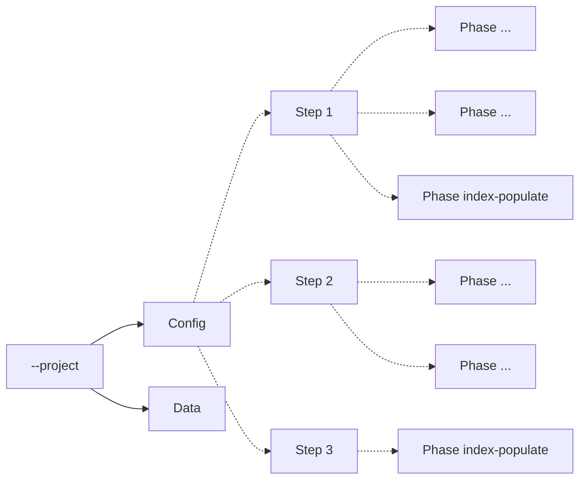
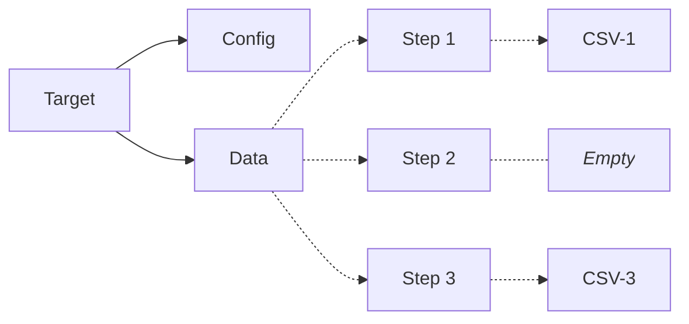

# Purpose
Provide framework for loading data into elasticsearch with just configuration.  Initial work is targeted at entity searching but it could be anything.

# Supported
1. Index creation
    1. Index mapping
    1. Index settings
    1. Index aliases
1. Enrichment Policies
1. Pipeline creation bound to 1 or more enrichment policies
1. Index population
    1. Direct to index or
    1. Via pipeline
1. Data importation from CSV files

## execute_project.py Command line options

* `--project=` Data target directory contain config and data
* `--step=` The steps, config directories, to execute
* `--phase=` Config file types should be used if avaialble in each step

# Target Directories, Steps and Phases

## Steps
Steps are basically a bundle of related work. They are defined in a project's configuration.json.  Each step's configuration is defined in configuration files in a `project\configuration` directory one per phase.

## Configuration : Steps and Phases
A configuration file at the top of the `--project` directory describes the steps and phases that are possible. The configuration directories represent _steps_.  Configuration files in the directories contain the _phase configuration_ files.

## Processing Steps are made up of Phases
Each step can contain one or more phases as described by json configuration files. Phases represent the type of work that can be done in one or more steps.  Each step can contain zero or more phases.  The currently supported phases as implemented in [`phase_providers`](phase_providers)

1. `index-map` - create an index and alias
1. `enrichment-policies` - create enrichment policies and the related enrichment indexes
1. `pipelines` - create elasticsearch ingestion pipelines
1. `index-populate` - load data into an index

## Data : Steps
Processing is made up of one or more steps. Data is loaded during the `index-populate` phase.  We stage the source data in `data` subdirectories that have the same name as their step in the top level configuration

# Status
This is a work in progress

## Open Work Items
1. Cleaning up exiting
1. Deleting enrichment policies when they are tied to pipelines.  You have to delete the pipeline manually before policies can be deleted.
1. Support multiple steps for --step command line argument
1. Support multille phases for --phase command line argument
1. Add support for multiple pipelines in the pipeline phase
1. Add support for target specific processors
1. Implement compund indexes or indexes from combinations of fields.  Required for several of the data sets

### Closed work items
1. Add support for multiple policies in a policy phase.
1. Add support for --step command line argument to run a single step.
1. Add support for --phase command line argument to run a single phase.
1. Bind all phases to only one controller

# Setup
1. Have access to a docker cluster.
    * I use ElasticSearch on Docker using https://github.com/freemansoft/docker-scripts/tree/main/elasticsearch
    * Elasticsearch analysis plugins must be loaded
1. Clone this repo
1. Configure Python with `bash dependencies.sh`
1. create an `es_config.json` from `es_config_template.json`
1. Download data
    * Use the `download.....sh` script in one of the example directories
1. Run `python3 execute_project.py --project<the-project-dir>`
    * `python3 execute_project.py --project=CMS-Providers`
1. Verify the indexes have been created
    * The Elasticsearch url is usually something like the following when running locally http://localhost:5601/

# Government Datasets

* DOT Commercial https://ai.fmcsa.dot.gov/SMS/Tools/Downloads.aspx
* Medicare Providers https://data.cms.gov/provider-data/

# References

### Elasticsearch indexing
* https://dev.to/makalaaneesh/updating-the-mapping-of-an-elasticsearch-index-3h9n

### Analyzers
* https://www.informit.com/articles/article.aspx?p=1848528