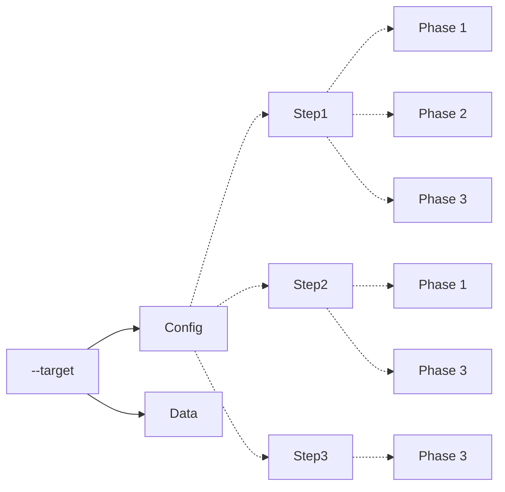
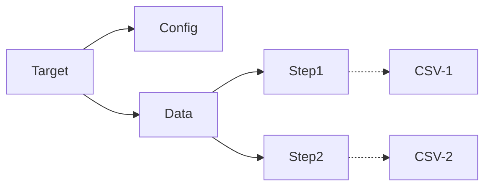

# Purpose
Provide framework for loading data into elasticsearch with just configuration.  Initial work is targeted at entity searching but it could be anything.

# Supported
1. Index creation
1. Index mapping
1. Index settings
1. Index aliases
1. Enrichment Policies
1. Pipeline creation bound to 1 or more enrichment policies
1. Index population direct to index or via pipeline
1. Index data ingestion from CSV files

# Target Directories, Steps and Phases
_to be documented_

## Target Configuration : Steps and Phases
_to be documented_

## Target Data : Steps
_to be documented_

# Status
**Nothing works yet**

## Open Work Items
1. Cleaning up exiting
1. Deleting enrichment policies when they are tied to pipelines.  You have to delete the pipeline manually before policies can be deleted.
1. Support multiple steps for --step command line argument
1. Support multille phases for --phase command line argument
1. Add support for multiple pipelines in the pipeline phase
1. Add support for target specific processors
1. Implement compund indexes or indexes from combinations of fields.  Required for several of the data sets

### Closed work items
1. Add support for multiple policies in a policy phase.
1. Add support for --step command line argument to run a single step.
1. Add support for --phase command line argument to run a single phase.
1. Bind all phases to only one controller

# Setup
1. Have access to a docker cluster.
    * I use ElasticSearch on Docker using https://github.com/freemansoft/docker-scripts/tree/main/elasticsearch
    * Elasticsearch analysis plugins must be loaded
1. Clone this repo
1. Configure Python with `bash dependencies.sh`
1. create an `es_config.json` from `es_config_template.json`
1. Download data
    * Use the `download.....sh` script in one of the example directories
1. Run `python3 execution_template.py --project<the-project-dir>`
    * `python3 execution_template.py --project=CMS-Providers`
1. Verify the indexes have been created
    * The Elasticsearch url is usually something like the following when running locally http://localhost:5601/

# Government Datasets

* DOT Commercial https://ai.fmcsa.dot.gov/SMS/Tools/Downloads.aspx
* Medicare Providers https://data.cms.gov/provider-data/

# References

### Elasticsearch indexing
* https://dev.to/makalaaneesh/updating-the-mapping-of-an-elasticsearch-index-3h9n

### Analyzers
* https://www.informit.com/articles/article.aspx?p=1848528