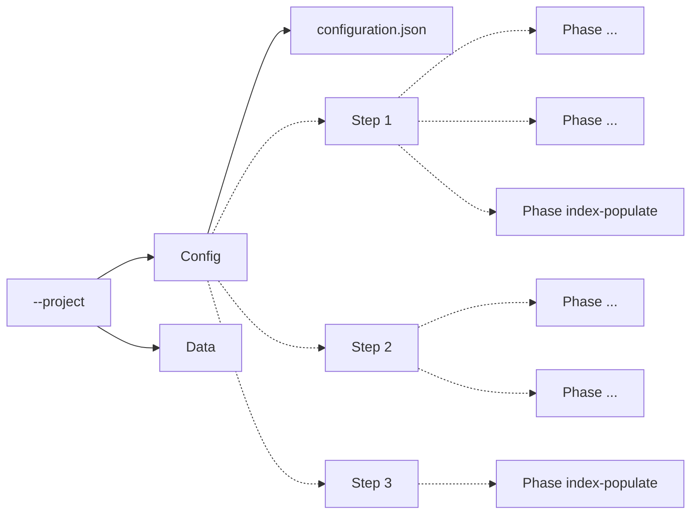
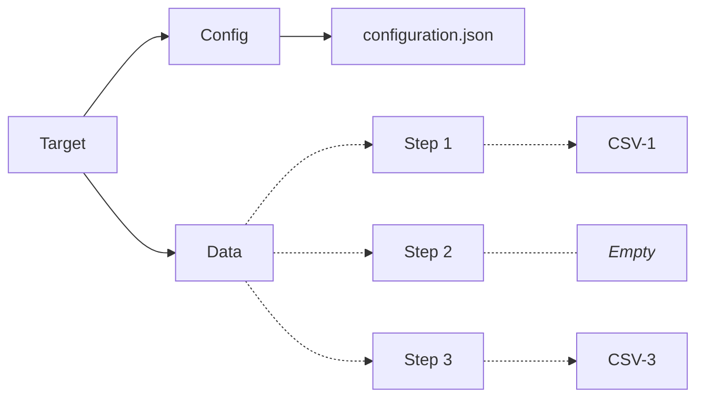

# Entitopia

## Purpose

Provide a framework for loading data into elasticsearch with just configuration. Initial work is targeted at entity searching but it could be anything.

## Supported

1. Data importation from CSV files
1. Index creation
   1. Index mapping
   1. Index settings
   1. Index aliases
1. Enrichment Policies
1. Pipeline creation bound to one (1) or more enrichment policies
1. Index population / load using parallel bulk API
   1. Direct to index
   1. Via pipeline

### execute_project.py Command line options

- `--project=` Data target directory contain config and data
- `--step=` The steps, config directories, to execute
- `--phase=` Config file types should be used if available in each step

## Target Directories, Steps and Phases

### Steps

Steps are basically a bundle of related work. They are defined in a project's configuration.json. Each step's configuration is defined in configuration files in a `project/configuration` directory one per phase.

### Configuration : Steps and Phases

A configuration file at the top of the `--project` directory describes the steps and phases that are possible. The configuration directories represent _steps_. Configuration files in the directories contain the _phase configuration_ files.

```mermaid
flowchart LR
    Target["--project"]
    Target-->Config --> ConfigFile[configuration.json]
    Target-->Data

    Config-.->Step1[Step 1]
    Config-.->Step2[Step 2]
    Config-.->Step3[Step 3]

    Step1-.->Phase11[Phase ...]
    Step1-.->Phase12[Phase ...]
    Step1-.->Phase13[Phase index-populate]

    Step2-.->Phase21[Phase ...]
    Step2-.->Phase22[Phase ...]

    Step3-.->Phase31[Phase index-populate]
```

### Processing Steps are made up of Phases

Each step can contain one or more phases as described by json configuration files. Phases represent the type of work that can be done in one or more steps. Each step can contain zero or more phases. The currently supported phases as implemented in [`phase_providers`](phase_providers)

1. `index-map` - create an index and alias
1. `enrichment-policies` - create enrichment policies and the related enrichment indexes
1. `pipelines` - create elasticsearch ingestion pipelines
1. `index-populate` - load data into an index
1. `entity-match` - score pairs of related entities and write ranked candidates to an output index

### Data : Steps

Processing is made up of one or more steps. Data is loaded during the `index-populate` phase. We stage the source data in `data` subdirectories that have the same name as their step in the top level configuration

```mermaid
flowchart LR
    Target-->Config --> ConfigFile[configuration.json]
    Target-->Data
    Data-.->Step1[Step 1]-.->CSV-1
    Data-.->Step2[Step 2]-.-Empty-2[<i>Empty</i>]
    Data-.->Step3[Step 3]-.->CSV-3

```

## Status

This is a work in progress

### Open Work Items

1. Cleaning up on exit
1. Deleting enrichment policies when they are tied to pipelines. You have to delete the pipeline manually before policies can be deleted. This is worse than a bureaucratic annoyance: if a rerun's policy rebuild silently hits this conflict (because a pipeline referencing the policy is still live from a prior run), the enrich policy is left as a STALE, UNDERSIZED snapshot with no error — later steps keep enriching against outdated/incomplete data with no signal anything is wrong. Confirmed in practice during the DOT-Commercial VIN/units work: `inspections-enrichment-policy` silently stayed pinned to a 5,000-row validation-sample snapshot of `inspections` across a full 5.6M-row production run because `carrier-enrichment-pipeline-000001` still existed and blocked the policy delete-and-rebuild, dropping `carriers.inspections` enrichment coverage from ~572K to ~4K matches with no failure anywhere in the run.
1. Support multiple steps for --step command line argument
1. Support multiple phases for --phase command line argument
1. Add support for multiple pipelines in the pipeline phase
1. Add support for target specific processors
1. DOT-Commercial: carriers ingestion loses ~0.04-0.44% of documents under load to Elasticsearch enrich-coordinator queue-capacity limits (1024 slots) when `parallel_bulk`'s 8-thread concurrency runs enrich lookups against the full ~2M-carrier / 5.6M-inspection / 333K-crash dataset. Not a data-correctness bug (failures are now logged and idempotent reruns fill the gap), but a real throughput ceiling worth addressing (e.g. tune thread_count, add retry/backoff, or raise the ES enrich queue capacity setting).
1. DOT-Commercial: inspections ingestion silently drops ~0.65% of documents (36,788 of 5,647,567 on a full run) because `insp_carrier_state_id` is not pinned in `inspections/index-mappings.json` — Elasticsearch dynamically infers its type (`float`) from whichever value it sees first under `parallel_bulk`'s 8-thread concurrency, and the source column actually mixes numeric and non-numeric strings (e.g. `'NONE'`, `'S00000030887'`), so every non-conforming row fails with `document_parsing_exception`. Deterministic and lossy on every full run; which specific rows drop varies with thread ordering. Fix by pinning `insp_carrier_state_id` to `keyword` in `index-mappings.json`, mirroring how `dot_number`/`inspection_id` are already pinned.
1. `phase_enrichment_policies.py` aborts the whole policy-rebuild loop on a missing source index. `execute_policy` sits in a `try` that catches only `BadRequestError`, while `delete_policy` above it catches both `ConflictError` and `NotFoundError`. So if a dated source index is absent — which happens when a run crosses midnight and earlier steps created indexes under yesterday's date — the `NotFoundError` escapes and every policy _after_ the failing one in the list is never rebuilt. Those policies keep serving their previous snapshot, which is the same stale-enrichment failure already described above, reached by a different route. It fails loudly with a traceback rather than silently, but an unattended overnight run can still finish with several policies quietly out of date. Fix by catching `NotFoundError` around `execute_policy`, logging which policy and index were missing, and continuing to the next policy.
1. `entity-match` over-selects predecessors because `out_of_service_orders` is mapped as a plain `object` rather than `nested`. A carrier with an ACTIVE 2015 order and an INACTIVE 2022 order satisfies `status: ACTIVE` and `oos_date >= 2020` from two _different_ array elements, so it is swept even though no single order matches both filters. `TemporalSignal` then reports whichever `oos_date` is latest, so `shutdown_date` and `gap_days` on an emitted pair may come from an order the selector never intended to match. Over-selection preserves recall and `max_predecessors` bounds the cost, which is why it ships. Fix by mapping `out_of_service_orders` as `nested` and using a `nested` query in `matching/predecessors.py`.

### Closed work items

1. Add support for multiple policies in a policy phase.
1. Add support for --step command line argument to run a single step.
1. Add support for --phase command line argument to run a single phase.
1. Bind all phases to only one controller
1. Supports daily indexes and alias so you can do zero downtime index creation/reload
1. `_id` is autogenerated if `id_field` is not specified in configuration
1. Add example fingerprint `_id` field hashed from multiple fields - deterministic `_id`
1. Warn if no step executed
1. DOT-Commercial: fixed `crashes-enrichment-into-carriers` returning zero matches by adding an explicit `long` mapping for `crashes.dot_number` (was dynamically inferred as `float`, mirroring `carriers/index-mappings.json`'s existing pattern of pinning field types explicitly), plus a Painless `script` ingest processor on `crashes-pipeline-000001` that casts `dot_number` to a real JSON integer in `_source` before indexing. A `convert` processor (type: `long`) was tried first but fails silently: Elasticsearch's convert-to-long calls `Long.parseLong()` on the string form, which throws on decimal-point strings like `'3240797.0'`; a Painless `(long)` cast does not have this limitation.
1. Implemented compound/composite `id_field` support: `phase_index_populate.py`'s `id_field` config value can now be a JSON list, not just a single column name — `compute_id()` joins the listed fields' values with `|` to build a deterministic `_id`, falling back to the existing single-column behavior when `id_field` is a string, and to ES auto-generated IDs when unset. Wired to DOT-Commercial's four datasets that previously had no `id_field` at all: `crashes` (`crash_id`, a natural single-column key that was simply never configured), `boc3-agents` (`docket_number`, likewise natural), `out-of-service-orders` (composite of `dot_number`+`oos_date`+`oos_reason`+`status`+`rescind_date`, empirically confirmed 100% unique against the full 394,963-row dataset), and `auth-history` (composite of all 9 columns — empirically the source data itself has 10,510 exact full-row duplicates that no key can separate, so the composite correctly collapses them into one document, which is the desired outcome since they're byte-identical). This closes the "no `id_field` → duplicate on same-day rerun" limitation for all four; see `docs/superpowers/specs/2026-07-28-dot-commercial-shadow-carrier-datasets-design.md`'s "id_field fix" section for the full uniqueness analysis.

## Setup

1. Have access to a docker cluster.
   - I use ElasticSearch on Docker using <https://github.com/freemansoft/docker-scripts/tree/main/elasticsearch>
   - Elasticsearch analysis plugins must be loaded
1. Clone this repo
1. Requires Python 3.11 or higher (see `.python-version`)
1. Configure Python with `bash dependencies.sh`
1. create an `es_config.json` from `es_config_template.json`
1. Download data
   - Use the download or fetch script in one of the example directories (e.g. `download_cms_provider.sh`, `fetch_commercial_carriers.py`)
1. Run `python3 execute_project.py --project<the-project-dir>`
   - `python3 execute_project.py --project=CMS-Providers`
1. Verify the indexes have been created
   - The Elasticsearch url is usually something like the following when running locally <http://localhost:5601/>

## Government Datasets

- DOT Commercial <https://ai.fmcsa.dot.gov/SMS/Tools/Downloads.aspx>
- Medicare Providers <https://data.cms.gov/provider-data/>

## References

### Elasticsearch indexing

- <https://dev.to/makalaaneesh/updating-the-mapping-of-an-elasticsearch-index-3h9n>

### Analyzers

- <https://www.informit.com/articles/article.aspx?p=1848528>
