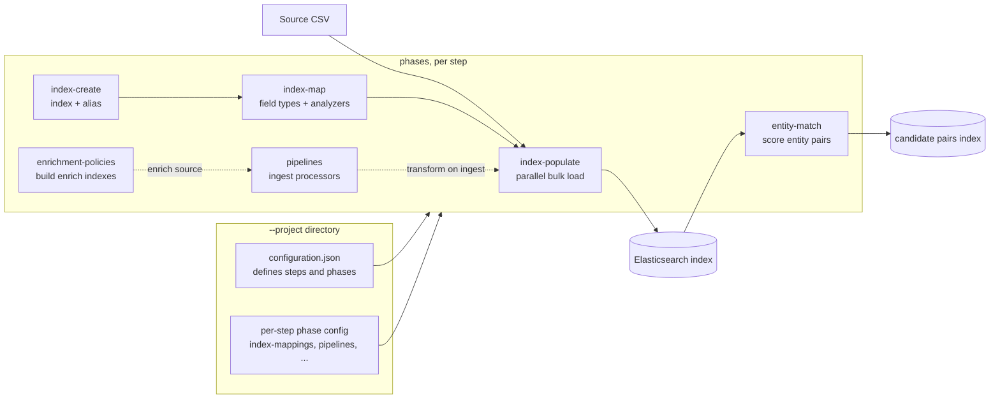
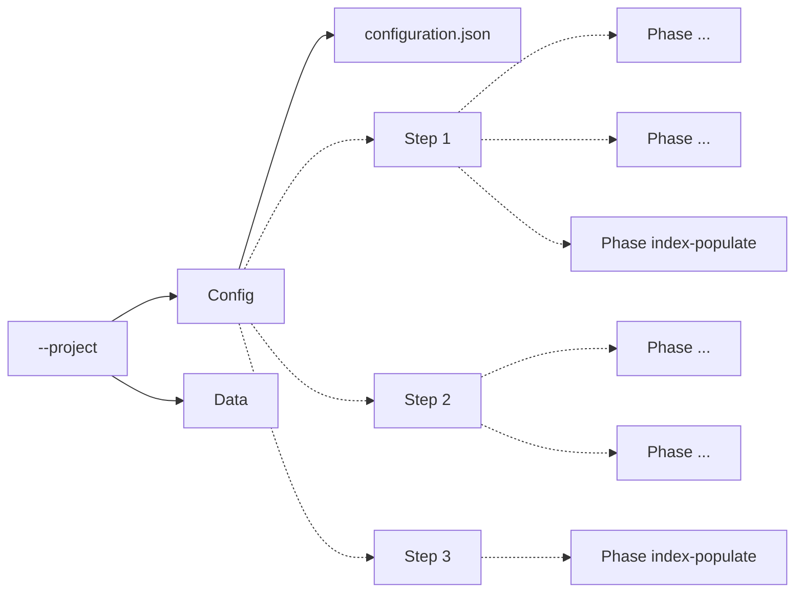
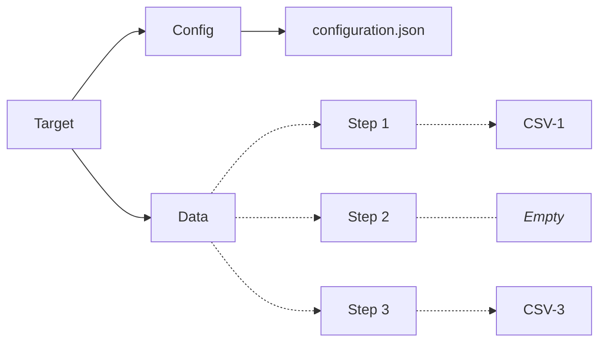

# Entitopia

## Purpose

Entitopia is a **configuration-driven framework for loading data into Elasticsearch and matching entities across it**. You describe indexes, analyzers, enrichment policies, ingestion pipelines, and matching rules in JSON; the framework executes them. The goal is that adding a new dataset means writing configuration, not code.

The initial focus is **entity resolution** — finding records that describe the same real-world thing despite differing spelling, punctuation, abbreviation, or deliberate obfuscation — but nothing in the framework is specific to that.

### Reference implementations

The framework ships with two example projects. They exist to prove the framework works against real, messy, public data, and each one is where that dataset's specifics live:

| Project                             | Dataset                                     | What it proves                                                                                                                                               |
| ----------------------------------- | ------------------------------------------- | ------------------------------------------------------------------------------------------------------------------------------------------------------------ |
| [`CMS-Providers`](CMS-Providers/)   | Medicare provider data (~5.6M rows)         | Scale, composite document IDs, and phonetic/fuzzy analyzers on names and addresses. No enrichment.                                                           |
| [`DOT-Commercial`](DOT-Commercial/) | FMCSA commercial trucking data (~9.6M rows) | Multi-dataset enrichment, two-level enrichment chains, ingestion pipelines, and entity matching — detecting "chameleon carriers" that reopen under a new ID. |

Each project has its own README covering its datasets, the steps it runs, its index relationships, and the dataset-specific problems solved there. **This README covers the framework and the hazards common to any dataset.**

Adding a third dataset? Start with [docs/adding-a-dataset.md](docs/adding-a-dataset.md) — it walks the decisions in order and points back here for the details.

## How it works

A **project** is a directory containing configuration and data. Running it executes **steps** in order; each step runs one or more **phases**.


```mermaid
flowchart LR
    CSV[Source CSV] --> Populate

    subgraph project["--project directory"]
        Config[configuration.json<br/>defines steps and phases]
        PhaseCfg[per-step phase config<br/>index-mappings, pipelines, ...]
    end

    subgraph phases["phases, per step"]
        direction TB
        Create[index-create<br/>index + alias]
        Map[index-map<br/>field types + analyzers]
        Policies[enrichment-policies<br/>build enrich indexes]
        Pipelines[pipelines<br/>ingest processors]
        Populate[index-populate<br/>parallel bulk load]
        Match[entity-match<br/>score entity pairs]
    end

    Config --> phases
    PhaseCfg --> phases

    Create --> Map --> Populate
    Policies -.->|enrich source| Pipelines
    Pipelines -.->|transform on ingest| Populate
    Populate --> Index[(Elasticsearch index)]
    Index --> Match --> Output[(candidate pairs index)]
```

### `execute_project.py` command line options

- `--project=` project directory containing configuration and data
- `--step=` run a single step
- `--phase=` run a single phase within the selected steps

```bash
.venv/bin/python execute_project.py --project=CMS-Providers
.venv/bin/python execute_project.py --project=DOT-Commercial --step=carriers --phase=index-map
```

### Steps

Steps bundle related work. They are declared in a project's `configuration.json`. Each step's configuration lives in `project/configuration/<step>/`, one file per phase.


```mermaid
flowchart LR
    Target["--project"]
    Target-->Config --> ConfigFile[configuration.json]
    Target-->Data

    Config-.->Step1[Step 1]
    Config-.->Step2[Step 2]
    Config-.->Step3[Step 3]

    Step1-.->Phase11[Phase ...]
    Step1-.->Phase12[Phase ...]
    Step1-.->Phase13[Phase index-populate]

    Step2-.->Phase21[Phase ...]
    Step2-.->Phase22[Phase ...]

    Step3-.->Phase31[Phase index-populate]
```

### Phases

Each step contains zero or more phases. Phases are the units of work, implemented in [`phase_providers`](phase_providers):

1. `index-create` — create an index and alias
1. `index-map` — apply field mappings and analyzer settings
1. `enrichment-policies` — create enrichment policies and their enrich indexes
1. `pipelines` — create Elasticsearch ingestion pipelines
1. `index-populate` — load data into an index, directly or through a pipeline
1. `entity-match` — score pairs of related entities and write ranked candidates to an output index

### Data staging

Source data lives in `data` subdirectories named after the step that consumes it. Setup-only steps have no data.


```mermaid
flowchart LR
    Target-->Config --> ConfigFile[configuration.json]
    Target-->Data
    Data-.->Step1[Step 1]-.->CSV-1
    Data-.->Step2[Step 2]-.-Empty-2[<i>Empty</i>]
    Data-.->Step3[Step 3]-.->CSV-3
```

## Common data-loading hazards

Every one of these was hit for real in at least one reference project, usually more than once. They share a signature: **the run reports success and the data is quietly wrong.** Read this section before adding a dataset.

### Measure the data first

Most of the hazards below are decidable before you write a line of configuration, and cheaper to find there than after a load. `scripts/profile_dataset.py` runs the measurements that catch them:

```bash
.venv/bin/python scripts/profile_dataset.py DOT-Commercial/data/carriers/carriers.csv
.venv/bin/python scripts/profile_dataset.py <path.csv> --key col_a --key col_b   # test a candidate id_field
.venv/bin/python scripts/profile_dataset.py <path.csv> --rows 200000             # sample a huge file
```

It reports, per column: distinct count, blank rate, detected date formats, and the specific conditions that break a load — columns mixing numeric and non-numeric values, identifiers carrying leading zeros, and non-ISO dates. It also splits columns into **fingerprints** (high cardinality, can identify an entity) and **filters** (low cardinality, can only narrow a population), and tests whether a candidate key is unique — distinguishing real collisions from byte-identical source rows, which call for opposite responses.

These measurements were previously done ad hoc, one throwaway snippet at a time, which is why the same mistakes recurred across datasets. Run it before configuring; act on every WARNING it prints.

### 1. Dynamic type inference silently drops or breaks documents

Elasticsearch infers a field's type from the first document that carries it. That inference is made under concurrency, so it is not even deterministic across runs — and once made, non-conforming values fail with `document_parsing_exception` and **the whole document is rejected**, not just the field.

Observed failures:

- A numeric-looking ID column inferred as `float`; rows containing `'NONE'` or `'S00000030887'` dropped **36,788 of 5,647,567** documents (DOT-Commercial `insp_carrier_state_id`).
- A ZIP column inferred as `long`; alphanumeric ZIPs dropped 62 rows and leading-zero ZIPs were mangled (`00602` → `602`) (CMS-Providers `ZIP Code`).
- An ID inferred as `float` in one index and `keyword` in another made an enrichment policy match **zero** documents (DOT-Commercial `crashes.dot_number`).
- Enriched object fields inferred as `text` rather than `keyword`, so `term`/`terms` queries matched nothing — an uppercase query value never matches the lowercased analyzed token (DOT-Commercial predecessor selectors).

**The rule: pin every field you rely on in `index-mappings.json`.** Identifiers and codes are `keyword` even when they look numeric. Anything an enrich policy writes onto a document must be mapped explicitly, because the enriched value inherits the _target_ index's mapping, not the source's.

### 2. Legacy date formats, and why mapping them as `date` is worse

Source data frequently carries non-ISO dates. FMCSA supplies Oracle-style `01-JUN-74`. Elasticsearch's dynamic date detection does not recognize it, so the field silently becomes text.

Mapping it as `dd-MMM-yy` is **worse than leaving it broken**: Java's `yy` pattern pivots to 2000–2099, so a 1974 registration becomes **2074**.

The framework's answer, and the pattern to copy:

- Map the field as `date` with **ISO only**.
- Convert in a Painless `script` ingest processor, applying an explicit century pivot.
- **Validate the result is a real calendar date** — construct it (`LocalDate.of`) rather than pattern-matching digits. A shape-valid but impossible value like `9999-99-99` or `2021-02-29` passes a regex and then costs you the entire document at index time.
- Attach an `on_failure` handler that **removes the field**, so a script failure drops a value rather than a record.

When a date is only ever read client-side, mapping it `keyword` is the safer choice — ISO strings still sort and range-query correctly because they compare lexicographically.

### 3. Analyzers referencing columns that no longer exist are silently inert

Elasticsearch accepts a mapping for a field that never appears in the data. It applies nothing, and dynamically maps the real column as plain `text` instead. All three CMS-Providers datasets shipped this way after CMS renamed its columns: the phonetic and cleaning analyzers were configured, looked correct, and never ran.

**Verify analyzers against real data, not against the mapping file.** `GET <index>/_analyze` and a `_mapping` check on the actual field names will catch this in seconds.

### 4. Validation samples left switched on in production config

`num_rows` in `index-config.json` caps the load. A sample left at `50000` makes a "full" run silently truncate — and if that index then feeds an enrichment policy, the truncation propagates into everything enriched from it. Set `num_rows: null` for full loads.

### 5. Missing `id_field` duplicates every row on rerun

Without `id_field`, Elasticsearch generates document IDs, so re-running a load against the same index appends rather than overwrites. Set `id_field` to a natural key, or to a JSON list of columns that `compute_id()` joins with `|` into a deterministic composite key. Verify the key is actually unique against the full dataset before trusting it.

### 6. Enrichment policies go stale without erroring

An enrich policy is a **point-in-time snapshot** of its source index. It does not track later changes. Two ways this bites:

- A policy bound to a live pipeline **cannot be deleted**. The rebuild fails with a conflict that is caught and logged as a warning, so the run continues against the _old_ snapshot. This left a policy pinned to a 5,000-row validation sample across a full 5.6M-row production run, silently cutting enrichment coverage from ~572K matches to ~4K. **Delete the pipeline before rebuilding its policies.**
- If a source index is missing when policies rebuild, the loop aborts and every policy after it keeps its previous snapshot (see open items).

**After rebuilding policies, check the enrich index document count** rather than trusting an `acknowledged: true`.

## Framework code vs project-specific code

The intent is that everything under the repository root is generic, and each project directory owns its own dataset specifics.

**Generic framework code** — `phase_providers/` (phase implementations), `utils/` (config loading, Elasticsearch client, CSV loading, deterministic IDs), `execute_project.py` (the driver).

**Project-owned code** — data acquisition lives with its project: [`CMS-Providers/download_cms_provider.sh`](CMS-Providers/download_cms_provider.sh), [`DOT-Commercial/fetch_commercial_carriers.py`](DOT-Commercial/fetch_commercial_carriers.py).

**Known exception — `matching/` is generic in structure but currently carries DOT-Commercial vocabulary.** The signal types, scoring, renormalization, and guards are dataset-agnostic, but several pieces are not yet parameterized:

- `CarrierDoc` names its entity key `dot_number`, and `matching/candidates.py` / `matching/scorer.py` read that attribute directly.
- `matching/predecessors.py` hardcodes FMCSA semantics — the field paths `out_of_service_orders.oos_date` and `auth_history.disp_action_desc`, the literal value `"REVOKED"`, and a sort on `dot_number`. Its four selectors are FMCSA's notions of "shut down", not general ones.

Using `entity-match` against a different dataset therefore requires code changes today, not just configuration. Generalizing it is tracked in the open items below.

## Local Elasticsearch (Docker)

Development runs against a disposable single-node Elasticsearch in Docker, defined by [`docker/`](docker/) in this repo. Use it rather than a shared cluster: the workflow below deletes and recreates indexes constantly, because **Elasticsearch cannot change an analyzer or a field mapping on a live index.**

```bash
docker compose -f docker/compose.yml up -d --build   # build image and start
docker compose -f docker/compose.yml down            # stop, keep indexed data
docker compose -f docker/compose.yml down -v         # stop and discard all data
```

### Why a custom image

The stock Elasticsearch image will not run this project. `docker/Dockerfile` installs two analysis plugins on top of it:

- **`analysis-phonetic`** — supplies the `double_metaphone` and `beider_morse` encoders used for name matching.
- **`analysis-icu`** — supplies `icu_normalizer` and `icu_folding`, used by every name and street analyzer in both projects.

Without them, index creation **fails outright** — Elasticsearch rejects an analyzer that references an unknown filter type. It is a loud failure, not a silent one.

The server version is pinned to **9.4.1**, matching the `elasticsearch` client pinned in `requirements.txt`. Keep those two in step.

### Non-default settings, and why

Both are in `docker/compose.yml` and both exist because of failures documented above:

- **`ES_JAVA_OPTS=-Xms6g -Xmx6g`** — the 1 GB default trips circuit breakers partway through a multi-million-document load. This must fit inside the container runtime's VM, which on macOS is smaller than the host. Colima defaults to a **2 GB** VM, where a 6 GB heap fails at startup with `Native memory allocation (mmap) failed` and the container exits `70` before Elasticsearch logs anything recognizable. Size the VM first: `colima start --cpu 6 --memory 12`.
- **`thread_pool.write.queue_size=4000`** — `parallel_bulk`'s 8 threads exhaust the 1024-slot default enrich-coordinator queue and drop a fraction of a percent of documents.

Security is disabled to match `es_config.json`'s http/no-auth settings. This is a localhost development cluster; do not expose it.

### How it is used in development

The cluster is not just a place to load data — it is the only way to verify most of this project's configuration is correct, because JSON that parses can still be silently wrong.

**Check an analyzer actually does what you think**, rather than trusting the mapping file:

```bash
curl -s -XPOST "http://localhost:9200/<index>/_analyze" -H 'Content-Type: application/json' \
  -d '{"analyzer":"name_phonetic","text":"SMITH TRUCKING LLC"}'
```

This is what catches inert analyzers (hazard 3), stop filters that are not wired in, and encoder changes that do not actually collide the names you expect.

**Dry-run an ingest pipeline before loading millions of rows:**

```bash
curl -s -XPOST "http://localhost:9200/_ingest/pipeline/<name>/_simulate" -H 'Content-Type: application/json' \
  -d '{"docs":[{"_source":{"add_date":"01-JUN-74"}}]}'
```

`_simulate` is how the century-pivot and date-validation behavior in hazard 2 was verified, including the cases that would otherwise reject a whole document.

**Confirm a field is mapped the way you intended**, since a dynamic mapping looks identical until you query it:

```bash
curl -s "http://localhost:9200/<index>/_mapping/field/<field>"
curl -s "http://localhost:9200/_cat/indices?v"
```

**Check an enrich policy actually captured data** after rebuilding it, rather than trusting `acknowledged: true`:

```bash
curl -s "http://localhost:9200/.enrich-<policy-name>*/_count"
```

Because mappings and analyzers are immutable on a live index, the normal loop is: edit config → delete the index → re-run `index-create` / `index-map` → reload. Deleting the index is expected, not a failure.

## Setup

1. Start the local Elasticsearch (see above): `docker compose -f docker/compose.yml up -d --build`
1. Clone this repo
1. Requires Python 3.11 or higher
1. Create the virtualenv and install dependencies: `bash dependencies.sh`
   - Everything runs from `.venv`; never invoke the system Python.
1. Create an `es_config.json` from `es_config_template.json`
1. Download data using the project's own script (see that project's README)
1. Run a project: `.venv/bin/python execute_project.py --project=CMS-Providers`
1. Verify the indexes were created — Kibana is usually at <http://localhost:5601/>

### Development

```bash
.venv/bin/python -m pytest              # unit tests
.venv/bin/python -m ruff check .        # must report "All checks passed!"
```

Unit tests need no cluster — the matching and scoring logic is pure functions over token sets, deliberately so. Anything touching mappings, analyzers, pipelines, or enrichment needs the Docker cluster.

Conventions for working in this repo — comment style, linting, the `.venv` rule, Elasticsearch client usage — are in [CLAUDE.md](CLAUDE.md).

## Status

This is a work in progress.

### Open work items

Framework-level. Dataset-specific items live in each project's README.

1. **Every dataset joins to `carriers.dot_number` across a type boundary.** `carriers` maps `dot_number` as `keyword`, while `crashes`, `inspections`, `auth-history`, `out-of-service-orders`, and `boc3-agents` all map their own as `long`. The enrichment policies work today only through Elasticsearch's implicit coercion between the two. This is not currently broken, but it is the same shape as the `crashes.dot_number` bug already recorded in the closed items below — a `float`/`keyword` mismatch there produced **zero** enrich matches with no error. Any future change to either side's mapping, or a value that does not coerce cleanly, reintroduces that failure silently. Fix by aligning all six datasets on one type, which requires retyping five mappings and a full reload. Surfaced while evaluating a candidate sixth dataset; nobody had noticed it across the whole matching build.
1. **`csv_load_utils.py` strips leading zeros from identifier columns before Elasticsearch ever sees them, and a `keyword` mapping cannot prevent it.** `pd.read_csv` is called without `dtype`, so an all-numeric column is inferred as `int64` in the loader. Confirmed live: CMS `Facility ID` is mapped `keyword` and CMS facility IDs are zero-padded six digits, yet `010001` indexes as `10001`. Because that column is also the `id_field`, every affected document gets a wrong `_id`, and any join against a source that preserved the padding fails. The same mechanism affects `ZIP Code` (also `keyword`-mapped, also inferred `int64`) and any zero-padded key in a future dataset. Fix by reading with `dtype=str` so Elasticsearch's mappings do the typing — numeric-mapped fields still coerce correctly from strings — or at minimum by reading columns pinned as `keyword` as strings.
1. Cleaning up on exit
1. Deleting enrichment policies when they are tied to pipelines. You have to delete the pipeline manually before policies can be deleted. This is worse than a bureaucratic annoyance: if a rerun's policy rebuild silently hits this conflict (because a pipeline referencing the policy is still live from a prior run), the enrich policy is left as a STALE, UNDERSIZED snapshot with no error — later steps keep enriching against outdated/incomplete data with no signal anything is wrong. Confirmed in practice during the DOT-Commercial VIN/units work: `inspections-enrichment-policy` silently stayed pinned to a 5,000-row validation-sample snapshot of `inspections` across a full 5.6M-row production run because `carrier-enrichment-pipeline-000001` still existed and blocked the policy delete-and-rebuild, dropping `carriers.inspections` enrichment coverage from ~572K to ~4K matches with no failure anywhere in the run.
1. `phase_enrichment_policies.py` aborts the whole policy-rebuild loop on a missing source index. `execute_policy` sits in a `try` that catches only `BadRequestError`, while `delete_policy` above it catches both `ConflictError` and `NotFoundError`. So if a dated source index is absent — which happens when a run crosses midnight and earlier steps created indexes under yesterday's date — the `NotFoundError` escapes and every policy _after_ the failing one in the list is never rebuilt. Those policies keep serving their previous snapshot, which is the same stale-enrichment failure described above, reached by a different route. It fails loudly with a traceback rather than silently, but an unattended overnight run can still finish with several policies quietly out of date. Fix by catching `NotFoundError` around `execute_policy`, logging which policy and index were missing, and continuing to the next policy.
1. **`matching/` is not yet dataset-agnostic.** `CarrierDoc.dot_number` hardcodes the entity key name, and `matching/predecessors.py` hardcodes FMCSA field paths (`out_of_service_orders.oos_date`, `auth_history.disp_action_desc`), the literal `"REVOKED"`, and a `dot_number` sort. Using `entity-match` on another dataset requires editing framework code rather than writing configuration, which contradicts the project's premise. Generalize by making the entity key name configurable and moving selector definitions into project configuration — while keeping selectors a closed, code-backed menu rather than a query-DSL-in-JSON.
1. `signals[].detail` is specified in the chameleon matching design but was never implemented — `SignalContribution` has no such field. It was to carry human-readable evidence per signal (e.g. `"shared tokens: SM0, TRKN"`). `matched_on` covers the main triage path in the meantime.
1. `parallel_bulk`'s 8-thread concurrency can exhaust Elasticsearch's enrich-coordinator queue (1024 slots) on large enriched loads, losing ~0.04–0.44% of documents. Not a correctness bug — failures are logged and idempotent reruns fill the gap — but a real throughput ceiling. Tune `thread_count`, add retry/backoff, or raise the queue capacity.
1. Support multiple steps for the `--step` command line argument
1. Support multiple phases for the `--phase` command line argument
1. Add support for multiple pipelines in the pipeline phase
1. Add support for target specific processors

### Closed work items

1. Add support for multiple policies in a policy phase.
1. Add support for --step command line argument to run a single step.
1. Add support for --phase command line argument to run a single phase.
1. Bind all phases to only one controller
1. Supports daily indexes and alias so you can do zero downtime index creation/reload
1. `_id` is autogenerated if `id_field` is not specified in configuration
1. Add example fingerprint `_id` field hashed from multiple fields - deterministic `_id`
1. Warn if no step executed
1. Implemented compound/composite `id_field` support: `phase_index_populate.py`'s `id_field` config value can now be a JSON list, not just a single column name — `compute_id()` joins the listed fields' values with `|` to build a deterministic `_id`, falling back to the existing single-column behavior when `id_field` is a string, and to ES auto-generated IDs when unset. Both reference projects now use it; see their READMEs for the per-dataset uniqueness analysis.
1. Added the `entity-match` phase — configuration-driven pair scoring over a fixed menu of signal types, with weight renormalization over evaluable signals and guards against thin evidence. Proven out in DOT-Commercial's `chameleon-detection` step.

## Government Datasets

- DOT Commercial <https://ai.fmcsa.dot.gov/SMS/Tools/Downloads.aspx>
- Medicare Providers <https://data.cms.gov/provider-data/>

## References

### Elasticsearch indexing

- <https://dev.to/makalaaneesh/updating-the-mapping-of-an-elasticsearch-index-3h9n>

### Analyzers

- <https://www.informit.com/articles/article.aspx?p=1848528>
