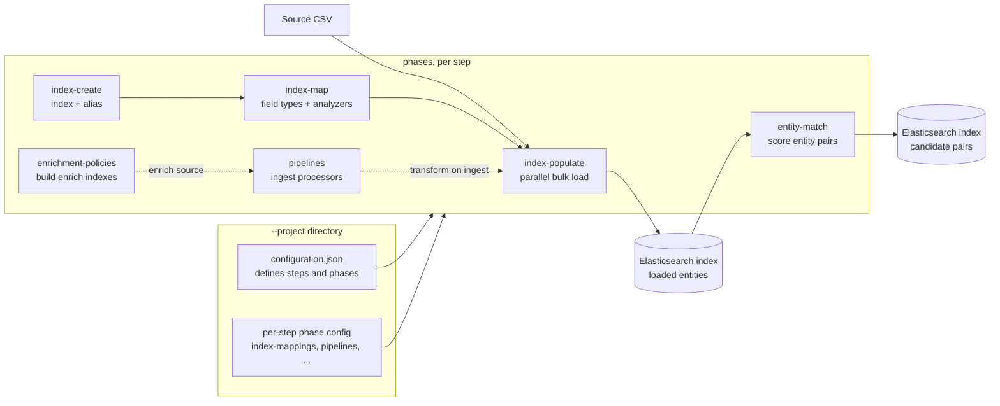
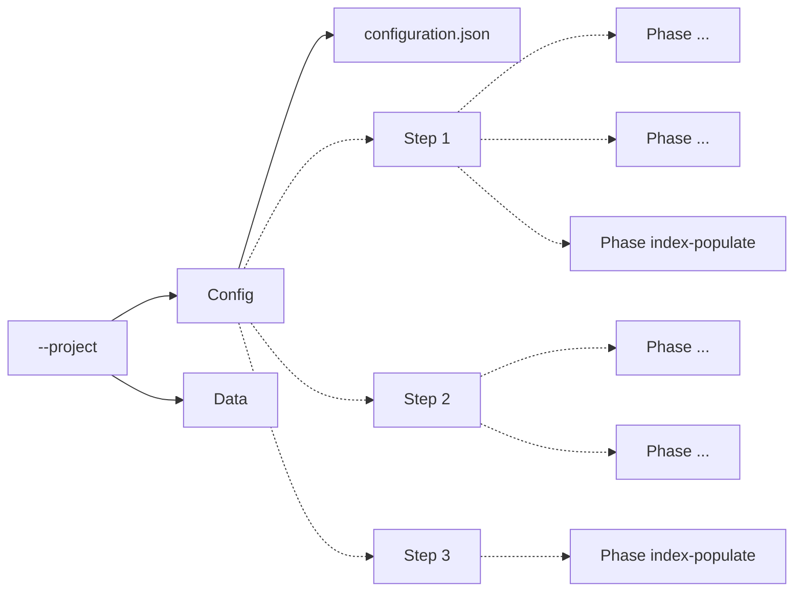
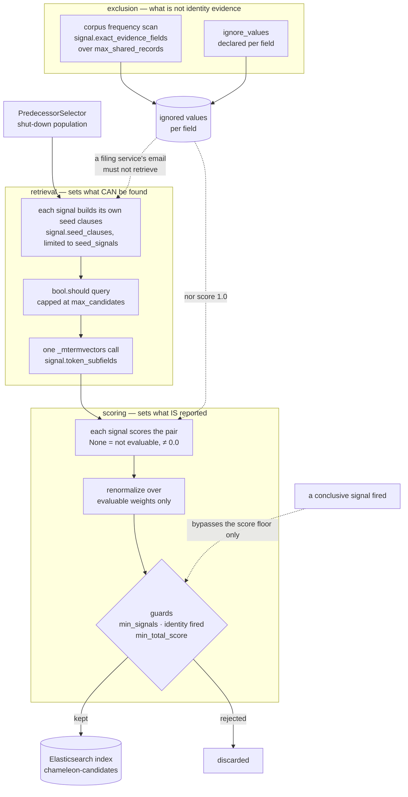
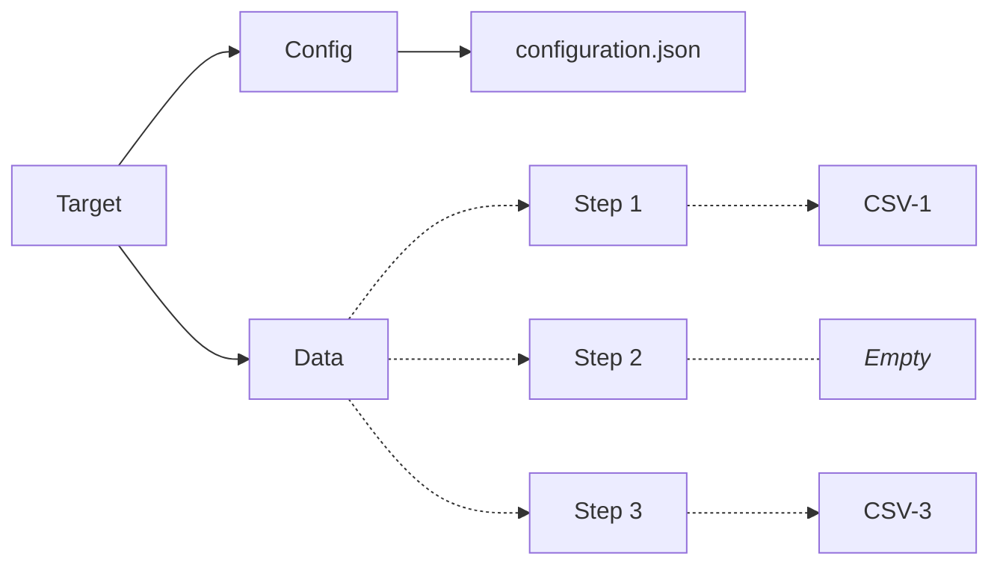

# Entitopia

## Purpose

Entitopia is a **configuration-driven framework for loading data into Elasticsearch and matching entities across it**. You describe indexes, analyzers, enrichment policies, ingestion pipelines, and matching rules in JSON; the framework executes them. The goal is that adding a new dataset means writing configuration, not code.

The initial focus is **entity resolution** — finding records that describe the same real-world thing despite differing spelling, punctuation, abbreviation, or deliberate obfuscation — but nothing in the framework is specific to that.

### Reference implementations

The framework ships with two example projects. They exist to prove the framework works against real, messy, public data, and each one is where that dataset's specifics live:

| Project                             | Dataset                                     | What it proves                                                                                                                                               |
| ----------------------------------- | ------------------------------------------- | ------------------------------------------------------------------------------------------------------------------------------------------------------------ |
| [`CMS-Providers`](CMS-Providers/)   | Medicare provider data (~5.6M rows)         | Scale, composite document IDs, and phonetic/fuzzy analyzers on names and addresses. No enrichment.                                                           |
| [`DOT-Commercial`](DOT-Commercial/) | FMCSA commercial trucking data (~9.6M rows) | Multi-dataset enrichment, two-level enrichment chains, ingestion pipelines, and entity matching — detecting "chameleon carriers" that reopen under a new ID. |

Each project has its own README covering its datasets, the steps it runs, its index relationships, and the dataset-specific problems solved there. **This README covers the framework and the hazards common to any dataset.**

Adding a third dataset? Start with [docs/adding-a-dataset.md](docs/adding-a-dataset.md) — it walks the decisions in order and points back here for the details.

### A note on the numbers in this document

Every record count, distinct-value count, match count and percentage here is a
**point-in-time measurement against one extract**, kept because the _magnitude_
is what makes an argument concrete — "two different dates returned the same
39,400 documents" lands where "some dates collided" does not.

A precise number is not the same as a true one. This document has carried a
retracted figure — "36,788 of 5,647,567 documents dropped" — for weeks, quoted
across three files, because it was specific enough to sound measured and nobody
checked it against a mapping. Cite the measurement _and_ how it was taken.

They are not invariants. The source agencies republish on their own schedules,
so row counts drift, placeholder values come and go, and a threshold tuned
against one extract can behave differently against the next. Treat a number
here as evidence that a problem is real and roughly how big it was, never as a
value to assert against in a test or to expect on your own download. If a
measurement you take disagrees with one written here, **trust yours** and
update the document — that is how this material was written in the first place.

## Glossary

Two vocabularies meet in this repo: **entity resolution**, where most terms come from record-linkage research, and **Elasticsearch**, where they come from the engine. Several words mean something narrower here than in general use, and a few — `seed`, `signal`, `suppression` — appear in both worlds with different senses. This section is the reference; the rest of the README assumes it.

### Matching and entity resolution

- **Entity resolution** — deciding that two records describe the same real-world thing when no field matches exactly. The alternative to an exact join, and the reason this project exists.
- **Sweep** — one full run of the `entity-match` phase: walk a population of interest, retrieve candidates for each, score every pair, write what survives. "The sweep" is the noun used throughout for that pass.
- **Predecessor / successor** — the two halves of a pair. The predecessor is drawn from the population being investigated (in DOT-Commercial, carriers ordered out of service); the successor is a candidate that may be the same operation continuing under a new identity. Direction matters: the pair is an assertion that the successor _followed_ the predecessor.
- **Pair** — one predecessor plus one candidate successor, scored together. The unit written to the output index.
- **Candidate** — a record retrieved as a possible successor for one predecessor, **before** any scoring. Retrieval and scoring are separate: being a candidate means "worth comparing", not "matches".
- **Candidate generation / retrieval** — the step that produces candidates. It sets the ceiling on what can ever be found, because a record never retrieved cannot be scored at any threshold.
- **Blocking** — the classical record-linkage name for candidate generation: partition the corpus so only plausible pairs are compared, avoiding the N² comparison. This project uses a relevance-ranked query rather than strict partitions, and calls it **seeding**.
- **Seed** — to retrieve candidates from a predecessor's own values. A signal that can do this is **seedable**.
- **Seed clause** — one Elasticsearch query clause built by a signal from the predecessor's values, e.g. a `match` on a phonetic name subfield or a `terms` on shared VINs. Produced by `signal.seed_clauses()`.
- **Seed query** — all the seed clauses for one predecessor, combined into a single `bool.should` query with `minimum_should_match: 1`. What actually runs against the index.
- **`seed_signals`** — the config list naming which signals may seed. A signal absent from it still scores pairs; it just cannot widen the search. This is the single most consequential recall setting in the project.
- **Truncation / the candidate ceiling** — the seed query is capped at `max_candidates`. When a predecessor returns that many hits, real matches beyond the cap were cut off and the run says so. Common name tokens make this the normal case, not the exception.
- **Signal** — one kind of evidence that two records are the same entity: name similarity, a shared address, a shared phone, timing between shutdown and re-registration. Each returns a score in `[0.0, 1.0]`, or `None`.
- **Not evaluable (`None`) vs no similarity (`0.0`)** — the distinction the whole scoring model rests on. `None` means the evidence is missing on one or both sides and the signal drops out; `0.0` means it was compared and disagreed. Conflating them penalizes a record for having sparse data. Blank must never match blank.
- **Evidence source** — the set of underlying fields a signal reads. Several signals over the same fields (two phonetic encoders plus a cleaned form of one name) are one source, not three, so corroboration counts sources rather than signals.
- **Identity signal vs corroborating signal** — an identity signal can establish that two records are the same (name, address, shared phone, shared VIN). A corroborating one only strengthens a link that already exists — timing proximity is meaningless on its own when hundreds of thousands of records were shut down.
- **Conclusive signal** — a signal marked `"conclusive": true` in config, whose firing reports the pair even when the blended score falls below `min_total_score`. For evidence that settles the question rather than merely supporting it. Averaging cannot express "this one fact is decisive": a shared VIN scoring 1.0 at weight 0.08 leaves a pair sharing nothing else at ~0.11 against a 0.35 floor.
- **Weight / blended score / `total_score`** — each signal's configured share of the verdict, and the weighted mean of the signals that were evaluable. **It is uncalibrated confidence, not probability.** Nothing has been fitted against known outcomes, so 0.9 does not mean 90% likely.
- **Renormalization** — dividing by the summed weight of the _evaluable_ signals rather than all configured ones, so missing data neither helps nor hurts.
- **Guard** — a threshold a pair must clear to be reported at all: `min_signals` (enough distinct evidence sources), `require_identity_signal` (at least one identity signal actually fired), `min_total_score` (the score floor). A pair can fire several signals and still be rejected.
- **Strong band** — an _analysis convention_, not a setting: the subset of output worth a human's time. For DOT-Commercial that is a pair re-registered within a year of shutdown, scoring ≥ 0.70, sharing a VIN or a phone/email. Elsewhere in the docs this is also called the **reviewable set**. It exists because raw output is dominated by low-scoring noise.
- **Fingerprint vs filter** — a high-cardinality field that can identify an entity, versus a low-cardinality one that can only narrow a population. Confusing the two is the most common configuration error here; see [Measure the data first](#measure-the-data-first).
- **Non-identifying value** — a value that cannot establish identity even though two records genuinely share it. Two kinds, needing the same treatment: outright **placeholders** (`UNKNOWN`, `(000) 000-0000`, a VIN of `GGGG`), and values that are **entirely correct but widely shared** — a filing agent's email, a corporate parent's phone. The second kind cannot be repaired, because nothing is wrong with it.
- **Suppression / exclusion / ignoring** — the same operation under three names: removing a non-identifying value from consideration so it neither seeds retrieval nor scores as a match. Deliberately done at query time, not by editing the data, because the value is often correct and the audit trail is worth keeping.
- **`ignore_values`** — values an operator declares non-identifying, keyed by field path (`"*"` for all fields). Covers what is known in advance.
- **Frequency scan** — the automatic half: a per-field pass over the corpus at sweep start that finds values shared by too many records to identify anything. Covers what nobody knew to declare. Both halves merge into one per-field ignore set.
- **`max_shared_records`** — how many records may share a value before the frequency scan treats it as non-identifying. Per field, because the right number belongs to the attribute: siblings legitimately share a phone; two records sharing a VIN is already suspicious.
- **Rarity weighting (IDF)** — scoring a shared value by how rare it is, rather than treating every match equally. Used where a field is real evidence but a weak one.
- **Chameleon carrier** — the DOT-Commercial target: a trucking company shut down for safety or insurance reasons that reopens under a new identifier while reusing the same addresses, phones, vehicles, and near-identical names.

### Elasticsearch

Terms are linked to the official documentation where a fuller treatment helps.

- **[Index](https://www.elastic.co/guide/en/elasticsearch/reference/current/documents-indices.html)** — the store documents live in. This project creates date-stamped indexes (`carriers-2026.08.02-000001`) behind a stable **alias** (`carriers-000001`), so a reload can build a new index and swap without downtime. The swap is one atomic `update_aliases` call that detaches the previous index as it attaches the new one, leaving the alias naming exactly one index. That matters more than it sounds: an alias naming two indexes is not an error, it just returns every document twice. Pass `--retain-aliases` to keep the previous index attached, which is only ever wanted for a deliberate read-side cutover.
- **Document / `_id`** — one record. `id_field` in config makes the `_id` deterministic from the data, so re-running a load overwrites rather than appends. Without it, every rerun duplicates the corpus.
- **[Mapping](https://www.elastic.co/guide/en/elasticsearch/reference/current/mapping.html)** — the schema: which field is which type. Immutable on a live index, which is why the development loop deletes and rebuilds.
- **[`keyword` vs `text`](https://www.elastic.co/guide/en/elasticsearch/reference/current/keyword.html)** — `keyword` stores the value verbatim and matches exactly; `text` is broken into tokens and matched loosely. Getting this wrong is the difference between a `term` query working and silently matching nothing.
- **[Multi-field / subfield](https://www.elastic.co/guide/en/elasticsearch/reference/current/multi-fields.html)** — indexing one source field several ways at once, written `legal_name.phonetic`. This project leans on it heavily: one name is stored raw, cleaned, and under two phonetic encoders, so different signals can read different views of the same text.
- **[Analyzer](https://www.elastic.co/guide/en/elasticsearch/reference/current/analysis.html) / token / term** — the pipeline that turns text into indexed **tokens** (lowercasing, stripping punctuation, applying synonyms, phonetic encoding). A **term** is what ends up in the index. Signals compare token sets, never raw strings.
- **Phonetic encoder** — an analyzer filter that maps a word to how it sounds, so misspellings collide. This project uses **double metaphone** and **Beider-Morse** together because they fail differently.
- **[BM25 / relevance score](https://www.elastic.co/guide/en/elasticsearch/reference/current/index-modules-similarity.html)** — how Elasticsearch ranks text matches, rarer terms counting for more. Distinct from this project's `total_score`: BM25 orders the seed query's candidates, then the signals score them independently.
- **[`bool` query](https://www.elastic.co/guide/en/elasticsearch/reference/current/query-dsl-bool-query.html)** — combines clauses. `should` = optional and score-contributing, `must_not` = exclusion, `minimum_should_match` = how many optionals must hit. The seed query is a `bool.should` with `minimum_should_match: 1`.
- **[`terms` aggregation](https://www.elastic.co/guide/en/elasticsearch/reference/current/search-aggregations-bucket-terms-aggregation.html) / bucket / `min_doc_count`** — counts the most common values of a field. The frequency scan is exactly this, with `min_doc_count` set just above the sharing limit so only over-shared values come back.
- **[Term vectors / `_mtermvectors`](https://www.elastic.co/guide/en/elasticsearch/reference/current/docs-multi-termvectors.html)** — retrieves the analyzed tokens for documents. Fetched from Elasticsearch rather than recomputed in Python so scoring sees exactly what the index sees, with no risk of a local phonetic implementation drifting from the plugin's.
- **[Point in time (PIT)](https://www.elastic.co/guide/en/elasticsearch/reference/current/point-in-time-api.html) / `search_after`** — a consistent snapshot plus a cursor, for paging past the 10,000-result limit. How a sweep walks tens of thousands of predecessors without the corpus shifting underneath it.
- **[Refresh](https://www.elastic.co/guide/en/elasticsearch/reference/current/near-real-time.html)** — newly indexed documents are not searchable until a refresh, by default up to a second later. A recurring source of silent bugs here: anything reading documents written moments earlier sees nothing and reports success.
- **[Ingest pipeline / processor](https://www.elastic.co/guide/en/elasticsearch/reference/current/ingest.html)** — transformations applied as documents are indexed: parsing dates, attaching enrichment.
- **[Enrich policy / enrich index](https://www.elastic.co/guide/en/elasticsearch/reference/current/ingest-enrich.html)** — joins data from another index onto a document at ingest time. The policy is a **point-in-time snapshot**: it must be re-executed to see new data, and forgetting is one of this project's documented hazards ([hazard 6](#6-enrichment-policies-go-stale-without-erroring)).
- **`parallel_bulk` / 429 / rejected execution** — the bulk indexing helper, and what happens when Elasticsearch is asked for more than it can queue. A 429 here is **permanent data loss**, not a retry, because `parallel_bulk` has no retry support ([hazard 7](#7-enrichment-back-pressure-drops-documents-and-the-count-looks-like-deduplication)).

## How it works

A **project** is a directory containing configuration and data. Running it executes **steps** in order; each step runs one or more **phases**.


```mermaid
flowchart LR
    CSV[Source CSV] --> Populate

    subgraph project["--project directory"]
        Config[configuration.json<br/>defines steps and phases]
        PhaseCfg[per-step phase config<br/>index-mappings, pipelines, ...]
    end

    subgraph phases["phases, per step"]
        direction TB
        Create[index-create<br/>index + alias]
        Map[index-map<br/>field types + analyzers]
        Policies[enrichment-policies<br/>build enrich indexes]
        Pipelines[pipelines<br/>ingest processors]
        Populate[index-populate<br/>parallel bulk load]
        Match[entity-match<br/>score entity pairs]
    end

    Config --> phases
    PhaseCfg --> phases

    Create --> Map --> Populate
    Policies -.->|enrich source| Pipelines
    Pipelines -.->|transform on ingest| Populate
    Populate --> Index[(Elasticsearch index<br/>loaded entities)]
    Index --> Match --> Output[(Elasticsearch index<br/>candidate pairs)]
```

### `execute_project.py` command line options

- `--project=` project directory containing configuration and data
- `--step=` run a single step
- `--phase=` run a single phase within the selected steps

```bash
.venv/bin/python execute_project.py --project=CMS-Providers
.venv/bin/python execute_project.py --project=DOT-Commercial --step=carriers --phase=index-map
```

### Steps

Steps bundle related work. They are declared in a project's `configuration.json`. Each step's configuration lives in `project/configuration/<step>/`, one file per phase.


```mermaid
flowchart LR
    Target["--project"]
    Target-->Config --> ConfigFile[configuration.json]
    Target-->Data

    Config-.->Step1[Step 1]
    Config-.->Step2[Step 2]
    Config-.->Step3[Step 3]

    Step1-.->Phase11[Phase ...]
    Step1-.->Phase12[Phase ...]
    Step1-.->Phase13[Phase index-populate]

    Step2-.->Phase21[Phase ...]
    Step2-.->Phase22[Phase ...]

    Step3-.->Phase31[Phase index-populate]
```

### Phases

Each step contains zero or more phases. Phases are the units of work, implemented in [`phase_providers`](phase_providers):

1. `index-create` — create an index and alias
1. `index-map` — apply field mappings and analyzer settings
1. `enrichment-policies` — create enrichment policies and their enrich indexes
1. `pipelines` — create Elasticsearch ingestion pipelines
1. `index-populate` — load data into an index, directly or through a pipeline
1. `entity-match` — score pairs of related entities and write ranked candidates to an output index

#### Inside `entity-match`

Retrieval and scoring are separate problems, and a match must survive both. A pair the seed query never returns cannot be scored at any threshold, so recall is set by seeding, not by the signal weights.


```mermaid
flowchart TB
    Sel[PredecessorSelector<br/>shut-down population] --> Seed

    subgraph retrieve["retrieval — sets what CAN be found"]
        direction TB
        Seed["each signal builds its own seed clauses<br/>signal.seed_clauses, limited to seed_signals"]
        Cands["bool.should query<br/>capped at max_candidates"]
        Tokens["one _mtermvectors call<br/>signal.token_subfields"]
        Seed --> Cands --> Tokens
    end

    subgraph score["scoring — sets what IS reported"]
        direction TB
        Sig["each signal scores the pair<br/>None = not evaluable, ≠ 0.0"]
        Norm["renormalize over<br/>evaluable weights only"]
        Guard{"guards<br/>min_signals · identity fired<br/>min_total_score"}
        Sig --> Norm --> Guard
    end

    subgraph exclude["exclusion — what is not identity evidence"]
        direction TB
        Scan["corpus frequency scan<br/>signal.exact_evidence_fields<br/>over max_shared_records"]
        Decl["ignore_values<br/>declared per field"]
    end

    Scan --> Ignore[(ignored values<br/>per field)]
    Decl --> Ignore
    Ignore -.->|"a filing service's email<br/>must not retrieve"| Seed
    Ignore -.->|"nor score 1.0"| Sig

    Tokens --> Sig
    Conc["a conclusive signal fired"] -.->|"bypasses the score floor only"| Guard
    Guard -->|kept| Out[("Elasticsearch index<br/>chameleon-candidates")]
    Guard -->|rejected| Drop["discarded"]
```

Retrieval and exclusion are wired to the same values on purpose. If a value could seed but not score — or the reverse — the sweep would retrieve candidates it then refuses to credit, which reads as a silent recall loss rather than an error.

Three configuration knobs shape this, all in the step's `entity-match.json`:

- **`candidates.seed_signals`** — which signals may retrieve, not merely corroborate. Each signal builds its own clauses, so this list is the whole extent of what the sweep can reach. A signal absent here still scores pairs; it just cannot widen the search. `agent` is deliberately excluded: 87 BOC-3 agents cover 519,139 filings, so seeding on one returns essentially random carriers.
- **`signals[].conclusive`** — when this signal fires, report the pair even if the blended total falls under `min_total_score`. For evidence that is decisive rather than merely strong. A weighted average of eight signals cannot express "this one fact settles it": a shared VIN scores 1.0 at weight 0.08, so a pair sharing nothing else totals ~0.11 against a 0.35 floor and was discarded. Only the score floor is bypassed — `min_signals` and `require_identity_signal` still apply.
- **`ignore_values`** and **`max_shared_records`** — values that carry no evidence on a given field, and how many records may share an unknown value before it stops counting as identity. Both are keyed by field path with `"*"` as a default, because a value that is junk in one attribute is fine in another: `"0"` is not a VIN but is a real street number, and a phone tolerates more sharing than a VIN does.

  Every signal that scores a shared value `1.0` is asserting that the value picks out one thing in the world, and real data breaks that promise two different ways. Outright placeholders are the obvious half — the literal VIN `GGGG` on 158 carriers, `UNKNOWN` on 79, the phone `(000) 000-0000` on 664. The subtler half is values that are **entirely correct and still not identifying**: a permit-filing service, an insurance agency, or a corporate parent puts its own phone or email on every carrier it files for, so one address legitimately covers hundreds of unrelated carriers. Measured here: 200 email addresses sit on more than 20 carriers each, the largest on 755.

  That second half is why this is a query-time exclusion rather than a data-cleaning pass. There is nothing to repair — the filing service's email really is that carrier's contact address. It just cannot establish that two carriers are the same operation. Deleting it would destroy correct data and the audit trail with it.

### Data staging

Source data lives in `data` subdirectories named after the step that consumes it. Setup-only steps have no data.


```mermaid
flowchart LR
    Target-->Config --> ConfigFile[configuration.json]
    Target-->Data
    Data-.->Step1[Step 1]-.->CSV-1
    Data-.->Step2[Step 2]-.-Empty-2[<i>Empty</i>]
    Data-.->Step3[Step 3]-.->CSV-3
```

## Common data-loading hazards

Every one of these was hit for real in at least one reference project, usually more than once. They share a signature: **the run reports success and the data is quietly wrong.** Read this section before adding a dataset.

### Measure the data first

Most of the hazards below are decidable before you write a line of configuration, and cheaper to find there than after a load. `scripts/profile_dataset.py` runs the measurements that catch them:

```bash
.venv/bin/python scripts/profile_dataset.py DOT-Commercial/data/carriers/carriers.csv
.venv/bin/python scripts/profile_dataset.py <path.csv> --key col_a --key col_b   # test a candidate id_field
.venv/bin/python scripts/profile_dataset.py <path.csv> --rows 200000             # sample a huge file
```

It reports, per column: distinct count, blank rate, detected date formats, and the specific conditions that break a load — columns mixing numeric and non-numeric values, identifiers carrying leading zeros, and non-ISO dates. It also splits columns into **fingerprints** (high cardinality, can identify an entity) and **filters** (low cardinality, can only narrow a population), and tests whether a candidate key is unique — distinguishing real collisions from byte-identical source rows, which call for opposite responses.

These measurements were previously done ad hoc, one throwaway snippet at a time, which is why the same mistakes recurred across datasets. Run it before configuring; act on every WARNING it prints.

### Then check the config against the data

Profiling tells you what a column contains. It cannot tell you what that column will _become_, because that depends on the mappings — and **an unpinned column is indexed as `text` regardless of what its values look like**, since the loader hands Elasticsearch strings so the mappings can do the typing. `scripts/check_mapping_coverage.py` compares the two:

```bash
.venv/bin/python scripts/check_mapping_coverage.py --project=DOT-Commercial
.venv/bin/python scripts/check_mapping_coverage.py --project=CMS-Providers --step=hospitals
```

For each step it reports columns with no pin (and the type their own values argue for), pins naming a column the CSV no longer has, and non-ISO date columns — which are the one case where neither `text` nor a naive `date` pin is right. It exits non-zero when anything is unpinned, so it can gate a reload.

This exists because the two halves were never compared. When the loader stopped inferring types, 66 fields across three DOT-Commercial datasets silently changed type, with no error anywhere; the four datasets that were already fully pinned moved not one field. Run both scripts before configuring, and again before any reload.

### 1. Dynamic type inference silently drops or breaks documents

Elasticsearch infers a field's type from the first document that carries it. That inference is made under concurrency, so it is not even deterministic across runs — and once made, non-conforming values fail with `document_parsing_exception` and **the whole document is rejected**, not just the field.

Observed failures, each verified against a mapping rather than inferred from a column's contents:

- An ID inferred as `float` in one index and `keyword` in another made an enrichment policy match **zero** documents (DOT-Commercial `crashes.dot_number`).
- Enriched object fields inferred as `text` rather than `keyword`, so `term`/`terms` queries matched nothing — an uppercase query value never matches the lowercased analyzed token (DOT-Commercial predecessor selectors).

**The rule: pin every field you rely on in `index-mappings.json`.** Identifiers and codes are `keyword` even when they look numeric. Anything an enrich policy writes onto a document must be mapped explicitly, because the enriched value inherits the _target_ index's mapping, not the source's.

**Two entries were removed from that list on 2026-08-12 because measurement contradicted them, and the reason they were wrong is worth more than the entries were.** Both claimed a mixed numeric/non-numeric column was inferred as a numeric type, dropping rows: 36,788 of 5,647,567 for DOT-Commercial `insp_carrier_state_id`, and 62 rows plus mangled leading zeros (`00602` → `602`) for CMS-Providers `ZIP Code`. Neither could happen through this loader even then. `pd.read_csv` was called with no `dtype`, so **pandas resolved each column's type once over the whole file before Elasticsearch saw a document.** A column that mixes types resolved to `str`, every value arrived as a JSON string, and dynamic mapping picked `text`, which accepts all of them. Measured at the time: `insp_carrier_state_id` inferred `str` and both the pre-fix and post-fix indexes held all 5,662,304 rows; `DAC_NationalDownloadableFile.csv`'s ZIP column inferred `str`, kept its 62 `…ND` values, and preserved all 294,151 leading-zero ZIPs unmangled.

The pins stay — `keyword` is right for these columns regardless — but the danger was the opposite of what had been written down. **A column was at risk precisely when it was _uniformly_ numeric in the file pandas saw**, because pandas then handed Elasticsearch actual numbers: `Hospital_General_Information.csv`'s ZIP column inferred `int64`. A mixed column was self-protecting; a clean one was the trap. That is no longer a live hazard — the loader now reads every column with `dtype=str`, so the mappings do the typing and pandas types nothing (see the closed item on leading zeros). It is recorded because of how the wrong version survived: both retracted entries described plausible mechanics in convincing detail — a named exception, concurrency, row counts to five figures — and lasted across three documents for weeks because the inference was assumed from the data, never read from a mapping. Checking took two `curl`s.

### 2. Legacy date formats, and why mapping them as `date` is worse

Source data frequently carries non-ISO dates. FMCSA supplies Oracle-style `01-JUN-74`. Elasticsearch's dynamic date detection does not recognize it, so the field silently becomes text.

Mapping it as `dd-MMM-yy` is **worse than leaving it broken**: Java's `yy` pattern pivots to 2000–2099, so a 1974 registration becomes **2074**.

The framework's answer, and the pattern to copy:

- Map the field as `date` with **ISO only**.
- Convert in a Painless `script` ingest processor, applying an explicit century pivot.
- **Validate the result is a real calendar date** — construct it (`LocalDate.of`) rather than pattern-matching digits. A shape-valid but impossible value like `9999-99-99` or `2021-02-29` passes a regex and then costs you the entire document at index time.
- Attach an `on_failure` handler that **removes the field**, so a script failure drops a value rather than a record.

When a date is only ever read client-side, mapping it `keyword` is the safer choice — ISO strings still sort and range-query correctly because they compare lexicographically.

### 3. Analyzers referencing columns that no longer exist are silently inert

Elasticsearch accepts a mapping for a field that never appears in the data. It applies nothing, and dynamically maps the real column as plain `text` instead. All three CMS-Providers datasets shipped this way after CMS renamed its columns: the phonetic and cleaning analyzers were configured, looked correct, and never ran.

**Verify analyzers against real data, not against the mapping file.** `GET <index>/_analyze` and a `_mapping` check on the actual field names will catch this in seconds.

### 4. Validation samples left switched on in production config

`num_rows` in `index-config.json` caps the load. A sample left at `50000` makes a "full" run silently truncate — and if that index then feeds an enrichment policy, the truncation propagates into everything enriched from it. Set `num_rows: null` for full loads.

### 5. Missing `id_field` duplicates every row on rerun

Without `id_field`, Elasticsearch generates document IDs, so re-running a load against the same index appends rather than overwrites. Set `id_field` to a natural key, or to a JSON list of columns that `compute_id()` joins with `|` into a deterministic composite key. Verify the key is actually unique against the full dataset before trusting it.

### 6. Enrichment policies go stale without erroring

An enrich policy is a **point-in-time snapshot** of its source index. It does not track later changes. Ways this bites:

- A policy bound to a live pipeline **cannot be deleted**. The rebuild fails with a conflict that is caught and logged as a warning, so the run continues against the _old_ snapshot. This left a policy pinned to a 5,000-row validation sample across a full 5.6M-row production run, silently cutting enrichment coverage from ~572K matches to ~4K.
- Worse, and now fixed: `delete_policy`, `put_policy` and `execute_policy` used to share one `try`. On any cluster loaded before, the delete raised `ConflictError`, the put then raised `resource_already_exists_exception`, and **`execute_policy` never ran at all** — so the previous run's enrich index stayed live. On a reused cluster that index was frequently _empty_: carriers loaded with no `out_of_service_orders` field, `PredecessorSelector` matched zero predecessors, and the chameleon sweep logged a tidy `0 pairs` that is indistinguishable from "this data contains no chameleons". Execution is now unconditional, and a policy that cannot be replaced is compared against config rather than executed blind.
- If a source index is missing when policies rebuild, the loop aborts and every policy after it keeps its previous snapshot (see open items).

**After rebuilding policies, check the enrich index document count** rather than trusting an `acknowledged: true`. `phase_enrichment_policies.py` now does this for you: it compares each enrich index against its source and logs an ERROR when the enrich index is empty while the source is not. That is the difference between a run that reports success and a run you can believe.

The measured signature of the bug, for recognition: the step completes in **~1 second** and the enrich index holds **0 documents**. Correctly rebuilt, the same step takes **~3 minutes** and the counts match exactly.

### 7. Enrichment back-pressure drops documents, and the count looks like deduplication

An enriched load can silently come up short. `parallel_bulk` cannot retry — it has no `max_retries` — so a 429 from the enrich coordinator discards that document permanently. A full DOT-Commercial run lost **91,439 of 2,085,534 carriers (4.4%)** this way.

What makes it dangerous is how the shortfall reads afterwards. Every dataset here uses a deterministic `id_field`, so an index legitimately holding fewer documents than its CSV has rows is normal — repeated keys upsert. A 4.4% gap looks exactly like that, and it is tempting to write it off. Confirm which one you are looking at:

```bash
# rows the loader read vs documents that landed
curl -s "localhost:9200/carriers-000001/_count"
tail -n +2 data/carriers/carriers.csv | cut -d, -f1 | sort -u | wc -l
```

If the **distinct key count** equals the CSV row count but the index holds fewer, nothing was deduplicated and documents were lost. `phase_index_populate.py` also logs the truth directly — `N of M documents failed to index into ...` — so read that line before drawing conclusions from a document count.

The fix is the enrich coordinator queue sizing in the Docker section above. Reruns are idempotent, so reloading fills the gap once the queue is large enough.

## Framework code vs project-specific code

The intent is that everything under the repository root is generic, and each project directory owns its own dataset specifics.

**Generic framework code** — `phase_providers/` (phase implementations), `utils/` (config loading, Elasticsearch client, CSV loading, deterministic IDs), `execute_project.py` (the driver).

**Project-owned code** — data acquisition lives with its project: [`CMS-Providers/download_cms_provider.sh`](CMS-Providers/download_cms_provider.sh), [`DOT-Commercial/fetch_commercial_carriers.py`](DOT-Commercial/fetch_commercial_carriers.py).

**Known exception — `matching/` is generic in structure but currently carries DOT-Commercial vocabulary.** The signal types, scoring, renormalization, and guards are dataset-agnostic, but several pieces are not yet parameterized:

- `CarrierDoc` names its entity key `dot_number`, and `matching/candidates.py` / `matching/scorer.py` read that attribute directly.
- `matching/predecessors.py` hardcodes FMCSA semantics — the field paths `out_of_service_orders.oos_date` and `auth_history.disp_action_desc`, the literal value `"REVOKED"`, and a sort on `dot_number`. Its four selectors are FMCSA's notions of "shut down", not general ones.

Using `entity-match` against a different dataset therefore requires code changes today, not just configuration. Generalizing it is tracked in the open items below.

## Local Elasticsearch (Docker)

Development runs against a disposable single-node Elasticsearch in Docker, defined by [`docker/`](docker/) in this repo. Use it rather than a shared cluster: the workflow below deletes and recreates indexes constantly, because **Elasticsearch cannot change an analyzer or a field mapping on a live index.**

```bash
docker compose -f docker/compose.yml up -d --build   # build image and start
docker compose -f docker/compose.yml down            # stop, keep indexed data
docker compose -f docker/compose.yml down -v         # stop and discard all data
```

### Why a custom image

The stock Elasticsearch image will not run this project. `docker/Dockerfile` installs two analysis plugins on top of it:

- **`analysis-phonetic`** — supplies the `double_metaphone` and `beider_morse` encoders used for name matching.
- **`analysis-icu`** — supplies `icu_normalizer` and `icu_folding`, used by every name and street analyzer in both projects.

Without them, index creation **fails outright** — Elasticsearch rejects an analyzer that references an unknown filter type. It is a loud failure, not a silent one.

The server version is pinned to **9.4.1**, matching the `elasticsearch` client pinned in `requirements.txt`. Keep those two in step.

### Non-default settings, and why

Both are in `docker/compose.yml` and both exist because of failures documented above:

- **`ES_JAVA_OPTS=-Xms6g -Xmx6g`** — the 1 GB default trips circuit breakers partway through a multi-million-document load. This must fit inside the container runtime's VM, which on macOS is smaller than the host. Colima defaults to a **2 GB** VM, where a 6 GB heap fails at startup with `Native memory allocation (mmap) failed` and the container exits `70` before Elasticsearch logs anything recognizable. Size the VM first: `colima start --cpu 6 --memory 12`.
- **`thread_pool.write.queue_size=4000`** — `parallel_bulk`'s 8 threads outrun the 1000-slot default write queue on large loads.
- **`enrich.coordinator_proxy.queue_capacity=16384`** and **`max_concurrent_requests=16`** — the write queue above is _not_ the queue that overflows on an enriched load, and raising it never touched the real one. Enrichment has its own coordinator queue, defaulting to 1024. A full DOT-Commercial load rejected **91,439 of 2,085,534 carriers (4.4%)** and 2,197 inspections with `Could not perform enrichment, enrich coordination queue at capacity [1024/1024]`, while the write pool reported `rejected: 0` throughout — which is exactly why the wrong knob looked like the right one for so long. Rejected documents are **dropped, not retried**: `parallel_bulk` exposes no `max_retries` (only `streaming_bulk` does), so a 429 there is permanent. Sizing: `carriers` runs five enrich processors, and 8 threads × 500-document chunks put ~4,000 documents in flight, so a burst can demand ~20,000 lookup slots. Adding an enrich processor means revisiting this; the symptom is a 429 naming the enrich coordination queue.

Security is disabled to match `es_config.json`'s http/no-auth settings. This is a localhost development cluster; do not expose it.

### How it is used in development

The cluster is not just a place to load data — it is the only way to verify most of this project's configuration is correct, because JSON that parses can still be silently wrong.

**Check an analyzer actually does what you think**, rather than trusting the mapping file:

```bash
curl -s -XPOST "http://localhost:9200/<index>/_analyze" -H 'Content-Type: application/json' \
  -d '{"analyzer":"name_phonetic","text":"SMITH TRUCKING LLC"}'
```

This is what catches inert analyzers (hazard 3), stop filters that are not wired in, and encoder changes that do not actually collide the names you expect.

**Dry-run an ingest pipeline before loading millions of rows:**

```bash
curl -s -XPOST "http://localhost:9200/_ingest/pipeline/<name>/_simulate" -H 'Content-Type: application/json' \
  -d '{"docs":[{"_source":{"add_date":"01-JUN-74"}}]}'
```

`_simulate` is how the century-pivot and date-validation behavior in hazard 2 was verified, including the cases that would otherwise reject a whole document.

**Confirm a field is mapped the way you intended**, since a dynamic mapping looks identical until you query it:

```bash
curl -s "http://localhost:9200/<index>/_mapping/field/<field>"
curl -s "http://localhost:9200/_cat/indices?v"
```

**Check an enrich policy actually captured data** after rebuilding it, rather than trusting `acknowledged: true`:

```bash
curl -s "http://localhost:9200/.enrich-<policy-name>*/_count"
```

Because mappings and analyzers are immutable on a live index, the normal loop is: edit config → delete the index → re-run `index-create` / `index-map` → reload. Deleting the index is expected, not a failure.

## Setup

1. Start the local Elasticsearch (see above): `docker compose -f docker/compose.yml up -d --build`
1. Clone this repo
1. Requires Python 3.11 or higher
1. Create the virtualenv and install dependencies: `bash dependencies.sh`
   - Everything runs from `.venv`; never invoke the system Python.
1. Create an `es_config.json` from `es_config_template.json`
1. Download data using the project's own script (see that project's README)
1. Run a project: `.venv/bin/python execute_project.py --project=CMS-Providers`
1. Verify the indexes were created — Kibana is usually at <http://localhost:5601/>

### Development

```bash
.venv/bin/python -m pytest              # unit tests
.venv/bin/python -m ruff check .        # must report "All checks passed!"
```

Unit tests need no cluster — the matching and scoring logic is pure functions over token sets, deliberately so. Anything touching mappings, analyzers, pipelines, or enrichment needs the Docker cluster.

Conventions for working in this repo — comment style, linting, the `.venv` rule, Elasticsearch client usage — are in [CLAUDE.md](CLAUDE.md).

## Status

This is a work in progress.

### Open work items

Framework-level. Dataset-specific items live in each project's README.

1. **The `dot_number` join now has an enforced contract, and the loaded indexes still predate it.** The item this replaces described the hazard as a mapping mismatch — `carriers` maps `dot_number` as `keyword` while five datasets mapped their own as `long` — and prescribed retyping the five. Checked against the live cluster 2026-08-15, that diagnosis was wrong in the way that matters: **the join never consults either mapping.** An enrich index maps every field `keyword` regardless of the source mapping and reindexes `_source` verbatim, so what decides a match is the string each side's `_source` value renders to. `carriers` holds the string `"23680"`, `crashes` holds the integer `23680`, and the join works because both render the same digits — not because any type agrees. Retyping the five mappings and stopping there would have changed nothing, reported success, and closed the item. The two failures in the closed list confirm it from the other side: both were `_source` shape changes (a float `3240797.0`, a zero-padded `00023680`) and both produced zero matches with no mapping touched.

   The six datasets were rendering **three different shapes** into their enrich indexes: a JSON integer (`crashes`, `auth-history`, `boc3-agents`, each with a pipeline converting to `long`) and an untouched CSV string (`inspections` and `out-of-service-orders`, which had no `dot_number` processor at all — `out-of-service-orders` had no pipeline whatsoever). Nothing enforced their agreement; they agreed by arithmetic coincidence.

   All six now normalize to one canonical unpadded **string** — the type the enrich index itself uses — and all six declare `dot_number` as `keyword`, so the mapping documents what the pipeline enforces. `out-of-service-orders` gained its first pipeline and an `-ingestion-setup` step. `tests/test_dot_number_join_contract.py` pins the contract by simulating each shipped pipeline against the shapes that have actually broken this join — padded, float-widened, and the `0` placeholder that 159,140 of 1,860,604 `boc3-agents` rows carry — rather than by asserting anything about mapping types, since believing the types were the contract is what produced the wrong diagnosis. One hole is left open deliberately: `ignore_failure` means a `dot_number` that will not parse is left untouched and unjoinable rather than failing the document, on the grounds that dropping a row is worse than losing its enrichment.

   **What remains is the reload.** The configuration is right and the loaded indexes are not — they were built under the old pipelines and still hold the three mixed shapes. Nothing is broken while that is true, because the shapes still coincide, so this is not urgent; but the guarantee is not real until the five datasets, the policies, and `carriers` are rebuilt in that order.

1. **A composite `_id` no longer renders a missing component as `"None"`, and the loaded indexes still carry the old keys.** `compute_id` joined `str(value)` per component, so a row with an absent keyed column keyed as `1498477|2007-09-10|...|INACTIVE|None`. Two consequences: a Python repr in the key space, and a row whose column genuinely holds the string `"None"` colliding with one where the column is missing. Fixed 2026-08-15: a blank component renders as empty, which is what an empty _string_ component already did — so the change makes the two agree rather than adding a third rule, and blankness is judged by the same `_is_blank` the all-blank fallback uses.

   The reach was larger than this item recorded. It named 221,812 of 395,269 `out-of-service-orders` documents (56.1%), and missed that `auth-history` is composite-keyed on nine columns: **4,664,103 of 4,931,415 (94.6%)**. About 4.89M documents re-key in total. CMS `doctors-clinicians` is composite-keyed too and is not loaded here.

   Measured against both source CSVs before changing anything, because the risk in a re-key is two rows collapsing onto one document: no keyed column in either file holds an empty string, a whitespace-only value, or the literal string `"None"`, and the distinct-id count is unchanged across the change on both — 395,269 → 395,269, and 4,931,415 → 4,931,415 (which includes 10,510 genuine duplicate keys that exist today and are unaffected). The re-keying is one-to-one on this extract; nothing collapses.

   **What remains is the reload.** A reload into an index that already exists writes the ~4.89M re-keyed documents a second time under their new ids. `index-create` stamps the index name `{now/d}`, so a reload on a later day lands in a fresh index and is safe — a second reload on the _same_ day is the case to avoid.

1. Cleaning up on exit
1. Enrichment policies bound to a live pipeline still cannot be **deleted**, so a policy whose _definition_ needs to change (different source index, different `enrich_fields`) still requires deleting the pipeline by hand, then rerunning the ingestion-setup step and reloading anything that was enriched from it. **Measured 2026-08-13**: a full reload left all six policies pointing at indexes twelve days superseded, and `carriers` was then built from them. The run now stops rather than finishing green — see the closed item below — but the manual, ordered recovery is unchanged. A real fix deletes and recreates the dependent pipelines around the policy rebuild.
1. **`matching/` is not yet dataset-agnostic.** `CarrierDoc.dot_number` hardcodes the entity key name, and `matching/predecessors.py` hardcodes FMCSA field paths (`out_of_service_orders.oos_date`, `auth_history.disp_action_desc`), the literal `"REVOKED"`, and a `dot_number` sort. Using `entity-match` on another dataset requires editing framework code rather than writing configuration, which contradicts the project's premise. Generalize by making the entity key name configurable and moving selector definitions into project configuration — while keeping selectors a closed, code-backed menu rather than a query-DSL-in-JSON.
1. `signals[].detail` is specified in the chameleon matching design but was never implemented — `SignalContribution` has no such field. It was to carry human-readable evidence per signal (e.g. `"shared tokens: SM0, TRKN"`). `matched_on` covers the main triage path in the meantime.
1. `parallel_bulk` still cannot retry a 429. Raising `enrich.coordinator_proxy.queue_capacity` removed the observed loss, but the client has no `max_retries` (only `streaming_bulk` does), so back-pressure remains permanent data loss rather than a delay. Any future dataset with more enrich processors, or a smaller VM, reopens this. A real fix is switching the populate phase to `streaming_bulk` with retry/backoff and accepting the lower throughput, or chunking the load so retries are cheap.
1. Support multiple steps for the `--step` command line argument
1. Support multiple phases for the `--phase` command line argument
1. Add support for multiple pipelines in the pipeline phase
1. Add support for target specific processors

### Closed work items

1. **A scored pair now records which index, analyzed which way, produced it.** The check was already there and was only a log line; the pairs are what survives the run. `phase_entity_match` reads the source index's stamp once in `_preflight` — the same read the staleness check uses, so the value reported and the value stored cannot drift — and carries it two ways: `_meta.source_index` / `_meta.source_alias` / `_meta.source_analysis_fingerprint` on the candidates index, and the same three on every pair document. Both, not either: a pair is routinely read on its own — pulled by `_id`, exported into a review sample, quoted in a README — and at that point the index's `_meta` is not in the reader's hands.

   Three shapes worth keeping. **`source_index` is resolved to the concrete index, not the configured name**: `entity-match.json` says `carriers-000001`, which is an _alias_, and every rebuild repoints it — so stamping what config says would answer "which index produced this pair?" with a name meaning a different index next month, which is the ambiguity the stamp exists to remove. `get_mapping` is keyed by concrete name even when queried through an alias, so the real name costs no extra round trip; the configured name is kept as `source_alias`, and omitted when the two agree rather than duplicated. Second, the index-level keys are `source_*` because **the candidates index has no analyzers of its own**; a bare `analysis_fingerprint` there would be read as this index's own stamp, compared against the wrong config, and report a mismatch on every run. Third, a source index that predates the stamp leaves the field **absent rather than null**, so nobody can later quote a fingerprint the pair never had — the same distinction `_check_analysis_fingerprint` already draws between "unknown" and "wrong".

   Verified 2026-08-15 against the live cluster: `put_mapping(index=..., meta=...)` round-trips on the pinned 9.4.1 server, and sweeping the configured `carriers-000001` resolves to `carriers-2026.08.13-000001` carrying `0595ca890d9ec6fb` — the value every figure in `DOT-Commercial/README.md` cites — so pairs from the next sweep defend themselves whether or not that alias still points there. A source alias resolving to **more than one** index now warns, since the sweep reads all of them but can attribute its pairs to only one; that shape is the accumulated-alias bug `retain_aliases` exists to avoid, not a supported configuration. Existing candidates indexes are **not** retro-stamped; they predate this and stay dependent on their source index.

1. **A row whose `id_field` value is blank now keys by a hash of the whole row.** `id_utils.compute_id` returned the field's _value_, and `phase_index_populate` has already replaced `NaN` with `None` by then, so `_id` was `None` and Elasticsearch generated a fresh random one each run; the `KeyError` fallback beside it covers an _absent column_, not a present-but-blank value, which is why nothing reported it. **Measured 2026-08-13**: `boc3_agents.csv` carries exactly one blank `docket_number` among 1,860,604 rows, and re-populating the existing index left it holding 1,860,605 documents.

   Resolved by falling back rather than failing the load, because the phase can fix this one: a `blank-key:<sha256 of the canonical row>` id is a property of the data, so a reload overwrites instead of appending. Failing was the alternative considered and rejected — one keyless row out of 1.86M would abort a multi-hour load, and the repo's rule is that a phase raises when it _cannot_ fix a problem. Two consequences stated rather than discovered later: byte-identical keyless rows collapse onto one document (correct — nothing in the row distinguishes them, and the alternative is unbounded growth), and the `blank-key:` prefix is in the data on purpose so an operator can find those rows with a `prefix` query. The phase reports the count and the field name once at the end of the load, not per row.

   The same fallback catches the composite case, which fails the other way: an all-empty composite key joins to one constant string, so every such row would collapse onto a single document. Blankness is judged on the component values **before** the join. That was originally what kept every existing `_id` byte-identical; the `"None"` item above has since made the partial case use the same judgment, so the rule now serves consistency rather than preservation.

1. **Four phases in a row detected a real problem, logged below the level anyone reads, and returned success.** They are recorded together because the pattern matters more than any one of them: a phase that _knows_ something is wrong and still exits 0 turns a broken run into a clean-looking one, and the exit code is the only part of a long unattended run anybody checks. All four are now raises.

   - `phase_enrichment_policies` logged `ERROR` for a drifted or unexecutable policy and continued — measured as six policies pointing at indexes twelve days superseded, six `ERROR` lines, exit 0, and a `carriers` index built from them.
   - `phase_index_mappings` caught a refused `put_mapping` and logged it at **INFO**, then populated the index anyway. Elasticsearch cannot convert an existing object field to `nested`, so rerunning `carriers` after that change would have refused the mapping, indexed 2,085,534 documents under the old one, and reported success while the sweep's nested selector kept failing.
   - `phase_pipelines` caught a refused `put_pipeline` and logged it at **INFO** too. Found 2026-08-15 while adding the `out-of-service-orders` pipeline, and the worst of the three to lose, because the load that follows still succeeds and still looks right: a `dot_number` pipeline only normalizes a join key, so a rejected one costs no documents and raises no error — it just leaves an enrichment silently matching nothing, which is the failure that has already cost this project 546,042 and 565,299 enriched documents on two separate occasions. It is also the one way the join contract above can be reverted at runtime without anyone editing it.
   - The same enrichment fix then exposed a client-side timeout that had been swallowed underneath it (below).

   **When a phase detects a problem it cannot fix, raise.** Logging is for things the operator may want to know; a wrong index is not one of them.

1. **A policy rebuild that could not succeed logged `ERROR` and let the run exit 0.** Both ways enrichment goes quietly wrong were already _detected_ — a bound policy whose definition has drifted to an earlier day's index, and a policy executed against unrefreshed data that produces an empty enrich index — and both merely logged. Measured on a real reload: six drifted policies, six `ERROR` lines, exit code 0, and a `carriers` index built from them. The phase now collects failures and raises, so the step fails; collected rather than raised at the first, because reporting one of six would have left the operator to rediscover the rest a rerun at a time. A separate item claiming `NotFoundError` aborts the rebuild loop was **stale** — `_execute_policy` catches `Exception` broadly, so every policy is still attempted — and is dropped rather than carried forward.

   Making that raise immediately exposed a second defect it had been hiding: `execute_policy` reindexes the whole source, so it scales with the source rather than the request, and elasticsearch-py's default request timeout expired on the 9.6M-document policy while Elasticsearch went on to build all 9,632,353 documents successfully. The client gave up, not the server, and the run reported a failure that had not happened. Now given an hour, set on the `Elasticsearch` object — `EnrichClient` has no `options` of its own, and calling one on it fails only at runtime, on the long policy the timeout exists to protect.

1. **Preserving a source value exactly and making it joinable are different requirements.** FMCSA zero-pads `dot_number` to eight characters in `auth_history.csv` and `boc3_agents.csv` and does not pad it in `carriers.csv`. An enrich index coerces every field to `keyword` regardless of the source mapping, so the padded string is what the join compares and `'00023680'` never matches `'23680'`. That join had only ever worked because the loader was discarding the padding; fixing the loader took `carriers` enrichment from 546,042 `auth_history` and 565,299 `boc3_agents` documents to **zero**, with no error anywhere — caught only by comparing coverage against the pre-reload index. Fixed with an ingest pipeline per dataset converting `dot_number` to a `long`, mirroring what `crashes` already did. **When a key is padded on one side of a join and not the other, normalize it in a pipeline; do not rely on a numeric mapping, because the enrich index will not honour it.**

1. **The loader stripped leading zeros before Elasticsearch ever saw them, and a `keyword` mapping could not prevent it.** `pd.read_csv` was called without `dtype`, so pandas typed each column by inspecting it and an all-numeric column became `int64`. Confirmed live at the time: CMS `Facility ID` is pinned `keyword` and CMS facility IDs are zero-padded six digits, yet `010001` indexed as `10001` — in `_source` and, because that column is the `id_field`, in the document `_id` too. Fixed by reading with `dtype=str` so the mappings do the typing; Elasticsearch coerces strings into numeric fields, so nothing is lost by deferring the decision. Rebuilding hospitals afterwards gives `_id` `'010001'`.

   **It reached DOT-Commercial as well, which the item never recorded**: `crashes.report_time` (`0046` → `46`, 124,272 of 333,120 rows), `inspections.insp_start_time` and `insp_end_time`, `county_code` in both (`013` → the float `13.0`, since a NaN in the column also widened it to float64), `upload_dot_number`, and `auth_history.dot_number`, zero-padded eight wide on every row. None is read by a matching signal, so no score ever depended on them, but the data was wrong on disk.

   Two consequences worth keeping, because neither was obvious before the fix was made:

   **Every unpinned field becomes `text`.** Inference used to hide the gap — an unpinned numeric column still arrived numeric, so nobody had to notice it was unpinned. Measured across a capped end-to-end run, 66 fields moved: 21 in carriers, 23 in crashes, 22 in inspections, and **zero** in the four datasets that were already fully pinned. One of the 66 was `report_date`, which `DOT-Commercial/crash_lift.py` documents as depending on a `long` mapping. That is what `scripts/check_mapping_coverage.py` now exists to catch, before a reload rather than after.

   **`float` is 32-bit, and this data exceeds it.** Restoring the old types blindly would have been wrong twice over: `county_code` was `float` _because_ `013` had already become `13.0`, and pinning it back numeric would re-destroy the padding. Worse, integers above 2^24 round to even, so on the pre-fix cluster `term final_status_date=20250919` and `=20250920` returned **the same 39,400 documents**, and querying the 17th returned the 16th's records. The same exposure applied to `mcs150_mileage` (max 6,854,256,455), `crashes.docket_number` and `registration_date`. Not one of the 66 columns contains a decimal point, so all 44 non-padded ones are pinned `long`, 8 zero-padded ones `keyword`, and 14 flags `boolean`. **Prefer `long`/`double` over `float` for anything that might exceed seven significant digits.**

1. Add support for multiple policies in a policy phase.
1. Add support for --step command line argument to run a single step.
1. Add support for --phase command line argument to run a single phase.
1. Bind all phases to only one controller
1. Supports daily indexes and alias so you can do zero downtime index creation/reload
1. `_id` is autogenerated if `id_field` is not specified in configuration
1. Add example fingerprint `_id` field hashed from multiple fields - deterministic `_id`
1. Warn if no step executed
1. Implemented compound/composite `id_field` support: `phase_index_populate.py`'s `id_field` config value can now be a JSON list, not just a single column name — `compute_id()` joins the listed fields' values with `|` to build a deterministic `_id`, falling back to the existing single-column behavior when `id_field` is a string, and to ES auto-generated IDs when unset. Both reference projects now use it; see their READMEs for the per-dataset uniqueness analysis.
1. Added the `entity-match` phase — configuration-driven pair scoring over a fixed menu of signal types, with weight renormalization over evaluable signals and guards against thin evidence. Proven out in DOT-Commercial's `chameleon-detection` step.
1. Enrichment policies are now always executed, and verified. `delete_policy`/`put_policy`/`execute_policy` shared a `try`, so on a reused cluster the execute was skipped entirely and the previous — often empty — enrich index stayed live, producing carriers with no enrichment and a chameleon sweep that reported zero pairs without erroring. Execution is unconditional, the resulting enrich index is compared against its source, and a bound policy whose definition has drifted from config is refused rather than executed.
1. Sized the enrich coordinator queue. A full load silently dropped 91,439 of 2,085,534 carriers (4.4%) to `enrich coordination queue at capacity [1024/1024]`; the pre-existing `thread_pool.write.queue_size` setting addressed a different queue and never affected it. See the Docker section for the sizing arithmetic.
1. Candidate retrieval is no longer domain-aware. `candidates.py` held a hard-coded whitelist of seedable signal types plus a clause-builder per type, so teaching the sweep a new kind of evidence meant editing retrieval code that had no business knowing about phone numbers or vehicle identifiers. Signals now answer `seed_clauses()` and `token_subfields()` about themselves and `CandidateFinder` just asks; the dataset-specific part is confined to configuration.
1. Shared unique identifiers can seed retrieval, closing a real blind spot: a carrier that re-registers under a new name, address and phone but keeps its vehicles was unreachable at **any** `max_candidates` value, because the seed query never returned it. `vin-overlap` is generalized to `SharedTokenSignal` (alias `shared-token`) since nothing about the logic is vehicular. Placeholder values are suppressed from the corpus and from operator-declared `ignore_values` — without that, 94% of the apparent recall gain was junk like the literal VIN `GGGG` on 158 carriers.
1. A signal can declare itself `conclusive`, reporting a pair even when the blended total falls under `min_total_score`. Averaging cannot express "this one fact settles it".

## Government Datasets

- DOT Commercial <https://ai.fmcsa.dot.gov/SMS/Tools/Downloads.aspx>
- Medicare Providers <https://data.cms.gov/provider-data/>

## References

### Elasticsearch indexing

- <https://dev.to/makalaaneesh/updating-the-mapping-of-an-elasticsearch-index-3h9n>

### Analyzers

- <https://www.informit.com/articles/article.aspx?p=1848528>
